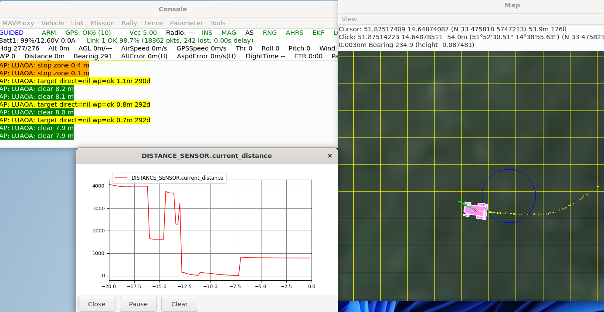
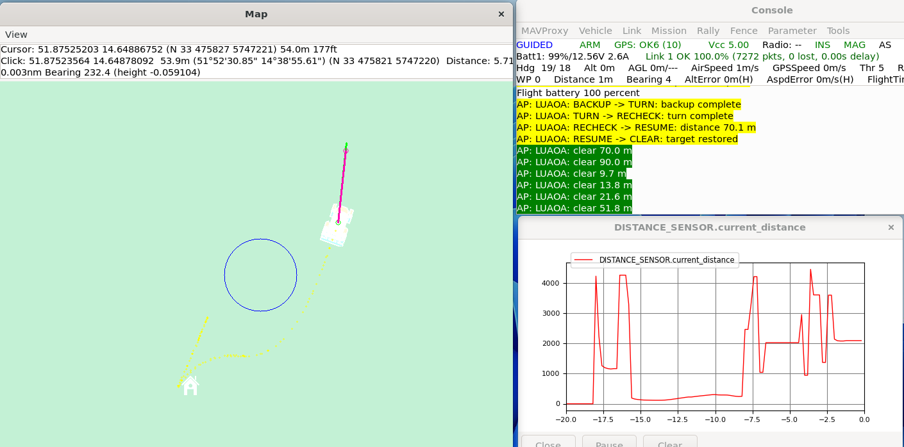

# SITL Luaサンプルスクリプト

更新日: 2026-06-30

対象: Rover最新版SITL、Lua Scripting、前方Rangefinder、Guided制御

## 結論

この文書は、保存済みLuaサンプルをRover SITLで実行するための手順である。

保存しているサンプルは、`OA_TYPE=1` / BendyRulerを使うものではない。前方RangefinderをLuaで読み、必要に応じてGuided向けAPIを試すためのSITL学習用スクリプトとして扱う。

2026-06-30時点では、最新版SITL向けに`rangefinder:distance_orient(0)`を使い、距離単位はmで統一する。Rover 4.6系向けの`rangefinder:distance_cm_orient(0)`は、このサンプルでは使わない。

実機投入用の完成スクリプトではない。実機では、通常運用正本のNative Simple Object Avoidanceを安全側の基準として残し、Lua制御はSITLで挙動と失敗時動作を確認してから分離試験する。

## 保存しているサンプル

| ファイル | 用途 | 走行指令 | 位置づけ |
| --- | --- | --- | --- |
| [luaoa_rangefinder_watch.lua](Scripts/luaoa_rangefinder_watch.lua) | 前方Rangefinderの読み取り確認、Target取得可否の診断 | なし | 最初に使う監視専用サンプル |
| [luaoa_min_guided_avoid.lua](Scripts/luaoa_min_guided_avoid.lua) | 最低限のGuided回避確認 | あり | SITLで状態機械の骨格を見るサンプル |

どちらも、SITLではArduPilot作業ディレクトリ直下の`scripts`へ置いて使う。

```text
ardupilot/scripts/luaoa_rangefinder_watch.lua
ardupilot/scripts/luaoa_min_guided_avoid.lua
```

起動前にScriptingを有効化し、再起動する。Luaは`scripts`直下の`.lua`を読み込むため、確認するサンプルは1本ずつ置く。

```text
SCR_ENABLE=1
```

## 実行手順

### 1. サンプルをSITL側へ置く

WSLでArduPilot作業ディレクトリへ移動し、確認したいLuaを`scripts`直下へ置く。まずは監視専用サンプルだけを置く。

```bash
cd ~/ardupilot
mkdir -p scripts
cp /mnt/c/path/to/cc02-ardurover-build-log/docs/03_Lua障害物回避/Scripts/luaoa_rangefinder_watch.lua scripts/
```

`luaoa_min_guided_avoid.lua`や`rover-quicktune.lua`など、別のLuaを同時に`scripts`直下へ置かない。複数のLuaが同時に動くと、速度指令やメッセージの原因を切り分けにくい。

### 2. Rover SITLを起動する

```bash
Tools/autotest/sim_vehicle.py -v Rover --console --map \
  -l 51.8752066,14.6487840,54.15,0
```

MAVProxyコンソールで、試験前のパラメータを保存し、Scriptingと前方Rangefinderを有効にする。

```text
param save /tmp/cc02_sitl_before_lua.param

param set SCR_ENABLE 1
param set SIM_SONAR_ROT 0
param set RNGFND1_TYPE 100
param set RNGFND1_MIN 0
param set RNGFND1_MAX 50
param set RNGFND1_ORIENT 0

param set PRX1_TYPE 4
param set AVOID_ENABLE 0
param set OA_TYPE 0
reboot
```

再接続後、仮想ポストをMAVProxyの地図へ表示し、距離表示を確認する。

```text
script /tmp/post-locations.scr
module load graph
graph DISTANCE_SENSOR.current_distance
param show SCR_ENABLE
param show RNGFND1_ORIENT
param show AVOID_ENABLE
param show OA_TYPE

arm throttle
```

### 3. 監視サンプルを確認する

再起動後に、GCSメッセージへ次のような表示が出ることを確認する。

```text
LUAOA: clear ... m
LUAOA: warn zone ... m
LUAOA: stop zone ... m
LUAOA: target direct=nil wp=ok ...m ...d
```

実行結果例:

GuidedでFly Toを送信した後のTarget診断込みの実行例:



この例では、GCSメッセージに`target direct=nil wp=ok ...`が出ており、`vehicle:get_target_location()`は直接Targetを返していないが、WP距離・方位からGuided Targetを復元できている。`DISTANCE_SENSOR.current_distance`のグラフもポスト接近時の距離変化を示している。

確認すること:

- MAVProxyの地図に仮想ポストが表示される
- `DISTANCE_SENSOR.current_distance`とLuaメッセージの距離が大きくずれていない
- ポストへ近づくと`clear`から`warn zone`、`stop zone`へ変わる
- Fly To送信後に、Targetが`get_target_location()`で直接読めるか、またはWP距離・方位で復元できるかが`target`ログへ出る
- Roverの速度、モード、操舵がLuaによって変わらない

監視サンプルで距離が読めない場合は、Guided回避サンプルへ進まない。
監視サンプルでFly To送信後も`target direct=nil wp=ok`または`target direct=ok`が出ない場合も、Target復帰試験へ進まず、Guided目標、モード、Arm状態を確認する。

### 4. Guided回避サンプルへ切り替える

監視サンプルを外し、最低限Guided回避サンプルだけを置く。

```bash
cd ~/ardupilot
rm -f scripts/luaoa_rangefinder_watch.lua
cp /mnt/c/path/to/cc02-ardurover-build-log/docs/03_Lua障害物回避/Scripts/luaoa_min_guided_avoid.lua scripts/
```

MAVProxyで再起動する。

```text
reboot
```

再接続後、GuidedにしてArmingする。

```text
mode guided
arm throttle
```

Mission Plannerの地図で、Roverから見て仮想ポストの向こう側をGuided目標に指定する。画面表示に応じて、地図の右クリックメニューから`Fly To Here`または`ここに移動`を選ぶ。

Fly To送信後、次のログが出ることを確認する。

```text
LUAOA: guided target ready via wp-vector
```

Rover masterでは`vehicle:get_target_location()`がLua APIとして存在していても、標準Rover側からは`nil`になることがある。そのため、このサンプルでは`vehicle:get_wp_distance_m()`、`vehicle:get_wp_bearing_deg()`、`ahrs:get_location()`からGuided Target座標を復元する。

Fly Toを送る前はTargetがまだ無いため、起動直後にTarget保存ログが出ないこと自体は異常ではない。Fly To送信後も`guided target ready via wp-vector`が出ない場合は、Target復帰試験へ進まず、Guided目標、モード、Arm状態を確認する。

確認すること:

- 障害物が遠い間は`CLEAR`または通常走行の状態になる
- 障害物へ近づくと`SLOW`、`STOP`へ移る
- 停止後、約2.0 m分の`BACKUP`、強めの固定方向`TURN`、`RECHECK`へ進む
- 前方距離が戻ると`RESUME`になり、保存したGuided目標へ戻ろうとする
- `RESUME -> CLEAR: target restored`が出る
- Rangefinderデータなし、Target保存失敗、API失敗、試行回数超過では`FAULT`になり停止側へ倒れる

このサンプルは、前方センサー1個だけで安全な左右回避を選ぶものではない。状態機械とAPI呼び出しがSITLで動くかを見るための確認に留める。

### 5. 終了して元に戻す

試験を終えるときは、まず停止してDisarmする。

```text
mode hold
disarm
```

Luaサンプルを外し、保存したパラメータへ戻す。

```bash
cd ~/ardupilot
rm -f scripts/luaoa_min_guided_avoid.lua
```

```text
param load /tmp/cc02_sitl_before_lua.param
reboot
```


## サンプル1: 前方Rangefinder監視

対象ファイル:

```text
docs/03_Lua障害物回避/Scripts/luaoa_rangefinder_watch.lua
```

目的は、Luaから前方Rangefinderを読めるか確認し、あわせてGuided TargetがLuaから見えるかを確認することである。

このスクリプトは、前方0度のRangefinderを100 ms周期で読み、距離帯をGCSメッセージへ表示する。さらに、`vehicle:get_target_location()`でGuided Targetを直接読めるか確認し、直接読めない場合は`vehicle:get_wp_distance_m()`、`vehicle:get_wp_bearing_deg()`、`ahrs:get_location()`からTarget座標を復元できるかをログへ表示する。操舵、スロットル、速度、モード変更は一切行わない。

主な確認内容:

- `rangefinder:has_data_orient(0)`で前方センサーのデータ有無を確認できる
- `rangefinder:distance_orient(0)`で前方距離をm単位で読める
- `vehicle:get_target_location()`がRoverでTargetを返すか確認できる
- 直接Targetが読めない場合、WP距離・方位フォールバックが使えるか確認できる
- `DISTANCE_SENSOR.current_distance`やMission Planner表示とLuaの表示値が一致する
- 警戒距離、停止距離のしきい値判定が期待どおり出る

Target診断ログの読み方:

| ログ | 意味 |
| --- | --- |
| `LUAOA: target direct=ok` | `vehicle:get_target_location()`でGuided Targetを直接取得できる |
| `LUAOA: target direct=nil wp=ok ...m ...d` | 直接APIは`nil`だが、現在位置、WP距離、WP方位からTargetを復元できる |
| `LUAOA: target direct=nil wp=no-dist` | TargetまたはWP距離がまだ見えていない。Fly To送信前なら正常範囲 |
| `LUAOA: target direct=err ...` | Lua API呼び出しがエラーになっている |

このサンプルは、仕様04のうち`SCP-03`の距離監視と、`SCP-02`の入口診断に相当する。減速、停止、後退、旋回、目的地復帰は行わない。

## サンプル2: 最低限Guided回避

対象ファイル:

```text
docs/03_Lua障害物回避/Scripts/luaoa_min_guided_avoid.lua
```

目的は、障害物を検出したときにLuaからGuided向けAPIを呼び出す流れを、CC-02向けの前方Rangefinder構成でSITL確認することである。

このスクリプトは、Guided中に前方障害物を検出した場合に、次の流れを試す。

```text
CLEAR
→ SLOW
→ STOP
→ BACKUP
→ TURN
→ RECHECK
→ RESUME
```

実行例:



主な動作:

- `vehicle:get_mode()`でGuided中か確認する
- 可能なら`vehicle:get_target_location()`でGuided目的地を保存する
- 標準Roverで`get_target_location()`が`nil`の場合は、現在位置、WP距離、WP方位からGuided目的地を復元する
- `rangefinder:distance_orient(0)`で前方距離をm単位で監視する
- `vehicle:set_desired_speed()`で警戒時の減速を試す
- `vehicle:set_desired_turn_rate_and_speed()`で停止、約2.0 m後退、強めの固定方向旋回を試す
- `vehicle:set_target_location()`で保存または復元した目的地への復帰を試す
- 目的地復帰後の速度復帰は`set_desired_speed()`だけを使い、`set_desired_turn_rate_and_speed()`へフォールバックしない
- API失敗、センサー喪失、最大試行回数到達時は`FAULT`として停止指令を出す

このサンプルは、仕様04の完全実装ではない。状態機械の骨格をSITLで確認するための最小版である。

## 仕様04との関係

[Guided位置指定対応Lua障害物回避仕様書](今後の開発検討/Guided位置指定対応Lua障害物回避仕様書.md) に対する位置づけは次の通り。

| 仕様項目 | 監視サンプル | 最低限回避サンプル |
| --- | --- | --- |
| `SCP-01` Guided対象モード | 対応なし | 簡易対応 |
| `SCP-02` 目的地保持 | 診断のみ | `get_target_location()`またはWP距離・方位から復元 |
| `SCP-03` 距離監視 | 対応 | 対応 |
| `SCP-04` 減速・停止 | 表示のみ | 簡易対応 |
| `SCP-05` 限定回避 | 対応なし | 約2.0 m後退・強めの固定旋回のみ |
| `SCP-06` 目的地復帰 | 対応なし | `set_target_location()`で簡易対応 |
| `SCP-07` 異常処理 | データなし表示のみ | 簡易`FAULT` |
| `SCP-08` ログ | 距離帯表示のみ | 状態遷移と異常表示 |

最低限回避サンプルでも、仕様04の受入試験を満たしたとは扱わない。SITLで各APIの戻り値、Guided内部状態、目的地復帰、Lua停止時の挙動を確認する必要がある。

## BendyRulerとの分離

`OA_TYPE=1`はArduPilot標準のBendyRuler経路計画を使う設定である。一方、この文書のLuaサンプルはLuaからRoverのGuided向けAPIを呼ぶ別系統である。

このため、次を混同しない。

| 試験 | 内容 |
| --- | --- |
| BendyRuler試験 | `OA_TYPE=1`でArduPilot標準の経路計画を確認する |
| Lua監視試験 | LuaでRangefinderを読むだけ |
| Lua回避試験 | LuaがGuided中に減速・停止・限定回避を試す |

前方センサー1個だけでは左右の空き比較はできない。最低限回避サンプルでも、空いている側を選ぶのではなく、固定方向に少し向きを変えてから前方を再確認する。

## REPLで試す意味

長いLuaファイルを投入する前に、小さいAPI呼び出しで戻り値と単位を確認しておく。

先に確認したいAPI:

| API | 確認すること |
| --- | --- |
| `vehicle:get_mode()` | Guidedのモード番号が想定どおりか |
| `vehicle:get_target_location()` | Roverで実装されていればGuided目的地を取得できるか |
| `vehicle:get_wp_distance_m()` | RoverでGuided WPまでの距離を取得できるか |
| `vehicle:get_wp_bearing_deg()` | RoverでGuided WPへの方位を取得できるか |
| `ahrs:get_location()` | 現在位置を取得できるか |
| `Location:offset_bearing(bearing, distance)` | 現在位置からTarget座標を復元できるか |
| `vehicle:set_target_location(location)` | 保存した目的地へ戻せるか |
| `vehicle:set_desired_speed(speed)` | Guided中に速度上限を変更できるか |
| `vehicle:set_desired_turn_rate_and_speed(rate, speed)` | 停止、後退、旋回指令が成功するか |
| `rangefinder:has_data_orient(0)` | 前方Rangefinderデータが有効か |
| `rangefinder:distance_orient(0)` | 前方距離の単位がmで期待どおりか |

REPLは実機走行判断の代わりではない。実機ではまずタイヤを浮かせ、距離読み取りだけを確認する。

## 実機へ移す前の確認

最低限、次をSITLで確認してから実機へ進む。

1. `DISTANCE_SENSOR.current_distance`とLuaの距離表示が一致する
2. 監視サンプルでFly To送信後に`LUAOA: target direct=nil wp=ok ...`または`LUAOA: target direct=ok`が出る
3. Guided回避サンプルでFly To送信後に`LUAOA: guided target ready via wp-vector`が出る
4. 警戒距離で`SLOW`へ入る
5. 停止距離で`STOP`へ入り、速度0指令を継続する
6. `BACKUP`、`TURN`、`RECHECK`が意図した時間だけ実行される
7. 前方安全時に`RESUME`へ入り、復元した目的地を再設定できる
8. Rangefinder喪失、API失敗、最大試行回数到達で`FAULT`へ入る
9. モード変更またはDisarmでLuaが回避シーケンスを中止する
10. QuikTuneなど他のLuaスクリプトと同時実行しない
11. 試験後に通常運用正本パラメータへ戻せる

実機では、最初から最低限回避サンプルを地上走行させない。まず監視サンプルで距離表示だけ確認し、次にタイヤを浮かせてGuided目的地保存と停止指令を確認する。

## 参照

- [2026-06-29 SITL Lua Guided回避 再開メモ](../../logs/test_runs/20260629_01_sitl_lua_guided_avoid_resume_handoff.md)
- ArduPilot master `Rover.cpp`: <https://github.com/ArduPilot/ardupilot/blob/master/Rover/Rover.cpp>
- ArduPilot Scripting README: <https://github.com/ArduPilot/ardupilot/blob/master/libraries/AP_Scripting/README.md>
- [Guided位置指定対応Lua障害物回避仕様書](今後の開発検討/Guided位置指定対応Lua障害物回避仕様書.md)
