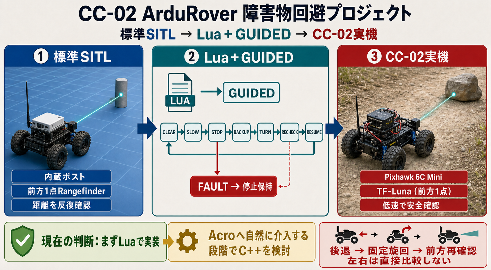

# Lua障害物回避プロジェクト概要



更新日: 2026-06-20

対象: CC-02 ArduRover、ArduRover 4.6.3、前方TF-Luna、Rover SITL、Lua

## 結論

CC-02 Roverには、前方TF-Lunaを使ったArduPilot標準のSimple Object Avoidanceがすでにあり、Acro低速とGuidedで障害物前停止まで確認済みである。

次の開発目標は、この実機ベースラインを壊さず、Rover SITLでLuaの距離判定と制御状態機械を先に検証し、その後に実機TF-Lunaへ移すこととする。

前方センサーが1個だけなので、確実に判断できるのは「現在の進行方向に障害物がある」「停止すべき」である。左右の空きを同時に観測して安全な方向を選ぶことはできない。

限定回避では、停止後に「後退 → 固定方向旋回 → 前方再確認」を行い、旋回後の進行方向が安全かを段階的に判断する。前方センサー1個で万能な経路選択を行うものではない。

## 現在の実機ベースライン

正本:

```text
params/tuned/20260613_pixhawk6c_rover_tuned_01.param
```

| 項目 | 現在値 / 状態 | 判断 |
| --- | --- | --- |
| 機体 | タミヤ CC-02 + Pixhawk 6C Mini | 実機走行確認済み |
| Firmware | ArduRover 4.6.3系 | 本計画の実機基準 |
| 前方センサー | Benewake TF-Luna、`TELEM2` | 距離確認済み |
| Rangefinder | `RNGFND1_TYPE=20`、`ORIENT=0` | 前向きTF-Luna |
| 有効範囲 | `RNGFND1_MIN_CM=20`、`MAX_CM=700` | 20 cm～7 m |
| Proximity | `PRX1_TYPE=4` | RangefinderをProximityへ使用 |
| Simple OA | `OA_TYPE=0`、`AVOID_ENABLE=7` | 通常運用の採用設定 |
| 停止余裕 | `AVOID_MARGIN=2` | 停止重視 |
| 自動後退 | `AVOID_BACKUP_SPD=0` | 通常運用では未採用 |
| Lua | `SCR_ENABLE=1` | QuikTuneで使用済み |
| 実機確認 | Acro低速停止、Guided停止 | 確認済み |
| BendyRuler | `OA_TYPE=1`実験版あり | 河原では最終採用しない |

このベースラインは上書きしない。Lua制御試験は別パラメータファイルとして保存する。

## 公式情報とソース根拠の範囲

「Rover単体SITLで、内蔵バリアを前方1点Rangefinderで測る」という組み合わせを、そのまま説明した公式記事は確認できない。

本計画のSITL手順は、次の情報を組み合わせた検証手順である。

| 根拠 | 直接確認できること | この根拠だけでは確認できないこと |
| --- | --- | --- |
| Adding Simulated PeripheralsのRangefinder節 | アナログRangefinderのSITL設定 | 前向きにして内蔵バリアを測る手順 |
| 同ページの360度LiDAR節 | LD06等、仮想バリア地点、地図表示 | 1点Rangefinderでの測距 |
| `SIM_Aircraft.cpp` / `SITL.cpp` | Roverの水平Rangefinderが内蔵ポスト群との交差距離を返す実装 | 使用中バージョンでの実行結果 |
| AirSim連携ページ | 前向きRangefinderと障害物回避利用 | ArduPilot単体SITLの内蔵バリア利用 |

AirSim連携ページはアーカイブ扱いである。前向きRangefinderの用途を補強する参考資料とし、単体SITL手順の直接根拠にはしない。

## バージョン差

提示された元情報は、4.6系と4.7系の記法が混在していた。CC-02実機はArduRover 4.6.3系なので、まず4.6.3へ合わせる。

| 項目 | ArduRover 4.6.3 | master / 4.7系 |
| --- | --- | --- |
| 最小距離 | `RNGFND1_MIN_CM`、cm | `RNGFND1_MIN`、m |
| 最大距離 | `RNGFND1_MAX_CM`、cm | `RNGFND1_MAX`、m |
| Lua距離API | `distance_cm_orient()`、cm | `distance_orient()`、m |

## 最終目的

前方LiDARの距離をLuaで監視し、次の動作を安全に実装する。

1. 障害物への接近を検出する
2. 警戒距離で減速する
3. 停止距離で停止する
4. センサー異常またはLua異常時は停止側へ倒す
5. 停止後の限定的な後退と旋回を検証する
6. 前方を再確認してから走行を再開する

## 開発構成

```text
Rover SITL内蔵ポスト
    -> 前方1点の仮想Rangefinder
    -> Lua距離監視
    -> Lua状態機械
    -> 減速 / 停止 / 後退 / 旋回 / 再確認

実機TF-Luna
    -> RNGFND1_ORIENT=0
    -> 同じLua距離判定
    -> 低速ベンチ試験
    -> 平坦地の実走試験
```

SITLのセンサー設定と実機TF-Lunaの設定は別物である。SITL用の`RNGFND1_TYPE=1`や`PIN=0`を実機へコピーしない。

## 開発フェーズ

### フェーズ1: SITL前方距離の確認

- ArduRover 4.6.3のSITLを仮想バリア地点で起動する
- 前方1点Rangefinderを設定する
- MAVProxyの`DISTANCE_SENSOR.current_distance`でcm単位の距離を確認する
- ポスト間では未検出になる制約を記録する

### フェーズ2: Lua監視

- `distance_cm_orient(0)`で前方距離を取得する
- GCSメッセージとMAVProxyグラフを比較する
- データなし、範囲外、近距離を区別する
- この段階では速度やモードを変更しない

### フェーズ3: Lua停止

- 警戒距離、停止距離、再開距離を分ける
- 連続3回などの確定回数を持たせる
- 最初は停止後に自動再開しない
- センサー喪失時は停止保持へ移る

### フェーズ4: 限定回避

| 状態 | 動作 |
| --- | --- |
| `CLEAR` | 通常走行 |
| `SLOW` | 警戒距離内で減速 |
| `STOP` | 停止距離内で停止保持 |
| `BACKUP` | 所定時間または距離だけ後退 |
| `TURN` | 固定方向へ最低旋回量だけ旋回 |
| `RECHECK` | 前方距離を再確認 |
| `RESUME` | 元の走行へ復帰 |
| `FAULT` | センサー・Lua・制御異常時に停止保持 |

前方センサーが障害物を外した瞬間に旋回を終了させない。最低旋回量、タイムアウト、最大試行回数を持たせる。

### フェーズ5: 実機移行

- 現在のTF-Luna配線とRangefinder設定を維持する
- タイヤを浮かせてLuaの読取りだけを確認する
- Native OAとLua制御を別々に試験する
- 平坦で石の少ない場所を使う
- 最低速度から始める

## Native OAとLuaの分離

現在の実機はNative Simple Object Avoidanceで停止確認済みであり、これは安全な復帰基準として残す。

| 試験 | Native OA | Lua |
| --- | --- | --- |
| 距離表示のみ | 現在設定を維持 | 読取りのみ |
| Native OA再現 | `AVOID_ENABLE=7` | 制御出力なし |
| Lua制御単独 | 専用パラメータで無効化を検討 | 減速・停止を実施 |

Native OAとLuaが同時に速度やモードへ介入すると、停止原因と回避挙動を切り分けられない。Lua制御試験前にパラメータを保存し、試験終了後は通常運用正本へ戻す。

QuikTune用スクリプトとの同時実行も避ける。新しいLua試験用パラメータでは`RTUN_ENABLE=0`を候補とし、`Scripting1`がQuikTuneを開始しない状態を確認する。

## 完了条件

### SITL

- 前方ポストへの接近で距離が連続的に減る
- Luaのcm値と`DISTANCE_SENSOR.current_distance`が一致する
- 停止距離より手前で停止する
- センサー喪失、Luaエラー、タイムアウトで停止保持する
- 20回以上の反復でポストへ衝突しない

### 実機

- 現行Native OAの停止を再現できる
- Lua読取り値がMission Plannerの距離と一致する
- Lua制御単独の停止原因をログで識別できる
- 低速で実測停止距離内に停止する
- Native OA通常運用正本へ確実に復帰できる

## 関連資料

- [WSLからSITLとBendyRulerを実行する最短手順](00_SITL_BendyRuler実行手順.md)
- [Rover SITL前方Rangefinder / 標準OA / Lua設定手順](01_RoverSITL前方Rangefinder設定手順.md)
- [開発検討: LuaとC++独自モードの実装判断](今後の開発検討/LuaとC++の実装判断.md)
- [開発検討: Guided位置指定対応Lua障害物回避仕様書](今後の開発検討/Guided位置指定対応Lua障害物回避仕様書.md)
- [SITL Luaサンプルスクリプト](05_SITL_Luaサンプルスクリプト.md)
- [最低限Guided回避Lua解説](06_MinGuided回避Lua解説.md)
- [仮想ポストKML表示補助](補助機能/10_MP_仮想ポストKML表示補助.md)
- [現在状況](../01_現在状況.md)
- [ArduRoverパラメータ](../01_FC換装/06_ArduRoverパラメータ.md)
- [走行試験](../01_FC換装/07_走行試験.md)
- [チューニングログ](../02_チューニング/09_チューニングログ.md)
- [2026-06-13 Guided障害物停止確認](../../logs/test_runs/20260613_07_guided_obstacle_stop_check.md)
- [2026-06-12 LiDAR Simple OA停止確認](../../logs/test_runs/20260612_LiDAR設定_簡易障害物回避_Acro停止確認.md)

## 公式資料

- [Adding Simulated Peripherals to sim_vehicle](https://ardupilot.org/dev/docs/adding_simulated_devices.html)
- [Using SITL with AirSim（アーカイブ）](https://ardupilot.org/dev/docs/sitl-with-airsim.html)
- [Rover-4.6.3 Rangefinderパラメータ定義](https://github.com/ArduPilot/ardupilot/blob/Rover-4.6.3/libraries/AP_RangeFinder/AP_RangeFinder_Params.cpp)
- [Rover-4.6.3 Lua API定義](https://github.com/ArduPilot/ardupilot/blob/Rover-4.6.3/libraries/AP_Scripting/docs/docs.lua)
- [Rover-4.6.3 水平Rangefinder処理](https://github.com/ArduPilot/ardupilot/blob/Rover-4.6.3/libraries/SITL/SIM_Aircraft.cpp)
- [Rover-4.6.3 仮想ポスト実装](https://github.com/ArduPilot/ardupilot/blob/Rover-4.6.3/libraries/SITL/SITL.cpp)
- [Lua Scripts](https://ardupilot.org/rover/docs/common-lua-scripts.html)
- [Simple Object Avoidance](https://ardupilot.org/rover/docs/common-simple-object-avoidance.html)
