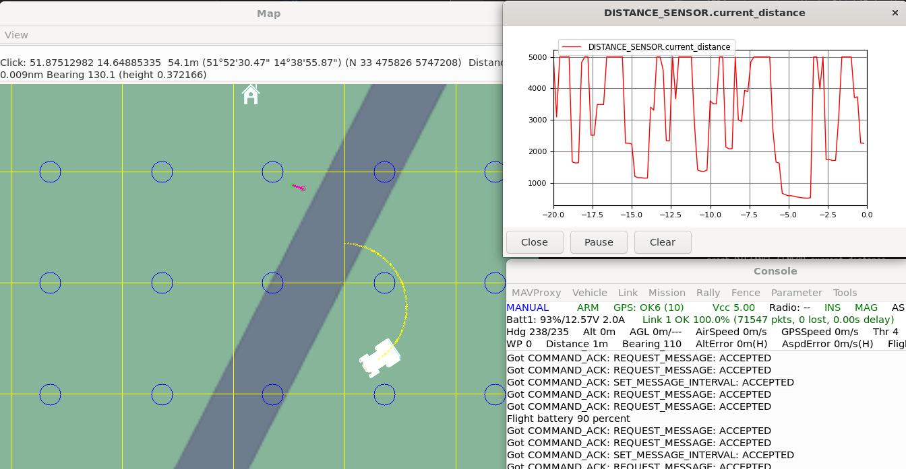

# Rover SITL前方Rangefinder / Lua設定手順

更新日: 2026-06-22

シミュレーション基準: 最新ArduPilotソース（`master`。試験時のコミットを記録する）

実機基準: ArduRover 4.6.3

## 目的

ArduPilot Rover SITLの内蔵機能だけで、前方へ1本の測距レイを出す仮想Rangefinderを構成する。MAVProxyとLuaの両方で距離を確認し、CC-02用Lua障害物回避ロジックを実機投入前に検証できる状態にする。

この手順では360度LiDARの`sim:ld06`を使用しない。

シミュレーション開発では、最新ArduPilotソースのSITL専用Rangefinderドライバ、m単位のパラメータ、およびm単位のLua APIを使用する。実機はArduRover 4.6.3のままなので、TF-Lunaの実機設定とcm単位のLua APIを別枠で残す。

SITLと実機では、パラメータファイルとLuaスクリプトを共用しない。共通ロジックへ距離を渡す場合は、境界でmへ正規化する。

> [!IMPORTANT]
> 公式記事には「単体SITLの内蔵バリアを前方1点Rangefinderで測る」という一連の手順はない。本書は、360度LiDAR用の仮想バリア地点、SITL専用Rangefinderドライバ、および`SIM_Aircraft.cpp` / `SITL.cpp`の水平Rangefinder実装を組み合わせた検証手順である。測距値を実行確認してからLua制御へ進む。

## クイック起動コマンド

ArduPilotリポジトリのルートでSITLを起動する。

```bash
Tools/autotest/sim_vehicle.py -v Rover --console --map \
  -l 51.8752066,14.6487840,54.15,0
```

MAVProxyコンソールで、距離確認用の表示を開く。

```text
script /tmp/post-locations.scr
module load graph
graph DISTANCE_SENSOR.current_distance
```

前方Rangefinder設定が未設定、または`-w`でSITLパラメータを消した直後だけ、MAVProxyコンソールで次を実行して再起動する。

```text
param set SIM_SONAR_ROT 0
param set RNGFND1_TYPE 100
param set RNGFND1_MIN 0
param set RNGFND1_MAX 50
param set RNGFND1_ORIENT 0
reboot
```

`--serial5=sim:ld06`は付けない。既存SITLパラメータを消す必要がある場合だけ、起動コマンドに`-w`を一時的に付ける。

## 1. 最新SITL設定と4.6.3実機設定を分ける

本書の最新ソースSITL設定:

```text
SIM_SONAR_ROT    = 0
RNGFND1_TYPE     = 100
RNGFND1_MIN      = 0
RNGFND1_MAX      = 50
RNGFND1_ORIENT   = 0
```

CC-02実機（ArduRover 4.6.3）のTF-Luna設定:

```text
SERIAL2_PROTOCOL = 9
SERIAL2_BAUD     = 115
RNGFND1_TYPE     = 20
RNGFND1_MIN_CM   = 20
RNGFND1_MAX_CM   = 700
RNGFND1_ORIENT   = 0
```

最新SITL用設定を実機Pixhawkへ書き込まない。特に`RNGFND1_TYPE=100`はSITL専用であり、実機のTF-Lunaには使用しない。

## 2. ArduPilotの版を確認

ArduPilotリポジトリのルートで実行する。

```bash
git describe --tags --always --dirty
git branch --show-current
git rev-parse HEAD
```

シミュレーションは最新ソースを使用し、試験ログへコミットIDを残す。`master`は更新されるため、「最新」とだけ記録せず、再現可能なSHAを必ず残す。

| 項目 | 最新ArduPilotソース（SITL基準） | ArduRover 4.6.3（実機基準） |
| --- | --- | --- |
| Rangefinder種別 | `RNGFND1_TYPE=100`（SITL専用） | `RNGFND1_TYPE=20`（TFmini/TF-Luna Serial） |
| 最小距離 | `RNGFND1_MIN`、m | `RNGFND1_MIN_CM`、cm |
| 最大距離 | `RNGFND1_MAX`、m | `RNGFND1_MAX_CM`、cm |
| Lua距離API | `distance_orient()`、m | `distance_cm_orient()`、cm |
| MAVLink `DISTANCE_SENSOR.current_distance` | cm | cm |

最新ソースにも`distance_cm_orient()`は互換APIとして残っているが非推奨である。SITL側の新規コードでは`distance_orient()`を使う。

## 3. Rover SITLを仮想バリア地点で起動

ArduPilotリポジトリのルートで実行する。

```bash
Tools/autotest/sim_vehicle.py -v Rover --console --map \
  -l 51.8752066,14.6487840,54.15,0
```

付けない指定:

```text
--serial5=sim:ld06
```

この座標は、公式Wikiが360度LiDARの仮想バリア試験に使用している地点である。前方1点Rangefinderとの組み合わせは公式Wikiに明記されていない。

前方1点でも同じポスト群を測るという判断は、Roverの水平Rangefinderが`measure_distance_at_angle_bf()`を呼び、`SITL.cpp`のポスト群との交差距離を取得する実装に基づく。

既存SITLパラメータを消す場合のみ`-w`を付ける。`-w`は毎回使用しない。

## 4. 前方Rangefinderを設定

MAVProxyコンソールで実行する。

```text
param set SIM_SONAR_ROT 0

param set RNGFND1_TYPE 100
param set RNGFND1_MIN 0
param set RNGFND1_MAX 50
param set RNGFND1_ORIENT 0

reboot
```

| パラメータ | 値 | 意味 |
| --- | ---: | --- |
| `SIM_SONAR_ROT` | 0 | SITLの測距レイを車体前方へ向ける |
| `RNGFND1_TYPE` | 100 | 最新ソースのSITL専用Rangefinderドライバ |
| `RNGFND1_MIN` | 0 | 最小距離0 m |
| `RNGFND1_MAX` | 50 | 最大距離50 m。グラフの縦軸上限ではなく、Rangefinderとして扱う有効距離の上限 |
| `RNGFND1_ORIENT` | 0 | ArduPilot側で前向きとして登録 |

`SIM_SONAR_ROT`は測距レイの物理方向、`RNGFND1_ORIENT`はArduPilotが扱うセンサー方向であり、両方を0にする。

`RNGFND1_TYPE=100`はSITLが生成した距離をm単位で直接受け取るため、アナログ模擬用の`RNGFND1_PIN`、`RNGFND1_SCALING`、`SIM_SONAR_SCALE`は設定しない。

> [!NOTE]
> `RNGFND1_TYPE=100`、`RNGFND1_MIN` / `RNGFND1_MAX`、`distance_orient()`は2026-06-22時点の`master`ソースで確認した。`master`は更新されるため、実行時のコミットでパラメータ表示と距離値を再確認する。

`RNGFND1_MAX`はMAVProxyグラフの縦軸上限ではない。最新のSITL専用ドライバでは、ポスト未検出時に設定上限50 mを超える大きな値が`DISTANCE_SENSOR.current_distance`へ現れることがある。これは有効な実距離として扱わず、Rangefinderの状態とポスト接近時の変化を見る。旧アナログ模擬設定では5000 cm付近が表示されることがある。

再起動後に確認する。

```text
param show SIM_SONAR_ROT
param show RNGFND1_TYPE
param show RNGFND1_MIN
param show RNGFND1_MAX
param show RNGFND1_ORIENT
```

### ArduRover 4.6.3のSITLを再現する場合

過去ログを同じ4.6.3環境で再現するときだけ、従来のアナログ模擬設定を使用する。

```text
param set SIM_SONAR_ROT 0
param set SIM_SONAR_SCALE 10
param set RNGFND1_TYPE 1
param set RNGFND1_PIN 0
param set RNGFND1_SCALING 10
param set RNGFND1_MIN_CM 0
param set RNGFND1_MAX_CM 5000
param set RNGFND1_ORIENT 0
reboot
```

これは4.6.3実機のTF-Luna設定ではなく、旧版SITLを再現するためだけの設定である。最新SITL、4.6.3 SITL、4.6.3実機のパラメータを混ぜない。

## 5. 仮想ポストを地図へ表示

MAVProxyコンソールで実行する。

```text
script /tmp/post-locations.scr
```

このスクリプトはポストを作るものではなく、SITLソースに定義されたポスト位置を地図へ描く。

ファイルがない場合:

1. Rangefinder設定後に再起動したか確認する
2. SITLコンソールの`Writing /tmp/post-locations.scr`を確認する
3. 数秒待って再実行する
4. WSL内のMAVProxyから実行しているか確認する

### 5.1 KML表示補助

仮想ポストの確認はMAVProxyの`script /tmp/post-locations.scr`を主手順とする。

Mission Plannerで位置関係を見たい場合は、`/tmp/post-locations.scr`をKMLへ変換し、KMLオーバーレイとして補助表示できる。手順と表示例は[仮想ポストKML表示補助](05_仮想ポストKML表示補助.md)を参照する。

## 6. MAVProxyで距離を確認

```text
module load graph
graph DISTANCE_SENSOR.current_distance
```

2026-06-20のArduRover 4.6.3 SITLローカル実行では、旧アナログ模擬設定で`DISTANCE_SENSOR.current_distance`の距離グラフが表示されることを確認した。最新ソースの`RNGFND1_TYPE=100`でも同じMAVLinkフィールドを使うが、選択したコミットで再実行し、試験ログへ結果を残す。`current_distance`の単位はcmである。

最新ソースのLua API `distance_orient(0)`はm、MAVLinkの`DISTANCE_SENSOR.current_distance`はcmである。両者を比較する場合は、`DISTANCE_SENSOR.current_distance * 0.01`としてMAVLink側をmへ変換する。

公式資料などで使われる`RANGEFINDER.distance`がこの接続で表示されない場合は、実行確認済みの`DISTANCE_SENSOR.current_distance`を使用する。

シミュレーターを正しく設定できた場合の表示例:



この例では、MAVProxyマップ上に内蔵ポストが表示され、`DISTANCE_SENSOR.current_distance`のグラフがcm単位で変化している。車体の向きと測距レイがポストを捉えているかを、マップとグラフを並べて確認する。

### 6.1 近距離を見やすくする

MAVProxyの`graph`コマンドには、確認できる範囲では縦軸を数値指定するサブコマンドがない。`RNGFND1_MAX`もグラフ縦軸の設定ではない。

近距離確認では、グラフウィンドウ側のズーム操作で0～1000 cm付近を拡大する。数値を小さく見たい場合はm単位の式を別グラフで開く。

```text
graph DISTANCE_SENSOR.current_distance*0.01
```

時間幅だけを狭める場合は、グラフを開く前に次を設定する。

```text
graph timespan 10
graph DISTANCE_SENSOR.current_distance
```

近距離で正確に測れているかは、グラフの形だけで判断しない。ポストへ真正面から接近し、`current_distance`が実距離に合わせて連続的に減ること、`current_distance * 0.01`がLuaの`distance_orient(0)`と同じm値になることを確認する。

合格条件:

- ポストへ向けて接近すると距離が減少する
- 旋回してレイがポストを外すと範囲外相当の大きな値へ戻る
- ポスト間では検出しないことがある
- `current_distance`がポストへの接近に合わせてcm単位で減少する
- 距離値が飛ぶ場合は向き、Rangefinder種別、上限距離を再確認する
- `RNGFND1_MAX`を下げても、`DISTANCE_SENSOR.current_distance`の表示値やグラフ縦軸がその値へ丸められるとは限らない

SITLのポストは半径1 m、格子間隔10 mで、交差判定レイは200 mである。連続した壁ではない。

## 7. Luaを有効化

MAVProxyコンソールで実行する。

```text
param set SCR_ENABLE 1
reboot
```

SITLでは、シミュレーターを起動したディレクトリ直下の`scripts`フォルダーからLuaを読む。

```bash
mkdir -p scripts
```

`scripts/front_rangefinder_monitor.lua`を作成する。

```lua
local FRONT = 0
local UPDATE_MS = 500

local function update()
    if rangefinder:has_data_orient(FRONT) then
        local distance_m = rangefinder:distance_orient(FRONT)
        gcs:send_text(
            6,
            string.format("Front range: %.2f m", distance_m)
        )
    else
        gcs:send_text(4, "Front range: no data")
    end

    return update, UPDATE_MS
end

gcs:send_text(6, "Front range monitor started")
return update, UPDATE_MS
```

この確認用スクリプトは距離表示だけを行い、速度やモードを変更しない。

### ArduRover 4.6.3実機へ移す場合

4.6.3実機では、距離取得部分をcm単位APIへ差し替え、直後にmへ正規化する。

```lua
local distance_cm = rangefinder:distance_cm_orient(FRONT)
local distance_m = distance_cm * 0.01
```

これ以降の警戒距離、停止距離、再開距離のロジックはm単位で統一する。SITL用の`distance_orient()`を4.6.3実機へそのまま持ち込まない。

SITLを再起動し、次のメッセージを確認する。

```text
Front range monitor started
Front range: xx.xx m
```

## 8. Lua停止制御へ進む条件

監視が安定してから停止制御を追加する。

初期検討値:

```text
警戒距離: 5.0 m
停止距離: 2.5 m
再開距離: 6.0 m
確定回数: 3回連続
制御周期: 100 ms
```

これはSITL初期値であり、実機TF-Lunaの`AVOID_MARGIN=2`や実測停止距離とは別に評価する。

実機停止距離:

```text
実測制動距離
+ センサーとLuaの遅延中に進む距離
+ 安全余裕
```

実装順:

1. 警告表示
2. 警戒距離で減速
3. 停止距離で停止保持
4. センサー喪失で停止保持
5. 後退
6. 固定方向旋回
7. 前方再確認
8. 走行再開

`vehicle:set_desired_speed()`、`vehicle:set_desired_turn_rate_and_speed()`、`vehicle:set_mode()`はRover-4.6.3のLua APIに存在する。採用APIと対象モードを固定し、停止だけを単独試験してから回避へ進む。

## 9. 実機へ移す前の分離手順

現在の通常運用正本はNative Simple Object Avoidanceを有効化している。

```text
OA_TYPE          = 0
PRX1_TYPE        = 4
AVOID_ENABLE     = 7
AVOID_MARGIN     = 2
AVOID_BACKUP_SPD = 0
```

Lua制御の実機試験前に、現在パラメータを別名保存する。

```text
params/tuned/YYYYMMDD_01_before_lua_avoid_test.param
```

試験ルール:

- 読取りだけのLuaはNative OAを維持して確認できる
- Luaが速度・モードへ介入する試験では、Native OAとの重複を避ける
- Native OAを無効化する場合は試験用パラメータだけで行う
- `RTUN_ENABLE=0`をLua試験用設定の候補とする
- QuikTuneの`Scripting1`を開始しない
- タイヤ浮かせ、低速、平坦地の順で進む
- 終了後は`20260613_pixhawk6c_rover_tuned_01.param`へ戻す

## 10. 試験表

| ID | 試験 | 合格条件 |
| --- | --- | --- |
| RF-01 | SITL距離受信 | `DISTANCE_SENSOR.current_distance`がcm単位で更新される |
| RF-02 | ポストへ接近 | 距離が連続的に減る |
| RF-03 | その場旋回 | ポストを外すと範囲外相当の大きな値へ戻る |
| RF-04 | ポスト間 | 未検出になり得ることを確認 |
| LUA-01 | Lua起動 | 起動メッセージが1回出る |
| LUA-02 | API単位 | Luaのm値が`DISTANCE_SENSOR.current_distance * 0.01`と一致する |
| LUA-03 | センサー無効 | `no data`を検出する |
| SAFE-01 | Lua停止 | 停止距離より手前で停止する |
| SAFE-02 | Lua異常 | 走行継続ではなく停止側へ倒れる |
| REAL-01 | 実機読取り | TF-Luna値とMission Planner表示が一致する |
| REAL-02 | 設定復帰 | 通常運用正本でNative OA停止を再現する |

## 11. トラブルシュート

### `RNGFND1_MIN`が見つからない

ファームウェア系統を確認する。

```text
param show RNGFND1_MIN*
param show RNGFND1_MAX*
```

最新ソースでは`RNGFND1_MIN` / `RNGFND1_MAX`を使う。ArduRover 4.6.3実機では`RNGFND1_MIN_CM` / `RNGFND1_MAX_CM`を使う。

### Luaで`distance_orient`がnilになる

ArduRover 4.6.3では`distance_cm_orient()`を使う。

### 距離が常に大きな値になる

- レイがポストを通っているか
- `SIM_SONAR_ROT=0`か
- ポスト間を向いていないか
- 最新SITLで`RNGFND1_TYPE=100`か
- 最新SITLで`RNGFND1_MIN=0`、`RNGFND1_MAX=50`か

4.6.3 SITLの旧アナログ模擬設定を再現している場合だけ、`SIM_SONAR_SCALE`と`RNGFND1_SCALING`が両方10かも確認する。

### Luaが起動しない

- `SCR_ENABLE=1`後に再起動したか
- SITL起動ディレクトリ直下に`scripts`があるか
- `.lua`拡張子か
- GCSメッセージに構文エラーがないか

### 実機TF-Lunaが読めなくなった

SITL用設定を実機へ書いていないか確認し、通常運用正本へ戻す。

```text
RNGFND1_TYPE = 20
RNGFND1_PIN  = -1
SERIAL2_PROTOCOL = 9
SERIAL2_BAUD = 115
```

## 関連資料

- [Lua障害物回避プロジェクト概要](README.md)
- [標準ArduRover SITLで前方LiDARによる障害物前停止を試す](02_標準SITLでのLiDAR再現方針.md)
- [現在状況](../01_現在状況.md)
- [ArduRoverパラメータ](../01_FC換装/06_ArduRoverパラメータ.md)
- [チューニングログ](../02_チューニング/09_チューニングログ.md)
- [2026-06-13 Guided障害物停止確認](../../logs/test_runs/20260613_07_guided_obstacle_stop_check.md)

## 公式資料

- [Adding Simulated Peripherals to sim_vehicle](https://ardupilot.org/dev/docs/adding_simulated_devices.html)
- [Using SITL with AirSim（アーカイブ）](https://ardupilot.org/dev/docs/sitl-with-airsim.html)
- [最新Rangefinderパラメータ定義](https://github.com/ArduPilot/ardupilot/blob/master/libraries/AP_RangeFinder/AP_RangeFinder_Params.cpp)
- [最新SITL Rangefinderドライバ](https://github.com/ArduPilot/ardupilot/blob/master/libraries/AP_RangeFinder/AP_RangeFinder_SITL.cpp)
- [最新Lua API定義](https://github.com/ArduPilot/ardupilot/blob/master/libraries/AP_Scripting/docs/docs.lua)
- [最新水平Rangefinder処理](https://github.com/ArduPilot/ardupilot/blob/master/libraries/SITL/SIM_Aircraft.cpp)
- [最新仮想ポスト実装](https://github.com/ArduPilot/ardupilot/blob/master/libraries/SITL/SITL.cpp)
- [Rover-4.6.3 Rangefinderパラメータ定義](https://github.com/ArduPilot/ardupilot/blob/Rover-4.6.3/libraries/AP_RangeFinder/AP_RangeFinder_Params.cpp)
- [Rover-4.6.3 Lua API定義](https://github.com/ArduPilot/ardupilot/blob/Rover-4.6.3/libraries/AP_Scripting/docs/docs.lua)
- [Rover-4.6.3 水平Rangefinder処理](https://github.com/ArduPilot/ardupilot/blob/Rover-4.6.3/libraries/SITL/SIM_Aircraft.cpp)
- [Rover-4.6.3 仮想ポスト実装](https://github.com/ArduPilot/ardupilot/blob/Rover-4.6.3/libraries/SITL/SITL.cpp)
- [Lua Scripts](https://ardupilot.org/rover/docs/common-lua-scripts.html)
- [Simple Object Avoidance](https://ardupilot.org/rover/docs/common-simple-object-avoidance.html)
