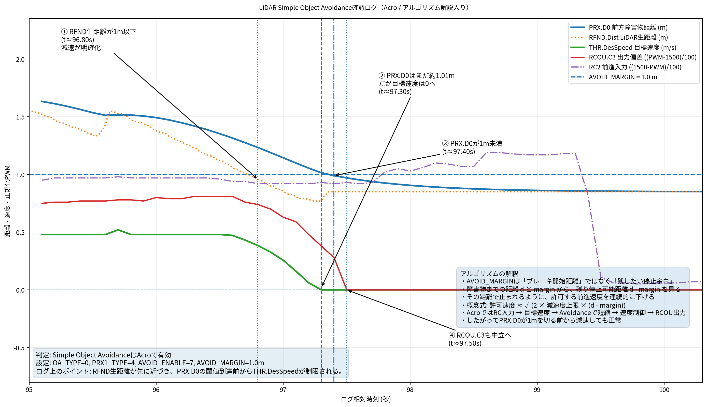
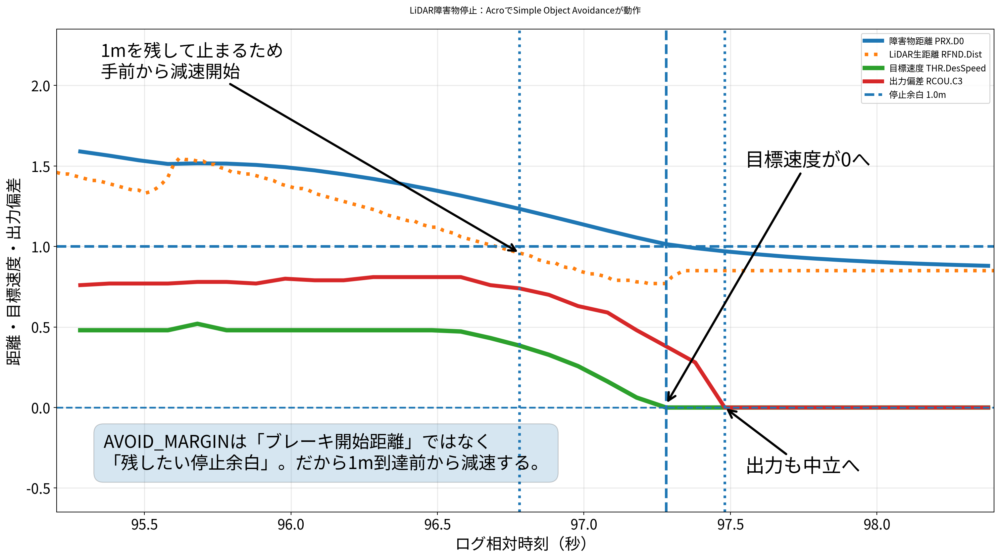

# LiDAR設定・検証記録

## 目的

タミヤ CC-02 + Pixhawk 6C Mini + ArduRover 構成で、前方LiDAR（Benewake TF-Luna）を使った障害物検出とSimple Object Avoidanceの動作を確認した。

今回の確認目的は、以下の3点である。

1. LiDARの距離値がArduPilot側で取得できること
2. RangeFinder値がProximity情報へ変換されること
3. Acroモード中に、障害物接近時に前進目標速度とスロットル出力が抑制されること

---

## 対象構成

| 項目 | 内容 |
| --- | --- |
| 車体 | タミヤ CC-02 |
| FC | Holybro Pixhawk 6C Mini |
| Firmware | ArduRover |
| 距離センサー | Benewake TF-Luna |
| 接続ポート | `TELEM2` |
| 用途 | 前方障害物検出 |
| 検証モード | Acro |
| 回避方式 | Simple Object Avoidance |
| BendyRuler | 今回は使用しない |

---

## LiDAR基本設定

LiDARはRangeFinderとして設定する。

```text
SERIAL2_PROTOCOL = 9
SERIAL2_BAUD     = 115

RNGFND1_TYPE     = 20
RNGFND1_ORIENT   = 0
RNGFND1_MIN_CM   = 20
RNGFND1_MAX_CM   = 700
```

### 設定メモ

- `SERIAL2_PROTOCOL=9` は、TELEM2をRangeFinder用シリアルとして使う設定。
- `SERIAL2_BAUD=115` は115200bps相当。
- `RNGFND1_TYPE=20` はBenewake TF系の距離センサー設定。
- `RNGFND1_ORIENT=0` は前向き。
- `RNGFND1_MAX_CM=700` は最大7m。  
  Object Avoidance確認では、2m上限だと `AVOID_MARGIN=2.0` と衝突しやすいため、屋外や余裕を持った検証では700cmが妥当。

---

## Object Avoidance設定

今回の検証では、BendyRulerではなくSimple Object Avoidanceを使う。

```text
OA_TYPE          = 0
PRX1_TYPE        = 4
AVOID_ENABLE     = 7
AVOID_MARGIN     = 1.0
AVOID_BACKUP_SPD = 0
```

### 設定メモ

| パラメータ | 意味 | 今回の判断 |
| --- | --- | --- |
| `OA_TYPE=0` | BendyRulerを使わない | Simple Object Avoidanceの切り分けを優先 |
| `PRX1_TYPE=4` | 1番目のRangeFinderをProximity Sensorとして使う | 必須 |
| `AVOID_ENABLE=7` | Avoidance有効化 | Simple Object Avoidance確認用 |
| `AVOID_MARGIN=1.0` | 障害物から残したい停止余白 | 室内・近距離テスト用 |
| `AVOID_BACKUP_SPD=0` | 後退維持を無効化 | 勝手な後退を避けるため |

---

## BendyRulerを使わなかった理由

一時的に `OA_TYPE=1` を設定したところ、Mission Planner上の距離表示が0になった。

その後、`OA_TYPE=0` に戻すと距離表示が復活した。

```text
OA_TYPE = 1
→ RangeFinder1表示が0.00になった

OA_TYPE = 0
→ sonarrange / 距離表示が復活
```

このため、今回の検証ではBendyRulerは使わず、まずSimple Object AvoidanceでLiDAR停止が成立するかを確認した。

---

## Mission Plannerでの確認項目

### まず見る項目

Mission Plannerの `Flight Data` → `Status` で以下を見る。

```text
sonarrange
```

今回、`PRX1_TYPE=4` にすると `RangeFinder1(cm)` のゲージ表示が0のままになる場面があったが、`sonarrange` は距離に追従していた。

そのため、`RangeFinder1(cm)` のゲージだけで判断せず、`sonarrange` とログ上の `RFND` / `PRX` を確認する。

### ログで見る項目

```text
RFND.Dist
RFND.Stat
PRX.D0
PRX.CDis
THR.DesSpeed
RCOU.C3
RCIN.C2
```

| 項目 | 意味 |
| --- | --- |
| `RFND.Dist` | LiDARの生距離に近い値 |
| `RFND.Stat` | RangeFinder状態 |
| `PRX.D0` | Proximity化された前方障害物距離 |
| `PRX.CDis` | 最近接障害物距離 |
| `THR.DesSpeed` | Roverが目標とする速度 |
| `RCOU.C3` | ESC / スロットル出力 |
| `RCIN.C2` | 送信機の前後入力 |

---

## 検証手順

### 1. パラメータ設定

以下を設定する。

```text
OA_TYPE          = 0
PRX1_TYPE        = 4
AVOID_ENABLE     = 7
AVOID_MARGIN     = 1.0
AVOID_BACKUP_SPD = 0
RNGFND1_MAX_CM   = 700
```

### 2. Mission Plannerから再起動

Mission Plannerで以下を実行する。

```text
Ctrl + F
→ Reboot Pixhawk
```

再起動後に再接続し、`sonarrange` が距離に追従するか確認する。

### 3. 静置確認

LiDAR正面に板や箱を置いて、距離値が変化するか確認する。

```text
0.5m → sonarrange が約0.5m相当
1.0m → sonarrange が約1.0m相当
2.0m → sonarrange が約2.0m相当
```

### 4. Acroで低速確認

Acroモードで、前進入力を入れた状態でLiDAR正面に障害物を近づける。

検証条件:

```text
モード: Acro
AVOID_MARGIN: 1.0m
障害物: LiDAR正面
期待動作: 1mを残して止まるように前進目標速度が抑制される
```

---

## 検証ログ

今回の検証ログ:

```text
2026-06-12 03-13-38.bin
```

対応するパラメータ保存候補:

```text
params/tuned/20260612_01_after_lidar_simple_avoid_acro_margin1_stop_check.param
```

---

## 結果概要

今回のログでは、次のことを確認した。

- `RFND.Dist` が距離変化に追従した。
- `PRX.D0` が出ており、RangeFinderからProximityへの変換が成功している。
- `AVOID_MARGIN=1.0` の条件で、障害物接近時に `THR.DesSpeed` が0へ低下した。
- その後、`RCOU.C3` が中立付近へ戻った。
- Acro中でもSimple Object Avoidanceが有効に働いていると判断できる。

---

## 重要な解釈

`AVOID_MARGIN` は「ブレーキ開始距離」ではない。

`AVOID_MARGIN` は「障害物から残したい停止余白」である。

そのため、`AVOID_MARGIN=1.0m` の場合、障害物が1mを切ってから急停止するのではなく、1mを残して止まれるように、その手前から目標速度を下げ始める。

概念的には以下のように考えられる。

```text
障害物距離 d を取得
停止余白 margin = AVOID_MARGIN

残り停止可能距離 = d - margin

if 残り停止可能距離 <= 0:
    前進方向の目標速度 = 0
else:
    その距離で止まれる最大速度を計算
    前進方向の目標速度 = min(操縦者の要求速度, 許可速度)
```

つまり、`PRX.D0` が1mを切る瞬間がブレーキ開始点ではない。  
距離が近づくほど、許可される前進速度が段階的に小さくなる。

---

## 画像1: 詳細解説版



この画像では、以下の流れを示している。

1. `RFND.Dist` が先に1m付近へ近づく
2. `THR.DesSpeed` が0へ低下する
3. `PRX.D0` が1m未満になる
4. `RCOU.C3` が中立付近へ戻る

この順序から、停止判定は単純な `PRX.D0 < 1.0m` の閾値だけではなく、障害物距離と停止余白から目標速度を制限していると解釈できる。

---

## 画像2: 簡略版



簡略版では、重要な点だけを示している。

- `AVOID_MARGIN` はブレーキ開始距離ではない
- 1mを残して止まるため、1m到達前から減速する
- `THR.DesSpeed` が0へ落ちる
- `RCOU.C3` も中立へ戻る

---

## 採用判断

```text
2026-06-12 03-13-38.bin
→ LiDAR Simple Object Avoidance / Acro margin1 stop check として採用
```

理由:

- `sonarrange` が距離に追従した。
- `RFND.Dist` がログに記録されている。
- `PRX.D0` がログに記録されている。
- `PRX1_TYPE=4` によるProximity化が成功した。
- Acro中に `THR.DesSpeed` が0へ落ちた。
- `RCOU.C3` が中立付近へ戻った。
- Simple Object AvoidanceがAcroで有効に働いた。

---

## 注意点

### Manualでは確認しない

ManualモードではObject Avoidance確認に使わない。  
Simple Object Avoidanceの確認はAcro、Guided、Autoなどで行う。

今回の確認ではAcroを使用した。

### BendyRulerは未採用

`OA_TYPE=1` は一度試したが、距離表示が0になる現象があったため、今回の採用設定には含めない。

現時点の採用設定は以下。

```text
OA_TYPE = 0
```

BendyRuler確認は、Simple Object Avoidanceの再現確認が十分に取れた後で別途行う。

### `RNGFND1_MAX_CM=200` は短い

GCS側の近距離Auto-stop用途なら2m上限でも使えるが、Object Avoidance検証では短すぎる場合がある。

今回の採用設定では以下を使う。

```text
RNGFND1_MAX_CM = 700
```

### `AVOID_MARGIN=1.0` は室内テスト用

今回の `AVOID_MARGIN=1.0` は室内または近距離確認用。  
屋外で余裕を持って停止確認する場合は、以下に戻すことを検討する。

```text
AVOID_MARGIN = 2.0
```

---

## 次回以降の作業

### 屋外再現確認

屋外で同じSimple Object Avoidanceの挙動を確認する。

候補ログ名:

```text
logs/accepted/20260612_02_lidar_simple_avoid_acro_margin2_outdoor_stop_check.bin
```

候補パラメータ名:

```text
params/tuned/20260612_02_after_lidar_simple_avoid_acro_margin2_outdoor_stop_check.param
```

推奨設定:

```text
OA_TYPE          = 0
PRX1_TYPE        = 4
AVOID_ENABLE     = 7
AVOID_MARGIN     = 2.0
AVOID_BACKUP_SPD = 0
RNGFND1_MAX_CM   = 700
```

### 追加確認項目

- `AVOID_MARGIN=2.0` で2m手前停止が再現するか
- 屋外でLiDAR距離値が安定するか
- 障害物がない状態で誤停止しないか
- BendyRulerを再検証する場合は、`OA_TYPE=1` 設定後に `sonarrange` / `PRX` が維持されるか
