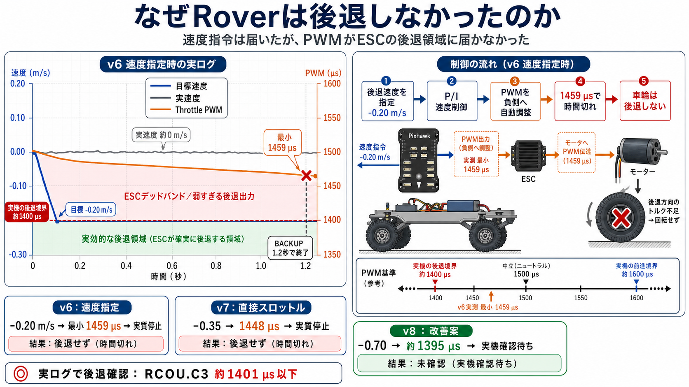

# 2026-07-26 Lua後退失敗 BINログ解析

更新日: 2026-07-27

対象:

- CC-02 Rover
- Pixhawk 6C Mini
- ArduRover 4.6.3
- Lua Guided障害物回避
- 実機用Lua v7相当（直接スロットル`-0.35`）

## 結論

LuaがBACKUP状態へ入らなかったのではなく、Luaの後退指令`-0.35`から生成されたThrottle出力が約`1448 us`にとどまり、実機ESCの有効な後退領域へ届かなかったことが、BINログから確認できた。

同じログ内のManual操作では、Throttle出力が約`1401 us`以下になると明確な負速度が発生し、`1380～1394 us`では約`-0.3～-0.57 m/s`の後退が記録されている。一方、Lua BACKUP中の`1448 us`では速度は概ね`-0.03～+0.03 m/s`に収まり、実質的に停止していた。

旧v6のログ66も追加解析した。v6は後退速度`-0.20 m/s`を指定しており、速度制御は速度誤差に応じてThrottle出力を約`-19%`から最大約`-28%`まで自動的に増加させていた。しかし、BACKUP時間`1.2秒`の間に`RCOU.C3`は最小でも約`1459 us`までしか下がらず、実速度は概ね`-0.02～+0.02 m/s`にとどまった。したがって、速度指定が無視されたのではなく、制御時間内に実機ESCの有効な後退PWM域へ到達しなかった。



したがって、今回バックしなかった直接原因は、次のとおりである。

```text
Lua後退指令 -0.35
  -> SERVO3出力 約1448 us
  -> ESCのニュートラル／デッドバンド内
  -> 車輪を後退駆動できない
  -> BACKUP時間だけ経過してTURNへ遷移
```

Luaの状態遷移、Guidedモードへの移行、Rangefinderの障害物検出が今回の直接原因ではない。

## 解析した生ログ

| ログ | パス | ファイルサイズ | SHA-256 | 主な解析区間 |
| --- | --- | ---: | --- | --- |
| 66・v6速度指定 | `C:\Users\ta1na\Documents\Mission Planner\logs\GROUND_ROVER\1\00000066.BIN` | `74,797,056 bytes` | `34EEF2A1F168F96A254832DE54EF6126BB704666AC3D2F78AE0F5382586121CE` | 2026-07-26 18:52:35～18:58:25 |
| 67・v7直接スロットル | `C:\Users\ta1na\Documents\Mission Planner\logs\GROUND_ROVER\1\67 2026-07-26 19-13-58.bin` | `23,904,256 bytes` | `198BAFF4F6A45DEBB9C7785699A6452C5D765940801B877D124114C60DEC100C` | 2026-07-26 19:09:01～19:09:42 |

生ログはGPS位置、Home位置、走行軌跡を含むためMission Plannerのローカル保存先に保持し、本リポジトリには解析結果だけを保存する。

## 当日の実機パラメータ

BINログ内の`PARM`から、後退出力に関係する値を確認した。

```text
RCMAP_THROTTLE = 3

SERVO3_FUNCTION = 70
SERVO3_MIN      = 1350
SERVO3_TRIM     = 1500
SERVO3_MAX      = 1750
SERVO3_REVERSED = 0

RC3_MIN      = 1000
RC3_TRIM     = 1706
RC3_MAX      = 1995
RC3_DZ       = 30
RC3_REVERSED = 0

ATC_SPEED_P  = 0.4604364
ATC_SPEED_I  = 0.4604364
ATC_SPEED_FF = 0
```

`SERVO3_TRIM=1500`から`SERVO3_MIN=1350`までの後退側出力幅は`150 us`である。直接スロットル`-0.35`の場合、概算出力は次になる。

```text
1500 - (1500 - 1350) * 0.35
= 1447.5 us
```

ログで確認した`RCOU.C3=1448 us`と一致する。

## 状態遷移

最終試験は19:09:14.96にGuidedへ入り、次の順で進んだ。

```text
19:09:15.06  IDLE -> CLEAR
19:09:17.66  CLEAR -> SLOW       d=2.85 m
19:09:21.88  SLOW -> STOP        d=1.97 m
19:09:23.38  STOP -> BACKUP
19:09:25.18  BACKUP -> TURN
```

その後も障害物距離が解消しなかったため、BACKUPとTURNを合計5回試行し、19:09:42.10に最大試行回数でFAULTへ入った。

各BACKUPでは次のメッセージが記録されている。

```text
LUAOA463: backing thr=-0.35
```

このため、Luaが後退処理を呼ばなかった可能性は否定できる。ただし、このログは現行v8.1の`-0.70`、PWM到達監視およびPWM付きメッセージを含まないため、v7相当の試験ログとして扱う。

## Lua後退とManual後退の比較

### Lua BACKUP

Lua BACKUP中は`THR.ThrOut=-35`となり、出力は立ち上がり後に`RCOU.C3=1448 us`で安定した。

| 時刻 | 操作 | RCOU.C3 | THR.Speed |
| --- | --- | ---: | ---: |
| 19:09:23.62 | Lua BACKUP | 立ち上がり中 | `-0.014 m/s` |
| 19:09:24.22 | Lua BACKUP | 約`1448 us` | `-0.009 m/s` |
| 19:09:24.82 | Lua BACKUP | 約`1448 us` | `-0.004 m/s` |
| 19:09:27.82 | Lua BACKUP再試行 | 約`1448 us` | `-0.014 m/s` |
| 19:09:28.42 | Lua BACKUP再試行 | 約`1448 us` | `-0.023 m/s` |
| 19:09:31.42 | Lua BACKUP再試行 | 約`1448 us` | `0.000 m/s` |

値はGPS/EKFの停止時ノイズ範囲に近く、継続した後退運動は確認できない。

### Manual後退

最終Guided試験直前のManual区間では、Throttle出力をさらに下げると明確な負速度が発生した。

| 時刻 | 操作 | RCOU.C3 | THR.Speed |
| --- | --- | ---: | ---: |
| 19:09:03.12 | Manual後退 | `1401 us` | `-0.196 m/s` |
| 19:09:03.32 | Manual後退 | `1385 us` | `-0.509 m/s` |
| 19:09:03.62 | Manual後退 | `1380 us` | `-0.573 m/s` |
| 19:09:05.42 | Manual後退 | `1394 us` | `-0.407 m/s` |

この実機では、少なくとも約`1394～1401 us`までThrottle出力を下げたときに後退が成立している。`1448 us`はそれより約`47～54 us`高く、有効な後退駆動になっていない。

## 旧v6速度指定（ログ66）の比較

ログ66では、次の特徴から実機用Lua v6の試験であると判断できる。

- `0.00 m`を障害物なしとして`SLOW -> CLEAR`へ戻すv6固有の状態遷移がある
- v7で追加された`LUAOA463: backing thr=-0.35`がない
- BACKUP時間がv6の設定どおり約`1.2秒`
- BACKUP中の`THR.DesSpeed`がv6の設定どおり`-0.20 m/s`

`LOG_DISARMED=0`、`LOG_FILE_DSRMROT=0`のため、ログ66には複数回のArm/Disarmと複数の試験が同居している。ログ内ではBACKUPが合計12回実行された。

最初のBACKUPでは、開始直前の目標速度が約`+1.17 m/s`であった。`ATC_ACCEL_MAX=1.0 m/s²`による速度目標の変化制限を受け、1.2秒後も`THR.DesSpeed=+0.15 m/s`であり、負の目標速度まで到達しなかった。

残り11回では、`THR.DesSpeed=-0.20 m/s`まで到達している。代表区間は次のとおり。

| 時刻 | 目標速度 | 実速度 | Throttle出力の変化 | 最小RCOU.C3 |
| --- | ---: | ---: | ---: | ---: |
| 18:53:42 | `-0.20 m/s` | `+0.006～+0.013 m/s` | `-19.3% -> -27.6%` | `1460 us` |
| 18:53:49 | `-0.20 m/s` | `-0.017～-0.012 m/s` | `-18.5% -> -25.4%` | `1463 us` |
| 18:54:06 | `-0.20 m/s` | `-0.010～-0.007 m/s` | `-18.6% -> -25.9%` | `1462 us` |
| 18:56:07 | `-0.20 m/s` | `+0.012～+0.015 m/s` | `-20.1% -> -28.0%` | `1459 us` |

目標速度と実速度に差が残っている間、Throttle出力は時間とともに負側へ増加している。このため、Roverの速度制御はスロットル量を自動調整していたと判断できる。ただし、当時の設定は次のとおりであった。

```text
ATC_SPEED_P  = 0.4604364
ATC_SPEED_I  = 0.4604364
ATC_SPEED_FF = 0
ATC_ACCEL_MAX = 1.0 m/s²
BACK_SPEED_MS = 0.20 m/s
BACK_MS       = 1200 ms
```

`ATC_SPEED_FF=0`のため、目標速度に応じた基準スロットルの先行加算はなく、主に速度誤差に対するP/I制御で出力を増やす構成だった。BACKUPは約1.2秒で終了するため、出力が実機後退域へ達する前にTURNへ遷移していた。

同じログ66では、`RCOU.C3=1350～1399 us`の記録中に平均約`-0.60 m/s`の負速度が出ている。一方、v6速度制御の最小値`1459 us`はこの範囲より約`60 us`以上高い。したがって、旧v6についても、後退しなかった直接原因は「速度指定機能がなかったこと」ではなく「生成されたPWMが実機ESCの後退領域へ届かなかったこと」である。

## v8.1の判断

現行v8.1は次の設定である。

```lua
local BACK_THROTTLE = -0.70
```

現在の`SERVO3_MIN=1350`、`SERVO3_TRIM=1500`から、期待される出力は次になる。

```text
1500 - (1500 - 1350) * 0.70
= 1395 us
```

これは今回Manual後退が成立した約`1394～1401 us`の範囲に入る。そのため、v8.1の`-0.70`は今回の原因に対する妥当な診断値である。

v8.1ではBACKUP開始1.0秒後に実PWMを検査し、`1405 us`以下へ届かない場合は`FAULT`停止保持へ入る。これにより、時間経過だけでBACKUP成功と扱う問題を防止する。ただし、v8.1の実機ログと物理後退はまだ確認していない。計算値とPWM検査の実装だけで解決済みとは扱わない。

## 次回の確認手順

1. 車輪を浮かせるか、十分に広い平坦地で機体を固定して開始する。
2. `APM/scripts`に現行v8.1だけが配置されていることを確認する。
3. 起動時に次の識別文字列を確認する。

```text
LUAOA463: loaded 20260727-rover463-staged-v8.1
```

4. BACKUP中に次の形式のログを確認する。

```text
LUAOA463: back thr=-0.70 pwm=1395
LUAOA463: back pwm ok 1395; motion unverified
```

5. 合格条件を次の4層で判定する。

| 層 | 合格条件 |
| --- | --- |
| ロジック | STOPからBACKUPへ遷移する |
| 指令 | `back thr=-0.70`が継続する |
| 出力 | Throttle PWMが約`1395 us`まで下がる |
| 物理 | 車輪が逆回転し、車体速度が負になる |

6. PWMが約`1395 us`でも車輪が動かない場合だけ、ESCの後退設定、ニュートラル、後退ロック動作、配線を確認する。
7. 試験後は停止、HOLD、Disarmを確認し、通常運用設定へ戻す。

## 別件: RC3中立値の不一致

ログでは次の組合せが確認された。

```text
RC3_TRIM       = 1706
RCIN.C3中立付近 = 1509
```

Manualで入力が中立付近でも`RCOU.C3`が約`1464 us`になる区間があり、RC入力の中立校正と一致していない可能性がある。

これは`vehicle:set_steering_and_throttle()`による今回の直接Lua出力とは分けて扱う。ただし、Manual操作やWebGCSの`1500`中立指令へ影響する可能性があるため、次回は次を実機確認する。

- Mission PlannerのRadio Calibrationで物理送信機の中立値を確認する
- WebGCSの停止指令`1500`時にMission PlannerのRC3と`RCOU.C3`を確認する
- 物理送信機とWebGCSのどちらを基準にするか決めてからRC3校正値を変更する

この確認前に、ログ値だけを根拠として`RC3_TRIM`を変更しない。

## 最終判断

今回のBINログから確認できた範囲では、後退失敗の直接原因はLuaの後退指令値不足である。

```text
-0.20 m/s速度指定 -> 最小約1459 us -> 実質停止
-0.35 -> 1448 us -> 実質停止
-0.70 -> 約1395 us見込み -> 次回実機確認
```

v8.1で約`1395 us`の出力と物理後退を確認できれば、LuaからESCまでの後退出力契約が成立したと判断する。
