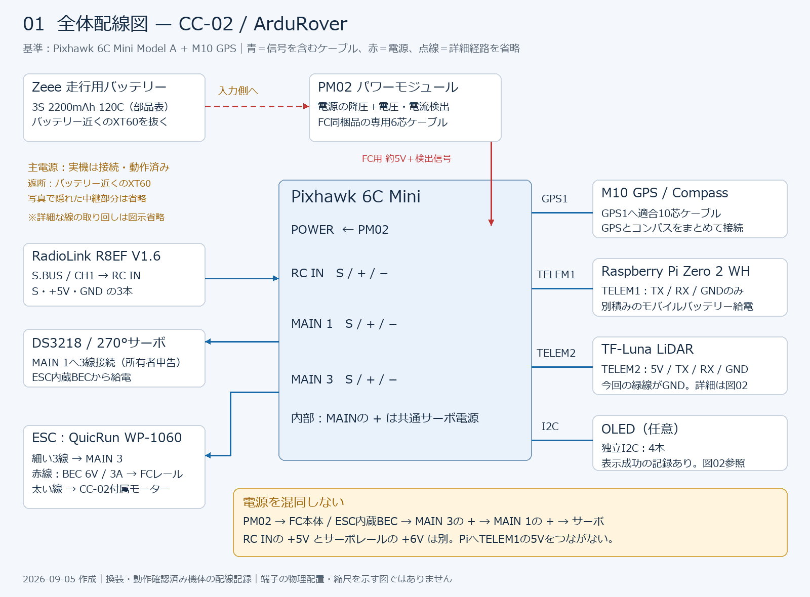

# 配線

実機はPixhawk 6C Miniへの換装と動作確認を完了しています。本資料は、そのCC-02の接続先、ケーブルの端子対応、電源系統をまとめます。構成は[部品リスト](../../docs/11_部品リスト.md)と2026-09-05までの配線記録に基づきます。動作確認日と資料更新日は異なり、2026-09-05に全配線を再測定したものではありません。

## 目次

- [1. 配線図と接続一覧](#connections)
- [2. 電源系統](#power)
- [3. 各機器の接続](#devices)
- [4. 接続後の確認と設定記録](#checks)
- [5. 配線写真](#photos)
- [6. 換装履歴](#history)
- [7. 関連資料](#references)

<a id="connections"></a>
## 1. 配線図と接続一覧



[ケーブル製作・端子対応図](diagrams/ardurover-wiring-cables.png) / [全体図SVG](diagrams/ardurover-wiring-overview.svg) / [端子対応図SVG](diagrams/ardurover-wiring-cables.svg) / [図面の説明](diagrams/README.md)

図は接続関係を示します。端子の実際の上下・左右は、機器の印字と公式ピン配置図で確認してください。

| 機器 | Pixhawk 6C Miniの接続先 | ケーブル / 信号 | 電源 |
| --- | --- | --- | --- |
| PM02 | `POWER` | セット付属6芯ケーブル。電源と電圧・電流検出 | 走行用バッテリーから降圧 |
| RadioLink R8EF V1.6 | `RC IN` | 受信機の`S.BUS / CH1`から3線 | RC INの5V |
| DS3218ステアリングサーボ | `MAIN 1` | S / + / −の3線 | ESC内蔵BECからサーボレール経由 |
| QuicRun WP-1060 ESC | `MAIN 3` | 制御用3線。太いモーター線はCC-02付属モーターへ | 主電源は走行用バッテリー、BEC出力はサーボレールへ |
| M10 GPS / Compass | `GPS1` | 適合10芯ケーブルでGPSとコンパスを接続 | FC側 |
| Raspberry Pi Zero 2 WH | `TELEM1` | TX / RX / GNDの3線 | 別積みモバイルバッテリー |
| Benewake TF-Luna | `TELEM2` | 5V / TX / RX / GNDの4線 | TELEM2の5V |
| OLED（任意） | 独立`I2C` | VCC / SCL / SDA / GNDの4線 | I2Cの5V |

独立したSafety ButtonとBuzzerは接続しない構成です。これはM10の適合ケーブル内の線を切る指示ではありません。USBは常用せず、設定・ファームウェア書き込み・復旧作業で必要に応じて使います。旧M8Nの`GPS2`変換配線は採用していません。

<a id="power"></a>
## 2. 電源系統

### 2.1 給電経路

FC本体、サーボ、Piの給電を分けて扱います。FCの`POWER`からサーボ電源が供給される構成ではありません。

| 系統 | 接続関係 | 記録・確認範囲 |
| --- | --- | --- |
| 走行用主電源 | Zeee 3S LiPo 2200mAh 120C → PM02 / ESC系 | バッテリーに近い太い電源線のXT60を抜いて遮断する。PM02周辺の隠れた中継配線の詳細は図面では省略。 |
| FC本体 | PM02 → `POWER` | 6C Mini同梱のPM02とケーブルを使用。約5V給電と電圧・電流検出。旧Power Moduleは流用しない。 |
| サーボ | ESC内蔵BEC → `MAIN 3`の+ → 共通サーボレール → `MAIN 1`の+ | 既存構成記録ではWP-1060の赤線から給電。BECは公称6V / 3A。 |
| Raspberry Pi | 別積みの小型モバイルバッテリー → Pi電源入力 | TELEM1の5Vは接続しない。FCとPiのGNDはUARTケーブルで共通にする。 |

走行用XT60を抜いてもPiの別電源は別途管理します。FCも同時に電源が落ちるかは、PM02への経路とUSB等の追加給電の有無で確認します。RC INの+5Vとサーボレールの+6Vは別系統です。別BECを追加する場合、既存BECのプラス出力と直結しません。

### 2.2 機器情報と図面の記載範囲

以下は資料に収録した情報の範囲です。実機の換装や動作確認の残作業を示すものではありません。

| 項目 | 記録内容 | 図面・資料で省略した詳細 |
| --- | --- | --- |
| 主電源ハーネス | XT60、白色中継コネクタ、太い赤黒線を写真で確認 | 写真で隠れた中継部分、PM02の入出力端子までの取り回し。全体図ではESC主電源の詳細線を省略。 |
| ステアリングサーボ | DS3218、20kg表記、270°版。MAIN 1に接続して動作。 | 製品の電気仕様、負荷電流の測定値。270°は製品仕様上の角度であり、車両の操舵範囲ではない。 |
| モーター | CC-02キット付属品を使用 | 詳細型番。 |
| Pi用電源 | 小型モバイルバッテリーを別積み | 現用品の型番・出力定格。旧部品表のC25 2500mAhは参考記録として扱う。 |
| PM02 | Mission Plannerで電圧表示を確認した記録あり | 実測との比較・負荷電流の詳細測定値。 |

<a id="devices"></a>
## 3. 各機器の接続

### 3.1 共通事項

- 作業前に走行用バッテリー、USB、Pi電源を外します。
- コネクタ形状だけで判断せず、Pin1と各信号を確認します。挿し込み面と電線側では左右が反転します。
- TXは送信、RXは受信です。UARTはTXから相手のRXへ接続し、GNDを共通にします。
- 線色は製品やケーブルで異なります。以下の現物色・推奨色より、端子番号と導通を優先します。
- 使用しない線は1本ずつ絶縁します。通電中に抜き差しや導通測定をしません。

### 3.2 受信機・ステアリング・ESC

3線コネクタは本体印字の`S / + / −`に合わせます。

| FC端子 | 接続相手 | 信号・電源の向き |
| --- | --- | --- |
| RC IN `S` | R8EF `S.BUS / CH1`信号 | 受信機 → FC。受信機をS.BUS出力モードで使用。 |
| RC IN `+ / −` | R8EF電源 / GND | FCから受信機へ5V給電 |
| MAIN 1 `S` | DS3218信号 | FC → サーボ |
| MAIN 1 `+ / −` | DS3218電源 / GND | サーボレールから給電 |
| MAIN 3 `S` | ESC制御信号 | FC → ESC |
| MAIN 3 `+ / −` | ESCのBEC出力 / GND | ESCからサーボレールへ給電 |

送信機はRadioLink T8FB BTです。接写写真だけでは各線の行き先を全て追えないため、MAIN 1/3の用途は既存の接続・動作確認記録に基づきます。

### 3.3 M10 GPS / Compass

適合した10芯ケーブルで`GPS1`へ接続します。2026-06-09に屋内`Not Fix`、屋外`3D Fix`を確認し、2026-06-12にRover用M10を採用しました。`Not Fix`は認識済みでも測位が確定していない状態です。

旧M8NのGPS UARTとCompass I2Cを分けた配線は使いません。屋外走行前にコンパスを有効化し、機体を北・東・南・西へ向けてHUD方位を確認します。モジュールの矢印だけでCompass Orientationを変更しないでください。

### 3.4 Raspberry Pi — TELEM1

Piの40ピンGPIOヘッダを使います。**TELEM1の5VはPiに接続しません。** UART信号は3.3Vです。

| TELEM1 Pin | FC側の機能 | Pi側 / 処理 |
| --- | --- | --- |
| 1 | `VCC +5V` | 未接続、絶縁 |
| 2 | `UART_TX` | 物理Pin10 / GPIO15 / RXD0へ |
| 3 | `UART_RX` | 物理Pin8 / GPIO14 / TXD0から |
| 4 | `CTS` | 未接続 |
| 5 | `RTS` | 未接続 |
| 6 | `GND` | 物理Pin6 / GNDへ |

物理番号とGPIO番号を混同しないでください。製作時の推奨色はPin2＝青、Pin3＝黄、Pin6＝黒です。Pin1に赤線があっても給電には使いません。

Pi側は`enable_uart=1`、シリアルコンソール無効を前提に、`/dev/serial0`が使えることを確認してMAVLink Router / Rpanionを起動します。記録上の通信速度は921600bpsです。FC側設定は4節にまとめています。

### 3.5 TF-Luna — TELEM2

UARTモードで4本接続します。以下の色はこの機体のケーブル記録で、他のTF-Lunaケーブルには適用できません。

| TELEM2 Pin | FC側の機能 | TF-Luna No. / 機能 | 現物色 |
| --- | --- | --- | --- |
| 1 | `VCC +5V` | No.1 / +5V | 赤 |
| 2 | `UART5_TX` | No.2 / RXD（I2C時SDA） | 青 |
| 3 | `UART5_RX` | No.3 / TXD（I2C時SCL） | 黄 |
| 4 | `UART5_CTS` | 接続しない | — |
| 5 | `UART5_RTS` | 接続しない | — |
| 6 | `GND` | No.4 / GND | 緑 |

TF-Luna側の**No.5＝白（Configuration Input）とNo.6＝黒（Multiplexing Output）は未接続**です。白をGNDに接続するとI2Cモードになります。今回の黒線はGNDではありません。

現物の並びは「本体正面、レンズを上、コネクタを手前、線を下に見て、左から赤・青・黄・緑・白・黒」と記録されています。最終判断は公式番号図と導通で行います。公式マニュアルのTable 6は番号と機能を定義し、線色は定義していません。Quick Implementation資料の色例とも異なります。

FC側ピグテールはPin1＝赤、Pin2＝青、Pin3＝黄、Pin6＝緑または黒を推奨色としていました。黒を使う場合も、TF-Luna側では**緑のNo.4**へ接続します。既定通信速度は115200bpsです。

### 3.6 OLED — 独立I2C（任意）

旧FCセット付属OLEDを使用した記録です。旧4Pコネクタを無理に挿さず、6C Mini側は適合JST-GH 4Pを使用します。

| I2C Pin | FC側の機能 | OLED基板印字 / 現物色 |
| --- | --- | --- |
| 1 | `VCC` | VCC / 赤 |
| 2 | `I2C2_SCL` | SCL / 緑 |
| 3 | `I2C2_SDA` | SDA / 黄 |
| 4 | `GND` | GND / 黒 |

OLED基板の印字順はGND / VCC / SCL / SDAです。FC側のピン順とは異なります。電源を切って配線し、短絡がないことを確認してから表示を確認します。切り分けはOLED単体で行い、複数のI2C機器を接続する場合はアドレス衝突や接触不良を確認します。

2026-06-08に`NTF_DISPLAY_TYPE=1`で再起動後の表示に成功しています。当時の候補はSSD1306＝1、SH1106＝2です。別製品へ適用する場合は表示ICを確認します。

<a id="checks"></a>
## 4. 接続後の確認と設定記録

### 4.1 配線変更・再組立て時の確認順序

以下は今後の作業に使う参考手順です。換装済みの実機の残作業一覧ではありません。

1. 無通電で、極性、端子番号、GND導通、不要線の絶縁を確認する。
2. 変更する電源経路を確認し、接続する負荷の仕様に合った電圧と極性を確認する。
3. 機器を1つずつ接続し、認識を確認する。配線を変更するときは再び全電源を外す。
4. 車輪を浮かせた状態でRC入力、操舵の中立と左右限界、ESCのニュートラルと前後進を確認する。
5. DISARM時停止、RCフェイルセーフ、モードスイッチ、XT60での遮断範囲を確認する。
6. 屋外走行前にGPS 3D Fix、コンパス方位、PreArm、磁場差、EKFを確認する。
7. PM02表示を実測と比較し、TF-Luna表示を既知距離と比較する。距離上限はAuto-stop試験と屋外反射条件で判断する。

詳細は[インストール・設定手順](05_ArduRoverインストール設定手順.md)と[パラメータ記録](06_ArduRoverパラメータ.md)を参照してください。

### 4.2 換装後に記録した設定値

以下は主に2026-06-09〜12の記録です。現在の実機から再取得した値でも、一括適用する設定一覧でもありません。

| 対象 | 記録値 | 確認事項 |
| --- | --- | --- |
| PM02 | `BATT_MONITOR=4`, `BATT_VOLT_PIN=8`, `BATT_CURR_PIN=4`, `BATT_VOLT_MULT=18.62` | 倍率は実測比較で再確認。 |
| RC | `RCMAP_ROLL=1`, `RCMAP_THROTTLE=2`, `MODE_CH=5` | 実スイッチ位置とManual / Hold / Acro割当を確認。部品表のCH8記載と一致しないため現物を優先。 |
| 補助スイッチ | `RC7_OPTION=153` | 実スイッチと機能を確認。 |
| ステアリング | `SERVO1_FUNCTION=26` | 中立・方向・左右限界を確認。 |
| ESC | `SERVO3_FUNCTION=70`, `MOT_SAFE_DISARM=1` | DISARM時と信号喪失時の停止を確認。 |
| GPS / Compass | `GPS1_TYPE=1`, `COMPASS_ENABLE=0` | `0`は室内Manual試験時の値。屋外前に有効化し、方位・校正を確認。 |
| TELEM1 / Pi | `SERIAL1_PROTOCOL=2`, `SERIAL1_BAUD=921` | 921600bps。Pi側との一致を確認。 |
| TELEM2 / TF-Luna | `SERIAL2_PROTOCOL=9`, `SERIAL2_BAUD=115`, `RNGFND1_TYPE=20` | 115200bps。距離表示を確認。 |
| 距離範囲 | `RNGFND1_MIN_CM=20`, `RNGFND1_MAX_CM=700` | 旧上限200cmからの変更記録。700cmの採否は実測で判断。 |
| アーミング | `ARMING_CHECK=1` | PreArm表示と停止手段を確認。 |

### 4.3 動作確認の記録

| 時点 | 結果 |
| --- | --- |
| 2026-06-08 | OLED表示成功。TF-LunaはSonar Range＝1.50mの記録あり。 |
| 2026-06-09 | R8EF認識、PiのTELEM1通信、M10の屋外3D Fixを確認。 |
| 2026-06-12時点のまとめ | PM02電圧表示、Manual操舵、Manual前後進、GPS / Compass認識、LiDAR距離表示を確認した記録。 |
| 日付未記載のチェック記録 | RCチャンネル割当、モード一致、車輪を浮かせたフェイルセーフ確認に完了印あり。ただし後続の確認事項にも残っているため、現在の完了保証には使わない。 |
| 2026-09-05 | 機器情報と写真を追加。通電・導通の再測定は未実施。 |

<a id="photos"></a>
## 5. 配線写真

<a id="2026-09-05-現物写真と所有者による補足"></a>
### 5.1 2026-09-05受領写真

受領日をファイル名に使用しています。撮影日自体は未確認です。原本を無加工で保存しています。

| 写真 | 観察できること | 写真だけでは確定しないこと |
| --- | --- | --- |
| [主電源・XT60・PM02/ESC周辺](photos/wiring/20260905_主電源_XT60_PM02_ESC.png) | 黄色XT60、白色中継コネクタ、太い赤黒線、透明被覆モジュール、ESC・モーター周辺。 | 被覆・固定材の下の配線、モジュール型番・入出力表示、電流計測経路、導通。PM02との対応は既存記録による。 |
| [MAIN・RC IN接写](photos/wiring/20260905_Pixhawk6Cmini_MAIN_RCIN接写.png) | 筐体印字と3線コネクタの挿入状態。 | 斜めの角度と重なった線のため、全端子のS/+/-位置と各線の行き先。 |

同日に確認したXT60遮断、Pi別電源、DS3218 270°版、CC-02付属モーターの情報は2節に反映しています。

### 5.2 換装前の写真（2026-06-08）

以下は旧Pixhawk 2.4.8Pro系の配線です。現在の6C Miniの接続先を示す写真ではありません。


| 日付 | 写真パス | 写っているもの | メモ |
| --- | --- | --- | --- |
| 2026-06-08 | [写真](photos/wiring/20260608_換装前配線_Pixhawk出力側_受信機周辺.JPG) | Pixhawk出力ピン側、受信機周辺、サーボ/ESC系の配線 | MAIN OUT側の接続状態を確認するための写真。ピン番号とケーブル行き先は別途ラベル確認が必要。 |
| 2026-06-08 | [写真](photos/wiring/20260608_換装前配線_Pixhawk上面ポート接続.JPG) | Pixhawk 2.4.8Pro上面、POWER、TELEM、GPS、I2C、SWITCH、BUZZER付近 | 旧FC撤去前のポート接続状態。6C miniへの変換表を作る元資料。 |
| 2026-06-08 | [写真](photos/wiring/20260608_換装前配線_TELEM2_コンパニオン接続.JPG) | Pixhawk TELEM2接続、コンパニオンコンピュータ側と思われる配線 | TELEM2を6C mini側のテレメトリポートへ移すための近接写真。 |
| 2026-06-08 | [写真](photos/wiring/20260608_換装前配線_受信機_RadioLinkR8EF_SBUS接続.JPG) | RadioLink R8EF V1.6 受信機、`S.BUS / CH1` 接続 | 受信機種別とSBUS接続を確認する写真。 |
| 2026-06-08 | [写真](photos/wiring/20260608_換装前配線_GPSポート_M8N接続.JPG) | Pixhawk GPSポート、M8N GPS配線、GPS周辺コネクタ | GPS UART系を6C miniへ移すための近接写真。 |
| 2026-06-08 | [写真](photos/wiring/20260608_換装前配線_I2Cポート_コンパス接続.JPG) | Pixhawk I2Cポート、M8N Compass I2C系配線 | Compass I2C系を6C miniへ移すための近接写真。 |


### 5.3 換装先6C Miniのポート写真（2026-06-08）


| 日付 | 写真パス | 写っているもの | メモ |
| --- | --- | --- | --- |
| 2026-06-08 | [写真](photos/fc_mount/20260608_換装先FC_Pixhawk6Cmini_上面.JPG) | Pixhawk 6C Mini上面、矢印、`AUX5`、`AUX6`、`RC IN` | Holybro公式の Pixhawk 6C Mini Model A (Current) のポート図と一致。 |
| 2026-06-08 | [写真](photos/fc_mount/20260608_換装先FC_Pixhawk6Cmini_POWER_TELEM_GPS_CAN側.JPG) | `POWER`、`TELEM1`、`TELEM2`、`GPS1`、`CAN1`、`CAN2` | PM02、TELEM1、TELEM2、GPS1の接続先確認に使用。 |
| 2026-06-08 | [写真](photos/fc_mount/20260608_換装先FC_Pixhawk6Cmini_MAIN_AUX_RCIN側.JPG) | `MAIN 1-8`、`AUX 1-4`、`AUX5`、`AUX6`、`RC IN` | MAIN 1/3の位置確認用。 |
| 2026-06-08 | [写真](photos/fc_mount/20260608_換装先FC_Pixhawk6Cmini_DSM_RSSI_RCIN側.JPG) | `DSM`、`RSSI`、`RC IN` | RadioLink R8EFのSBUSは`RC IN`へ移行済み。 |
| 2026-06-08 | [写真](photos/fc_mount/20260608_換装先FC_Pixhawk6Cmini_USB_FMUDebug_GPS2_I2C側.JPG) | USB-C、`FMU Debug`、`GPS2`、`I2C` | `GPS2`は6ピン対応。旧M8NをGPS2へまとめる検討時の写真。流用は後に中止。 |


<a id="history"></a>
## 6. 換装履歴

### 6.1 旧FCからの変更点

| 対象 | 換装前 | 換装後の採用構成 / 結果 |
| --- | --- | --- |
| FC電源 | 旧Power Module | 6C Mini同梱PM02 → POWER |
| Pi | 旧FC TELEM2 | TELEM1へ移行 |
| LiDAR | 旧FC SERIAL4/5系 | TELEM2へ移行。6C MiniのSERIAL4はGPS2に対応するため設定を流用しない。 |
| GPS / Compass | M8N、GPSとI2Cの二股 | GPS2変換はNo GPS未解決で中止。M10 → GPS1を採用。 |
| 受信機 | R8EF S.BUS | RC INへ移行 |
| 操舵 / ESC | MAIN OUT 1 / 3 | MAIN 1 / 3を継続 |
| OLED | 旧セット付属品 | 独立I2Cへ変換、表示成功 |
| 独立Safety Button / Buzzer | 接続あり | 接続しない構成。電源の物理遮断、RC操作、GCS表示・通知で運用。 |
| USB | 旧配線に含む | 常用せず設定・復旧用 |

当時の写真では裏面にModel / Rev等の追加表記がなく、箱もありませんでした。6C Mini Model A (Current)相当との判断は写真と公式ポート図によります。

### 6.2 SERIAL・距離設定の変更記録

| パラメータ | 換装前 | 2026-06-10の記録 |
| --- | --- | --- |
| `SERIAL4_PROTOCOL` | 9（LiDAR） | 5（GPS2検討時） |
| `SERIAL4_BAUD` | 115 | 230（GPS2検討時） |
| `SERIAL2_PROTOCOL` / `SERIAL2_BAUD` | — | 9 / 115（TELEM2 LiDAR） |
| `SERIAL5_PROTOCOL` | -1 | -1 |
| `RNGFND1_TYPE` / `RNGFND1_MIN_CM` | 20 / 20 | 20 / 20 |
| `RNGFND1_MAX_CM` | 200 | 700 |

PiとLiDARのTELEM1/2を逆にする案もありましたが、採用構成はPi＝TELEM1、LiDAR＝TELEM2です。1つのUARTポートに両機器を同時接続しません。

### 6.3 旧M8NのGPS2変換記録（流用中止）

GPS LEDは点灯しましたが、Mission PlannerのNo GPSを解決できず、M10へ移行しました。LED点灯はGPS通信成功の証拠にはなりません。以下は当時の検討手順を保存したもので、現在の組立て手順には使用しません。

<details>
<summary>中止した変換案・端子対応・作業記録</summary>


この節は旧M8N流用検討時の履歴である。
2026-06-12時点ではRover向けに追加購入したM10 GPSを`GPS1`で採用したため、旧M8Nの`GPS2`流用作業は中止する。

当時は、現行M8Nの2股配線をPixhawk 6C Miniの`GPS2` 6ピンへまとめる方針だった。

| GPS2側信号 | 接続する現行M8N側 | 注意 |
| --- | --- | --- |
| `VCC` | GPS UART系またはCompass I2C系の5V | 5Vは共通化する。重複給電にならないよう配線を整理する。 |
| `UART TX` | M8N GPS側 `RX` | FCからGPSへ送る線。TX/RXは交差接続。 |
| `UART RX` | M8N GPS側 `TX` | GPSからFCへ送る線。TX/RXは交差接続。 |
| `I2C SCL` | M8N Compass側 `SCL` | SCL同士を接続。 |
| `I2C SDA` | M8N Compass側 `SDA` | SDA同士を接続。 |
| `GND` | GPS UART系またはCompass I2C系のGND | GNDは共通化する。 |

`GPS2` 6ピンへまとめられない場合だけ、`GPS1`または独立`I2C`ポートを予備候補として使う。

#### 当時のGPSコネクタ作業方針

現行Pixhawk Pro / 2.4.8Pro系セット付属のM8N GPSコネクタを、6C Miniへそのまま流用するのは避ける。
理由は、旧コネクタと6C Mini側JST-GHのハウジング形状、爪位置、接触圧が一致しない可能性があるため。

旧Pixhawk標準GPSポートのピン順:

```text
旧Pixhawk GPS port Pin1 = VCC +5V
旧Pixhawk GPS port Pin2 = TX OUT
旧Pixhawk GPS port Pin3 = RX IN
旧Pixhawk GPS port Pin4 = CAN2 TX / 未使用扱い
旧Pixhawk GPS port Pin5 = CAN2 RX / 未使用扱い
旧Pixhawk GPS port Pin6 = GND
```

GPSモジュール側の信号として見ると、FCのTXはGPSのRXへ、FCのRXはGPSのTXへ入る。
したがって、現行M8N GPS側6ピンは以下として扱う。

```text
M8N GPS側 Pin1 = VCC +5V
M8N GPS側 Pin2 = GPS RX
M8N GPS側 Pin3 = GPS TX
M8N GPS側 Pin6 = GND
```

現行GPS 6ピンケーブルの写真から読める色:

```text
赤 = Pin1 +5V
黄 = Pin2 GPS RX
緑 = Pin3 GPS TX
黒 = Pin6 GND
```

6C Mini `GPS2`へ接続する場合:

```text
6C Mini GPS2 Pin1 VCC      -> 現行GPS 赤 +5V
6C Mini GPS2 Pin2 UART_TX  -> 現行GPS 黄 GPS RX
6C Mini GPS2 Pin3 UART_RX  -> 現行GPS 緑 GPS TX
6C Mini GPS2 Pin4 I2C_SCL  -> GPS単体確認では未接続
6C Mini GPS2 Pin5 I2C_SDA  -> GPS単体確認では未接続
6C Mini GPS2 Pin6 GND      -> 現行GPS 黒 GND
```

2026-06-08:

- 上記配線方針でGPS LED点灯を確認。
- GPSへの5V/GND給電はOK。
- 次はMission Planner上でGPSステータス、衛星数、HDOPを確認する。

選択肢:

| 方法 | 判断 | メモ |
| --- | --- | --- |
| 既存コネクタから端子を抜いて上下反転/差し替え | 非推奨 | 小型端子を壊しやすく、爪保持が甘くなると走行中に接触不良になる。ハウジング形状が違う場合、端子を入れ替えても根本解決にならない。 |
| 現行GPSケーブルを途中で切り、6C Mini用JST-GH 6Pピグテールへ半田付け | 推奨 | 6C Mini側は正規JST-GHを使える。信号名で接続でき、導通確認もしやすい。 |
| M8N側コネクタから完全に作り直す | 予備 | M8N側端子規格が分かる場合のみ。作業量が増える。 |

推奨作業:

1. 現行M8N GPS側ケーブルを、GPS本体側に十分な余長を残して切る。
2. 6C Mini `GPS2`用JST-GH 6Pピグテールを用意する。
3. 現行GPS側の各線を、旧コネクタのピン位置または導通で `5V / RX / TX / GND` として特定する。
4. 以下の対応で半田付けする。

```text
6C Mini GPS2 Pin1 VCC      -> M8N GPS 5V
6C Mini GPS2 Pin2 UART_TX  -> M8N GPS RX
6C Mini GPS2 Pin3 UART_RX  -> M8N GPS TX
6C Mini GPS2 Pin4 I2C_SCL  -> 未接続、またはCompass SCLへまとめる場合のみ接続
6C Mini GPS2 Pin5 I2C_SDA  -> 未接続、またはCompass SDAへまとめる場合のみ接続
6C Mini GPS2 Pin6 GND      -> M8N GPS GND
```

初回確認では、GPS UARTだけを優先してPin1/2/3/6を接続する。
Compass I2Cは、GPSが認識されてから独立`I2C`へ接続するか、`GPS2` Pin4/5へまとめる。

注意:

- 切断前に写真を撮る。
- 1本ずつ半田付けし、熱収縮チューブで絶縁する。
- 通電前に`VCC-GND`ショートがないことを確認する。
- GPSを挿す前に、6C Mini `GPS2`側Pin1-Pin6間が約5Vであることを確認する。
- 通電後、M8N GPS LEDが点灯/点滅することを先に確認する。


</details>

<a id="references"></a>
## 7. 関連資料

- [部品リスト](../../docs/11_部品リスト.md)：採用部品の基準。
- [配線図一式と出典](diagrams/README.md)：2026-09-05作成のPNG / SVGと公式資料へのリンク。
- [Pixhawk 6C Mini換装メモ](03_Pixhawk6Cmini換装メモ.md)、[パラメータ記録](06_ArduRoverパラメータ.md)。
- [サーボ式パンチルト計画・電源方針](../07_PiZero2Wカメラ/2026-08-03_サーボ式パンチルトジンバル計画.md)：ESC BECからサーボレールへの給電記録。
- [rover-gcs旧部品表の保存原文](diagrams/20260905_rover-gcs_hardware参照原文.md)：換装前の補助資料。FC・GPSは旧構成、C25は旧部品表だけの型番記載。原文の相対画像リンクは元リポジトリ基準。

配線を変更した場合は、接続一覧・端子対応・確認日を更新し、写真を`photos/wiring/`、図面を`diagrams/`へ保存します。
