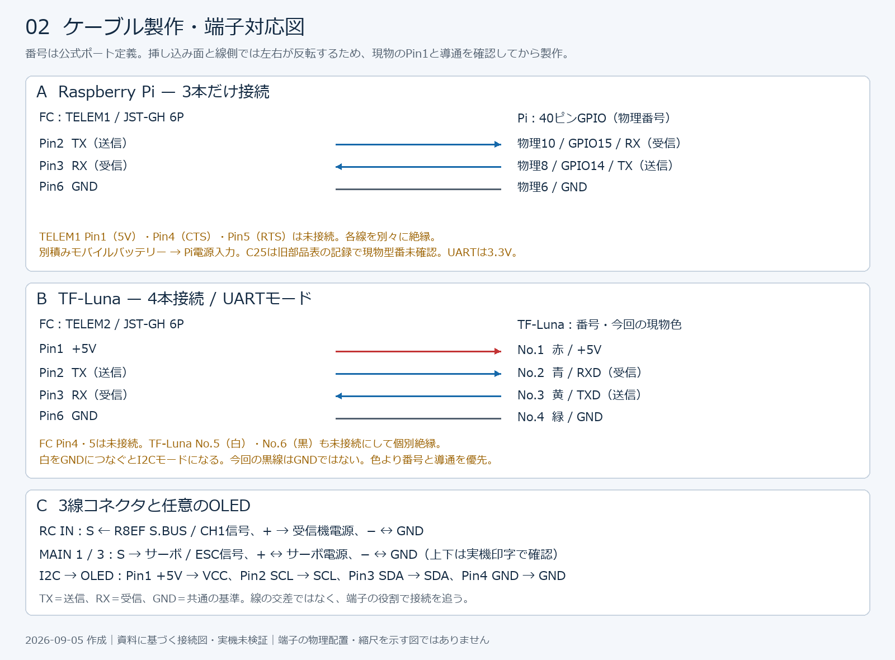

# 配線図

2026-09-05作成。[04_配線.md](../04_配線.md)の採用済み構成を図に整理したものです。旧Pixhawk / M8Nの換装履歴を新規組立てに混ぜないよう、**Pixhawk 6C Mini Model A・M10 GPS・R8EF・WP-1060・TF-Luna・Pi Zero 2 WH**を基準にしました。図は接続関係を示し、実物の端子配置や挿す向きは示しません。

## 図面

2026-09-05追記：所有者からXT60による遮断、Piの別積みモバイルバッテリー給電、DS3218 270°サーボの情報と写真2枚を受領し、図に反映しました。[写真と観察記録](../04_配線.md#2026-09-05-現物写真と所有者による補足)を参照してください。申告による確定と写真で見える範囲を区別しています。

### 01 全体配線図

[拡大・編集用SVG](ardurover-wiring-overview.svg)

### 02 ケーブル製作・端子対応図

[拡大・編集用SVG](ardurover-wiring-cables.svg)

## 図を使う前に

- FCは走行を制御するコンピュータ、ESCはモーターを駆動する装置、BECはサーボ用に電圧を下げる電源回路です。PM02はFC給電と電圧・電流検出を担当します。
- 実線は資料に接続の記録がある経路です。この図作成時に実機の通電・導通を再確認した意味ではありません。
- 太いバッテリー線はFCのPOWERやMAINへ直接接続しません。POWERにはPM02の適合した専用ケーブルを使います。
- MAIN 1のサーボとMAIN 3のESCは、**S＝信号、+＝電源、−＝GND**を本体印字で確認します。図の上下を実物の上下と解釈しないでください。R8EFはS.BUS出力モードを確認し、CH1の信号端子をRC INのSへ接続します。
- GPS1は適合した10芯ケーブルを使用します。旧M8N用のGPSとI2Cの二股変換手順は使いません。既存の独立Safety Button / Buzzerは省略した記録ですが、M10ケーブル内の安全スイッチ等の線を切る指示ではありません。
- TF-Lunaの線色は**この資料の現物ケーブル限定**です。特に緑＝GND、黒＝未使用です。他の購入品へ色だけで適用しないでください。
- JST-GHは挿し込み面と電線側で左右が反転します。[保存済み公式ポート表](../../../参考資料/Pixhawk6Cmini_Holybro/03_ports-pinout.html)のPin1位置図と現物を照合し、テスターで各端子から線端まで追います。Piも物理Pin1の目印から数え、GPIO番号と物理番号を混同しないでください。

## まだ確定していない主電源部分

**全体図だけで主電源ハーネスを製作できる状態ではありません。** 既存資料には、次の情報が揃っていません。未確定の配線を実配線として描かないため、ESC主電源の線は省略しました。

| 確認箇所 | 組立て前に決める・確かめる内容 |
| --- | --- |
| バッテリー → PM02 → ESC | PM02入力・負荷側の実端子、変換コネクタの極性、分岐位置。ESC電流を測る場合、ESCの電流がPM02の計測経路を通るよう製品仕様と照合する。 |
| 物理遮断 | 所有者確認済み：バッテリー近くの太い電源線のXT60を抜く。FC電源も同時に落ちるかは給電経路の確認待ち。Piの別電源は別途管理する。 |
| ステアリングサーボ | 所有者確認済み：DS3218、20kg表記、270°版。6V対応・停止電流は製品仕様との照合待ち。WP-1060のBEC公称6V / 3Aで負荷を賄えるか確認する。270°全域を操舵に使わず、リンケージに合わせる。 |
| Pi別電源 | 所有者確認済み：モバイルバッテリーを別積みする。旧部品表にC25 2500mAh・5Vの記載あり。ただし最新部品表には製品名がなく、現物型番・出力電流定格・給電ケーブルは未確認。TELEM1の5VをPiへ追加接続しない。 |
| 駆動モーター | 所有者確認済み：CC-02キット付属品。詳細型番情報なしとして記録。3S使用条件・ESC適合性の仕様は未照合。3S対応ESCというだけでモーターも3S対応とは判断しない。 |

既存記録ではESC内蔵BECの赤線がMAIN 3の+に入り、共通レールからMAIN 1のサーボへ給電します。RC INの+5Vとは別です。別BECを追加する場合、既存BECのプラスと直結して二重給電しないでください。

## 初回組立て・確認の順序

1. バッテリー・USB・Pi電源を全て外します。端子名ラベルをケーブル両端に付け、端子の向き・極性・GND導通・不要線の個別絶縁を確認します。
2. 電源仕様と主電源経路を上表で確定します。負荷を接続する前に、適切に絶縁した測定方法でPM02出力・FC周辺機器5V・サーボレール6Vの極性と電圧を確認します。通電中の導通測定はしません。
3. 毎回電源を切ってから、PM02、受信機、M10、Pi、TF-Luna、必要ならOLEDを順に接続します。接続のたびに認識を確認し、異常が出た機器を切り分けます。
4. モーターを駆動できない状態でRC入力を確認します。車輪を浮かせて保持し、サーボの中立・左右・機械的限界を確認します。
5. ESCを接続し、車輪を浮かせたままニュートラル、微小な前後進、DISARM時停止、送信機断時のフェイルセーフ、物理遮断を確認します。具体的な設定は[導入手順](../05_ArduRoverインストール設定手順.md)と[パラメータ記録](../06_ArduRoverパラメータ.md)に従います。
6. 屋外自律走行前に、GPS 3D Fix、コンパス有効化・校正、北東南西に向けたHUD方位を確認します。室内試験時の`COMPASS_ENABLE=0`は屋外用設定ではありません。Orientationは矢印だけで変更しません。

## 接続後の照合値（記録値であり一括適用用ではありません）

| 接続 | 資料上の値 / 確認方法 |
| --- | --- |
| MAIN 1 | `SERVO1_FUNCTION=26`。ハンドルの左右と中立を確認。 |
| MAIN 3 | `SERVO3_FUNCTION=70`。停止・前進・後退・DISARM時停止を確認。 |
| TELEM1 / Pi | `SERIAL1_PROTOCOL=2`, `SERIAL1_BAUD=921`（921600bps）。Pi側UART有効、シリアルコンソール無効、通信速度一致を確認。 |
| TELEM2 / TF-Luna | `SERIAL2_PROTOCOL=9`, `SERIAL2_BAUD=115`（115200bps）, `RNGFND1_TYPE=20`。既知距離とSonar Range表示を比較。 |
| GPS1 / M10 | GPSとCompassの認識、屋外3D Fix、方位を確認。 |
| I2C / OLED | `NTF_DISPLAY_TYPE=1`で表示成功の記録。別製品では表示ICを確認。 |

## 根拠と確認範囲

**現行構成の基準は[最新部品表](../../../docs/11_部品リスト.md)と今回の所有者申告です。** 所有者から参照先訂正を受けて照合しました。旧rover-gcs部品表は履歴の補助資料とし、そこだけにあるC25型番を現物確認済みとは扱いません。

- [rover-gcs部品表の参照原文](20260905_rover-gcs_hardware参照原文.md)：2026-09-05、所有者指定のrover-gcsの旧ハードウェア構成資料から保存。Zeee 3S 2200mAh 120C、パワーバンクC25 2500mAh、T8FB BT等を補足。FC・GPSは旧構成のため現行図には転記しない。原文の画像等の相対リンクは元リポジトリ基準。元ファイルは変更していない。

- [主資料：04_配線.md](../04_配線.md)：各ポート、Pi・TF-Luna・OLEDの端子対応、M10採用と旧M8N中止。
- [チューニング手順](../../02_チューニング/08_ArduRoverチューニング手順.md)：3S 2200mAhと機器構成。
- [2026-08-03 サーボ式パンチルト計画「電源方針」](../../07_PiZero2Wカメラ/2026-08-03_サーボ式パンチルトジンバル計画.md)：WP-1060 BEC → MAIN 3 → サーボレールの実構成記録。パンチルト追加配線自体は今回の範囲に含めていません。
- [Holybro 6C Miniポート表](https://docs.holybro.com/autopilot/pixhawk-6c-mini/pixhawk-6c-mini-ports)：ライブ本文の取得ができなかったため、上記リポジトリ内の保存済み公式HTML本文でTELEM1/2・I2C・RC IN・MAINの定義を照合。
- [Holybro 6C Mini仕様](https://docs.holybro.com/autopilot/pixhawk-6c-mini/technical-specification)：2026-09-05に公式検索結果で確認。周辺機器用5Vはポート群で電流制限を共有するため、追加負荷の合計を確認。レールの最大定格はサーボの使用電圧を保証しません。
- [Benewake TF-Luna User Manual](https://en.benewake.com/uploadfiles/2025/04/20250430174515390.pdf)：2026-09-05確認。No.1〜6、UART設定端子と115200bpsを照合。
- [Hobbywing WP-1060公式仕様](https://www.hobbywing.com/en/products/quicrun-wp-1060-brushed55)：2026-09-05確認。BEC 6V / 3Aを照合。

PNGは閲覧用、SVGは拡大・編集用です。生成元は`build_wiring_diagrams.py`（Python + Pillow、Windows Meiryoフォント）です。図作成時は画像表示・文字配置、端子対応、参照リンクを確認しました。実機の通電試験は実施していません。
