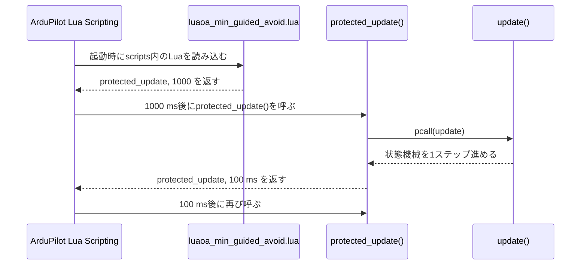
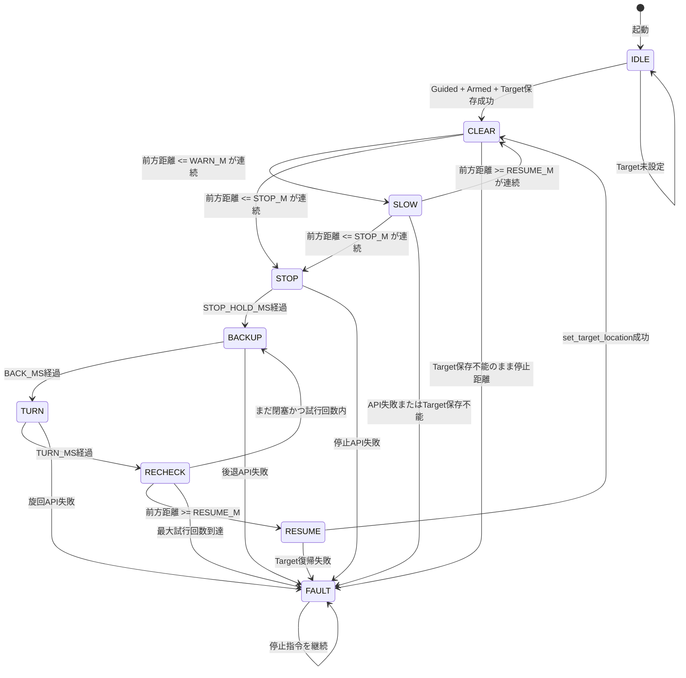
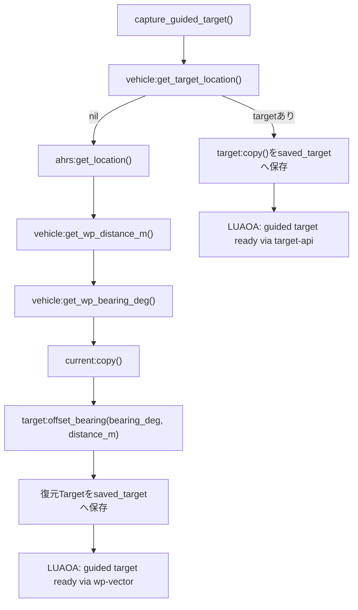

# MinGuided回避Lua解説

更新日: 2026-06-30

> 本書はSITL学習版`luaoa_min_guided_avoid.lua`の解説であり、実機用`luaoa_guided_avoid_rover463.lua`の現行設定ではない。実機の現状は[プロジェクト概要](README.md)と[実機テスト手順](07_実機テスト手順.md)を参照する。

対象スクリプト: [luaoa_min_guided_avoid.lua](scripts/luaoa_min_guided_avoid.lua)

## 結論

このLuaは、Rover最新版SITLで「前方Rangefinder 1個だけを使い、Guided目標へ走行中に最低限の停止・後退・固定旋回・再確認・Target復帰を試す」ための学習用サンプルである。

Mission Plannerが直接このLuaを呼び出すのではない。ArduPilotのLua Scripting機能が起動時に`scripts`フォルダ内の`.lua`を読み込み、スクリプト末尾で返された関数を周期実行する。

このスクリプトでは、最後に次を返している。

```lua
return protected_update, 1000
```

つまり、読み込み後1秒で`protected_update()`が呼ばれ、その後は`protected_update()`が返す周期に従って再実行される。通常時は100 ms周期で動く。

## どこに置くか

リポジトリ内の保存元:

```text
projects/03_Lua障害物回避/scripts/luaoa_min_guided_avoid.lua
```

SITLで実行するときの配置先:

```text
~/ardupilot/scripts/luaoa_min_guided_avoid.lua
```

前提:

```text
SCR_ENABLE=1
```

試験中は、`scripts/`直下にこのLuaだけを置く。`rover-quicktune.lua`など他のLuaと同時実行すると、速度指令やGCSメッセージの原因を切り分けにくい。

## 呼び出しの流れ



`protected_update()`は`pcall(update)`で本体を呼ぶ。Lua内でエラーが出た場合でも、GCSへ`LUAOA: internal error ...`を出して、次回は1秒後に再試行する。

## 外部から来る入力

このLuaが自分でMission Plannerのボタンや地図クリックを受け取るわけではない。

| 入力 | どこから来るか | Luaでの読み方 |
| --- | --- | --- |
| Guidedモード | Mission Planner / MAVProxy / RC等 | `vehicle:get_mode()` |
| Arm状態 | ArduPilot内部状態 | `arming:is_armed()` |
| Fly To HereのTarget | Mission PlannerがRoverへ送る | `get_target_location()`またはWP距離・方位から復元 |
| 前方距離 | SITL Rangefinder | `rangefinder:distance_orient(0)` |
| 現在位置 | AHRS / EKF | `ahrs:get_location()` |

重要なのは、Mission Plannerの`Fly To Here`はRover内部のGuided Targetを設定するだけであり、Luaを直接呼び出すイベントではない、という点である。Luaは100 ms周期の`update()`の中で、そのTargetや距離を読みに行く。

## 全体状態遷移



## 主な状態

| 状態 | 役割 | 主な出力 |
| --- | --- | --- |
| `IDLE` | Guided / Armed / Targetを待つ | 走行指令なし |
| `CLEAR` | 通常走行中として距離監視 | Target保存を継続 |
| `SLOW` | 警戒距離内で速度を下げる | `set_desired_speed(SLOW_SPEED_MS)` |
| `STOP` | 停止距離内で停止保持 | `set_desired_turn_rate_and_speed(0, 0)` |
| `BACKUP` | 短時間だけ後退 | `set_desired_turn_rate_and_speed(0, -BACK_SPEED_MS)` |
| `TURN` | 固定方向へ旋回 | `set_desired_turn_rate_and_speed(TURN_RATE_DEG_S * TURN_DIR, TURN_SPEED_MS)` |
| `RECHECK` | 前方距離を再確認 | 停止指令を出しながら確認 |
| `RESUME` | 保存Targetへ戻す | `set_target_location(saved_target)` |
| `FAULT` | 異常時の停止側 | 停止指令を継続 |

## Target保存と復帰

Target復帰のため、このLuaは回避に入る前、つまり`CLEAR`や`SLOW`の間にTargetを保存する。

最新版Roverでは、Lua APIとして`vehicle:get_target_location()`は見えるが、標準Rover側ではTargetを返せず`nil`になることがある。そのため、このLuaは次の順でTargetを保存する。



期待するログ:

```text
LUAOA: guided target ready via wp-vector
```

このログがFly To送信後に出れば、Lua側でTarget復帰に使う座標を保存できている。

## RESUMEでの注意

`RESUME`では、保存済みTargetへ戻すために次を呼ぶ。

```lua
vehicle:set_target_location(saved_target)
```

その後、速度復帰は次だけを使う。

```lua
vehicle:set_desired_speed(RUN_SPEED_MS)
```

以前の版にあった、次のフォールバックは削除している。

```lua
vehicle:set_desired_turn_rate_and_speed(0, RUN_SPEED_MS)
```

理由は、`set_target_location()`でGuidedのWP追従へ戻した直後に`set_desired_turn_rate_and_speed()`を呼ぶと、Guidedのサブモードを再びTurnRateAndSpeedへ切り替えてしまう可能性があるためである。

## 時間と距離の設定

現在の主な設定:

| 設定 | 値 | 意味 |
| --- | ---: | --- |
| `WARN_M` | 8.0 | 警戒距離 |
| `STOP_M` | 4.0 | 停止距離 |
| `RESUME_M` | 10.0 | 前方安全とみなす距離 |
| `REQUIRED_COUNT` | 3 | 連続判定回数 |
| `SLOW_SPEED_MS` | 0.3 | 警戒時速度 |
| `BACK_SPEED_MS` | 0.45 | 後退速度 |
| `TURN_SPEED_MS` | 0.45 | 旋回時速度 |
| `TURN_RATE_DEG_S` | 35 | 旋回レート |
| `STOP_HOLD_MS` | 1500 | 停止保持時間 |
| `BACK_MS` | 4500 | 後退時間 |
| `TURN_MS` | 4500 | 旋回時間 |
| `MAX_TRY` | 5 | 最大回避試行回数 |
| `UPDATE_INTERVAL_MS` | 100 | 通常更新周期 |

距離は最新版SITL向けにm単位で扱う。

## 代表ログ

起動直後:

```text
LUAOA: loaded 20260630-wp-vector-target-v6
```

Fly To送信後:

```text
LUAOA: guided target ready via wp-vector
IDLE -> CLEAR: guided target ready
```

障害物接近から回避:

```text
LUAOA: CLEAR -> SLOW: distance 7.8 m
LUAOA: SLOW -> STOP: distance 3.9 m
LUAOA: STOP -> BACKUP: stop hold complete
LUAOA: BACKUP -> TURN: backup complete
LUAOA: TURN -> RECHECK: turn complete
```

復帰成功:

```text
LUAOA: RECHECK -> RESUME: distance 10.2 m
LUAOA: RESUME -> CLEAR: target restored
```

異常時:

```text
LUAOA: FAULT no front rangefinder data
LUAOA: FAULT no saved target before stop
LUAOA: FAULT set_target_location failed
LUAOA: FAULT max avoid tries reached
```

## このLuaで確認できること

- Lua Scriptingが起動時にスクリプトを読み込むこと
- `protected_update()`が周期呼び出しされること
- 前方Rangefinderをm単位で読めること
- Guided中だけ回避状態機械が進むこと
- Targetを`wp-vector`方式で保存できること
- 停止、短時間後退、固定旋回、再確認、Target復帰の流れが動くこと

## このLuaだけでは確認できないこと

- 実機で安全に後退できること
- 左右の空きから安全な方向を選べること
- BendyRuler相当の経路計画
- Native OAとLua制御が同時に働く場合の優先関係
- Lua停止時にも常に安全停止できること

前方センサー1個だけなので、左右の空きを比較して安全な回避方向を選んでいるわけではない。固定方向へ向きを変え、前方を再確認するだけである。

## 参照

- [SITL Luaサンプルスクリプト](05_SITL_Luaサンプルスクリプト.md)
- [Guided位置指定対応Lua障害物回避仕様書](今後の開発検討/Guided位置指定対応Lua障害物回避仕様書.md)
- [2026-06-29 SITL Lua Guided回避 再開メモ](logs/test_runs/20260629_01_sitl_lua_guided_avoid_resume_handoff.md)
