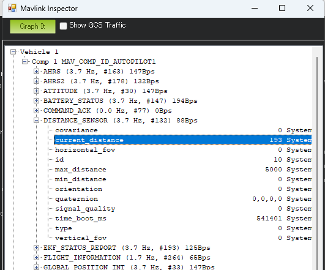
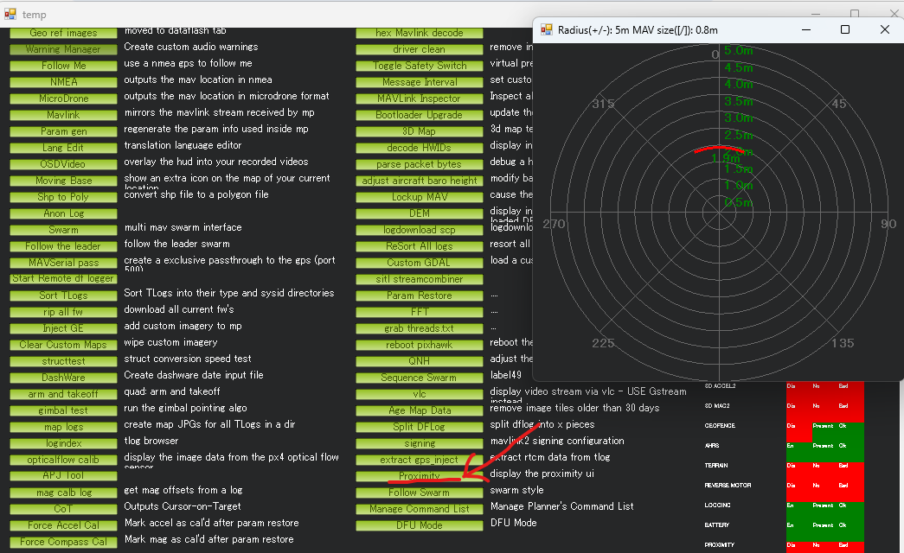
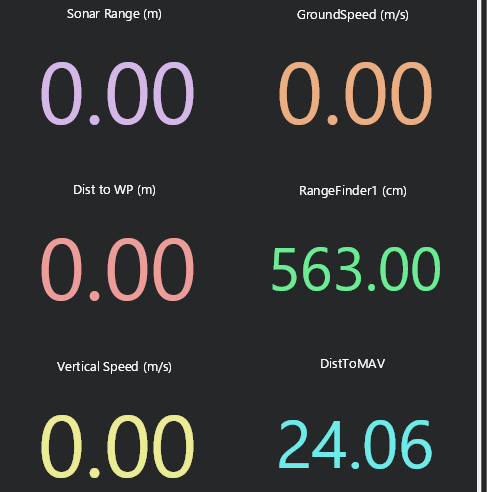

# Mission Plannerで前方距離が見づらくなる原因と確認方法

更新日: 2026-06-22

対象: 前方1点Rangefinder、`PRX1_TYPE=4`、Mission Planner

## 結論

`PRX1_TYPE=4`を設定すると、前方Rangefinderの値は障害物回避用のProximity情報として扱われる。

その結果、障害物停止設定中の前方距離は、通常の`rangefinder1`ではなく、`DISTANCE_SENSOR`のProximity用`id=10`として確認する。Mission PlannerのQuickやTuningで`rangefinder1`が0のまま、または距離を追えない場合がある。

障害物停止試験では`PRX1_TYPE=4`を維持し、次を正本とする。

- 数値と距離グラフ: MAVLink Inspectorの`DISTANCE_SENSOR id=10`
- 方向付き表示: Proximity Viewer
- 車速グラフ: Flight DataのTuning

## 1. 見づらくなる原因

通常のRangefinder表示:

```text
前方Rangefinder
  → DISTANCE_SENSOR id=0
  → Mission Plannerのrangefinder1
```

`PRX1_TYPE=4`で障害物停止設定中:

```text
前方Rangefinder
  → Proximityへ変換
  → DISTANCE_SENSOR id=10
  → Simple Object Avoidanceで使用
```

Mission Plannerの`rangefinder1`は主に`id=0`のRangefinder値を表示する。Proximityへ変換された前方障害物距離は`id=10`で送信されるため、`rangefinder1`では追えない。

`sonarrange`は主に下向きRangefinder用であり、前向きLiDARの確認には使用しない。

## 2. MAVLink Inspectorで数値とグラフを確認

1. `Flight Data`を開く
2. `Ctrl + F`を押す
3. `MAVLink Inspector`を開く
4. `Vehicle 1` → `Comp 1` → `DISTANCE_SENSOR`を展開する
5. `id=10`のメッセージを確認する
6. `orientation=0`を確認する
7. `current_distance`を選択する
8. `Graph It`を押す

障害物停止設定中の確認対象:

```text
id = 10
orientation = 0
current_distance = 前方距離（cm）
```



> [!NOTE]
> このスクリーンショットは`id=0`を表示した参考例である。障害物停止設定中の確認では、同じ`DISTANCE_SENSOR`内の`id=10`を選び、`current_distance`を確認する。画像の`193`は193 cm、すなわち1.93 mである。

## 3. Proximity Viewerで方向を確認

1. `Flight Data`を開く
2. `Ctrl + F`を押す
3. 一覧から`Proximity`を開く

前方1点Rangefinderのため、レーダー表示も前方だけに距離が現れる。



この画面例では、前方0度付近に約1.9 mの障害物距離が表示されている。左右や後方に表示がないのは、実機と同じ前方LiDAR 1台の構成による正常な状態である。

## 4. Quick表示が使える場合と使えない場合

通常の`DISTANCE_SENSOR id=0`をMission Plannerが`rangefinder1`へ割り当てている状態では、Quickタブに`RangeFinder1 (cm)`を表示できる。



この画面では`RangeFinder1 (cm)=563.00`、すなわち5.63 mが表示されている。

ただし、`PRX1_TYPE=4`による障害物停止設定中はProximity用`id=10`が確認対象となるため、このQuick表示を前方距離の正本にしない。`RangeFinder1 (cm)`が0または更新されない場合は、MAVLink InspectorとProximity Viewerを使用する。

## 5. Tuningグラフとの併用

Flight DataのTuningグラフでは`groundspeed`を表示し、停止までの速度変化を確認する。

1. `Flight Data`で`Tuning`をチェックする
2. 表示されたグラフをダブルクリックする
3. 項目一覧から`groundspeed`をチェックする

障害物停止設定中の距離は`rangefinder1`で取得できないため、距離グラフはMAVLink Inspectorの`current_distance`を`Graph It`で開く。

```text
MAVLink Inspector: DISTANCE_SENSOR id=10 の current_distance
Flight Data Tuning: groundspeed
```

2つのグラフを並べ、距離の減少に伴って対地速度が0へ下がることを確認する。

## 6. 表示先の整理

| 確認内容 | Mission Plannerでの表示場所 | 障害物停止設定中の扱い |
| --- | --- | --- |
| 前方距離の生値 | MAVLink Inspector | `DISTANCE_SENSOR id=10`の`current_distance` |
| 前方距離グラフ | MAVLink Inspector | `current_distance`を選び`Graph It` |
| 障害物の方向 | Proximity Viewer | 前方0度の表示を確認 |
| 車速グラフ | Flight DataのTuning | `groundspeed` |
| 通常のRangefinder値 | Quickの`rangefinder1` | 0または更新されない場合がある |
| 下向き距離 | `sonarrange` | 前向きLiDARには使用しない |

## 7. 注意

- `PRX1_TYPE=4`を維持する。標準障害物回避へ前方距離を渡すために必要
- `PRX1_TYPE=0`へ戻してQuick表示を優先すると、標準障害物回避へ前方距離を渡せなくなる
- `DISTANCE_SENSOR id=10`、`orientation=0`、`current_distance`を確認する
- `current_distance`はcm、Proximity Viewerはm表示なので単位を混同しない
- Quickの`RangeFinder1`表示とProximity用距離は別経路として扱う

## 関連資料

- [Rover SITL前方Rangefinder / 標準OA / Lua設定手順](../01_RoverSITL前方Rangefinder設定手順.md)
