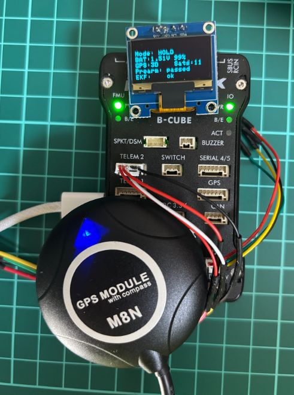
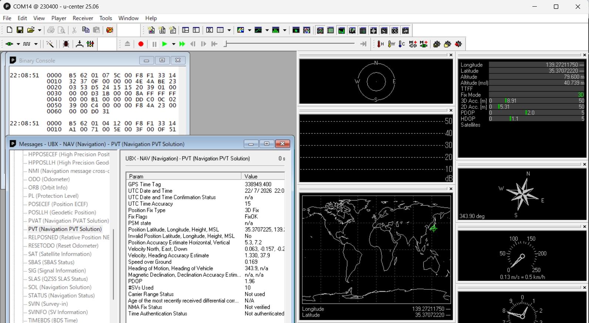
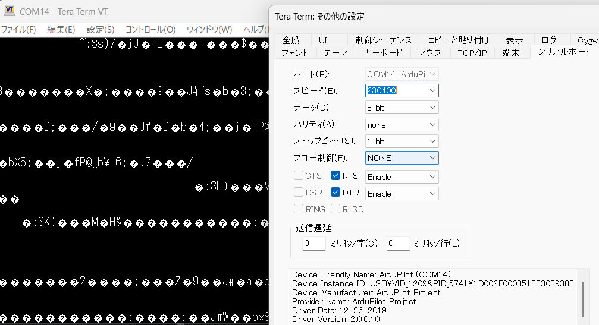

# Pixhawk 2.4.8 TELEM2 GPSパススルー確認手順

- 実施日: 2026-07-22
- 対象FC: Pixhawk 2.4.8 (`fmuv3`)
- ファームウェア: ArduRover 4.6.3 (`3fc7011a`)
- GPS: u-blox NEO-M8N
- GPS接続先: `TELEM2` / `SERIAL2`
- 確認ツール: u-center 25.06、Tera Term 5
- 変更前パラメータ: [20270722_01_befor_change.param](params/01_Pixhawk248/20270722_01_befor_change.param)

## 1. 結論

Pixhawk 2.4.8の`TELEM2`に接続したNEO-M8Nを、次の条件で正常に使用できた。

```text
通信形式    : u-blox UBXバイナリ
通信速度    : 230400bps
GPS更新周期 : 約5Hz
物理ポート  : TELEM2
論理ポート  : SERIAL2
```

u-centerで`UBX NAV-PVT`、`UBX NAV-DOP`、`UBX NAV-TIMEGPS`、`UBX MON-HW`、`UBX MON-HW2`の受信を確認した。これにより、次の経路が成立している。

```text
NEO-M8N TX
  -> Pixhawk TELEM2 RX
  -> SERIAL2
  -> Pixhawk USB
  -> PC
  -> u-center
```



## 2. TELEM2をGPSにする通常設定

Mission Plannerで次の値を設定する。

```text
SERIAL2_PROTOCOL = 5
SERIAL2_BAUD     = 230
SERIAL2_OPTIONS  = 0
BRD_SER2_RTSCTS  = 0

GPS1_TYPE        = 1
GPS2_TYPE        = 0
GPS_AUTO_CONFIG  = 1
GPS_SAVE_CFG     = 2
GPS_PRIMARY      = 0
GPS1_RATE_MS     = 200
```

| パラメータ | 値 | 内容 |
|---|---:|---|
| `SERIAL2_PROTOCOL` | `5` | `SERIAL2` / `TELEM2`をGPSに使用 |
| `SERIAL2_BAUD` | `230` | 230400bps |
| `SERIAL2_OPTIONS` | `0` | 反転・半二重・TX/RX入替なし |
| `BRD_SER2_RTSCTS` | `0` | RTS/CTSフロー制御を使用しない |
| `GPS1_TYPE` | `1` | GPS種類をAUTO検出 |
| `GPS_AUTO_CONFIG` | `1` | ArduPilotからシリアルGPSを自動設定 |
| `GPS_SAVE_CFG` | `2` | 必要な場合のみGPS設定を保存 |

設定後にPixhawkを完全再起動する。起動メッセージで次を確認する。

```text
GPS 1: probing for u-blox at 230400 baud
GPS 1: detected u-blox
GPS 1: u-blox saving config
u-blox NEO-M8N- 1 HW: 00080000 SW: EXT CORE 3.01
```

`GPS 1: u-blox saving config`は、`GPS_AUTO_CONFIG=1`と`GPS_SAVE_CFG=2`による正常な設定保存である。

GPSをTELEM2の1台だけに整理する場合は、TELEM2での認識確認後に次を設定できる。

```text
SERIAL3_PROTOCOL = -1
GPS_AUTO_SWITCH  = 0
```

`SERIAL4_PROTOCOL=9`と`SERIAL4_BAUD=115`はレンジファインダー用のため変更しない。

## 3. GPS生データのパススルー設定

PixhawkのUSB (`SERIAL0`)とGPSを接続したTELEM2 (`SERIAL2`)を一時的に直結する。

Mission Plannerで次の順に書き込む。`SERIAL_PASS2=2`は最後に設定する。

```text
SERIAL_PASSTIMO = 0
SERIAL_PASS1    = 0
SERIAL_PASS2    = 2
```

| パラメータ | 値 | 内容 |
|---|---:|---|
| `SERIAL_PASS1` | `0` | Pixhawk USB / `SERIAL0` |
| `SERIAL_PASS2` | `2` | TELEM2 / `SERIAL2` |
| `SERIAL_PASSTIMO` | `0` | Pixhawkを再起動するまでパススルーを維持 |

書き込み後はPixhawkを再起動しない。Mission Plannerを切断し、自動再接続を防ぐため完全に終了する。

## 4. u-centerのインストール

NEO-M8NはM8世代なので、`u-center 2`ではなく従来版の`u-center 25.06`を使用する。

1. [u-blox公式u u-centerページ](https://www.u-blox.com/en/product/u-center)を開く。
2. `u-center`欄の`Download v25.06`を選ぶ。
3. 使用条件に同意してインストーラーをダウンロードする。
4. インストーラーを起動し、初期値のままインストールする。

今回はGPSをPCへ直接USB接続せずPixhawk USB経由で確認する。Mission PlannerでPixhawkのCOMポートが認識されていれば、別のu-blox USBドライバーは通常不要。

## 5. u-centerでの受信確認

1. Mission Plannerが終了していることを確認する。
2. u-centerを起動する。
3. 上部ツールバーまたは`Receiver -> Connection`からPixhawkのCOMポートを選ぶ。
4. `Receiver -> Baudrate`で`230400`を選ぶ。
5. 画面下部の接続表示が緑になることを確認する。
6. `View -> Packet Console` (`F6`)を開く。
7. 必要に応じて`View -> Binary Console` (`F7`)または`View -> Messages View`を開く。

u-centerの`R ->`は、GPS受信機からPC側へ届いたメッセージを示す。

### 実機で確認した受信例

```text
14:58:22  R -> UBX NAV-DOP,     Size  26, 'Dilution of Precision'
14:58:22  R -> UBX NAV-TIMEGPS, Size  24, 'GPS System Time'
14:58:22  R -> UBX NAV-PVT,     Size 100, 'Navigation PVT Solution'
14:58:23  R -> UBX MON-HW,      Size  68, 'Hardware Status'
14:58:23  R -> UBX MON-HW2,     Size  36, 'Extended Hardware Status'
```

`UBX NAV-PVT`が1秒間に約5回受信されたため、GPS更新周期は約5Hzと判断できる。

`View -> Messages View -> UBX -> NAV -> PVT`で次を確認すると、測位状態まで判断できる。

| 項目 | 確認内容 |
|---|---|
| `fixType` | `3`なら3D Fix |
| `gnssFixOK` | `1`なら測位有効 |
| `numSV` | 測位に使用中の衛星数 |
| `lat` / `lon` | 緯度・経度 |
| `hAcc` | 水平精度推定値 |
| `vAcc` | 垂直精度推定値 |



### u-centerで受信ログを保存

1. `File -> New`で保存先ログファイルを作る。
2. `Player -> Record`または`Ctrl+R`で記録を開始する。
3. もう一度`Record`を押して終了する。

パススルーは双方向のため、確認中は`CFG`、`Save configuration`、`Cold start`、`Factory reset`などを実行しない。u-centerから送信したコマンドはGPSに届く。

## 6. Tera Termのインストールと使い方

Tera Termは通信の有無の確認や生バイナリ保存に使用できる。UBXの内容解析はu-centerを使用する。

1. [Tera Term公式GitHub Releases](https://github.com/TeraTermProject/teraterm/releases)を開く。
2. 通常の64bit Windows PCでは最新版の`teraterm-*-x64.exe`をダウンロードする。
3. 言語に日本語を選び、初期設定のままインストールする。
4. Mission Plannerとu-centerを完全に終了する。
5. Tera Termを起動し、「新しい接続」で「シリアル」とPixhawkのCOMポートを選ぶ。
6. `設定 -> その他の設定 -> シリアルポート`で次を設定する。

```text
スピード       : 230400
データ         : 8 bit
パリティ       : none
ストップビット : 1 bit
フロー制御     : none
```

NEO-M8NはUBXバイナリを出力しているため、Tera Term画面では文字化けのように見える。これは受信失敗とは限らない。



### Tera Termで生バイナリを保存

1. `ファイル -> ログ`を選ぶ。
2. 保存ファイル名を指定する。
3. `Binary`を選ぶ。
4. 必要な時間だけ受信する。
5. Loggingダイアログの`Close`で記録を終了する。

`Binary`を選ぶと、改行変換や制御文字の除去を行わず、受信バイトをそのまま保存する。

## 7. 診断終了と通常GPS処理への復帰

1. u-centerまたはTera Termを終了する。
2. Pixhawkを再起動する。
3. Mission PlannerでUSB接続する。
4. 次の値を確認する。

```text
SERIAL_PASS1    = 0
SERIAL_PASS2    = -1
SERIAL_PASSTIMO = 15
```

`SERIAL_PASS2`が`-1`に戻っていない場合は手動で戻す。その後、次の通常起動メッセージを確認する。

```text
GPS 1: probing for u-blox at 230400 baud
GPS 1: detected u-blox
```

この表示があれば、パススルーからArduPilotの通常GPS処理へ復帰している。

## 8. トラブル時の確認

| 現象 | 確認内容 |
|---|---|
| COMポートを開けない | Mission Planner、u-center、Tera TermのいずれかがCOMポートを使用中でないか |
| u-centerの接続表示は緑だがデータが出ない | ボーレートが`230400`か、`SERIAL_PASS2=2`か |
| Tera Termで文字化けする | UBXバイナリのため通常。u-centerで解析する |
| パススルー後にMission Plannerへ接続できない | Pixhawkを再起動し、`SERIAL_PASS2=-1`を確認 |
| `NoGPS`になる | `SERIAL2_PROTOCOL=5`、`SERIAL2_BAUD=230`、GPS TX -> TELEM2 RXを確認 |

## 9. 公式参考資料

- [ArduPilot Serial Passthrough](https://ardupilot.org/sub/docs/common-serial-passthrough.html)
- [ArduPilot Telemetry / Serial Port Setup](https://ardupilot.org/rover/docs/common-telemetry-port-setup.html)
- [u-blox u-center](https://www.u-blox.com/en/product/u-center)
- [u-center User Guide](https://content.u-blox.com/sites/default/files/u-center_Userguide_UBX-13005250.pdf)
- [Tera Term Releases](https://github.com/TeraTermProject/teraterm/releases)
- [Tera Term Serial Port Settings](https://teratermproject.github.io/manual/5/en/menu/setup-additional-serialport.html)
- [Tera Term Binary Log](https://teratermproject.github.io/manual/5/ja/menu/file-log.html)
