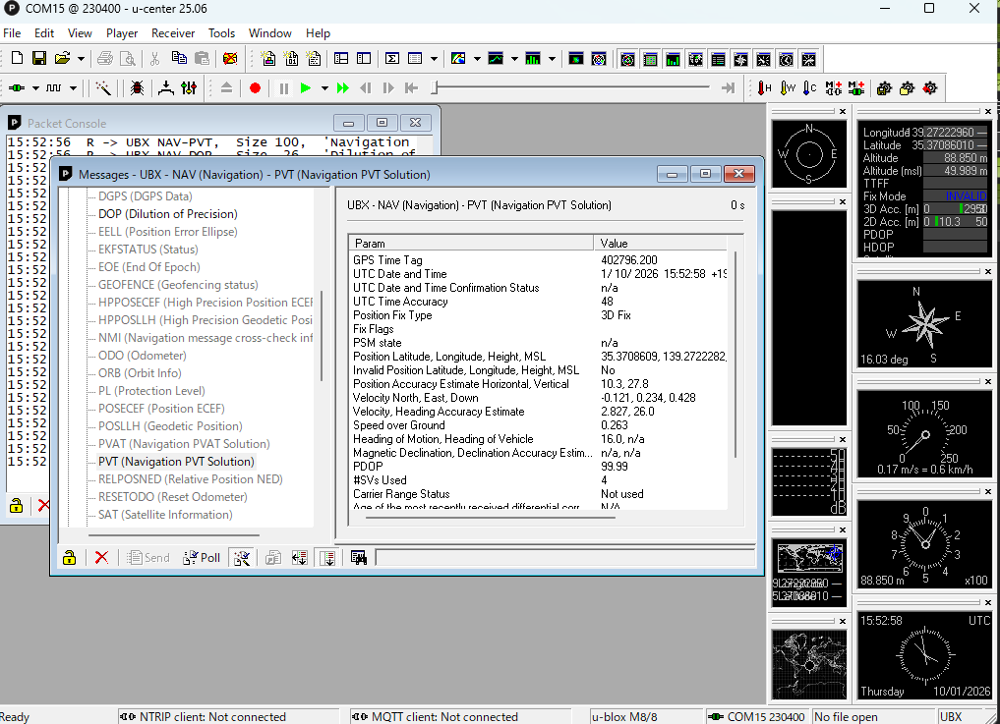

# Pixhawk 6C Mini・旧NEO-M8Nパススルー手順（TELEM2 / GPS2）

調査日: 2026-10-01。修正日: 2026-10-02。当初のユーザー訂正による接続先はTELEM2。追加依頼によりGPS2を使う場合の手順も併記する。その後、2026-10-02にユーザーからGPS2手順を実施したとの報告とu-center画像を受領し、UBX受信を確認した（6節）。対象は現行CC-02 / Pixhawk 6C Miniと、旧Pixhawk 2.4.8Proセット付属NEO-M8N。機体資料にあるArduRover 4.6.3 (`3fc7011a`) の実装を確認した。TELEM2での今回の実機結果と、有効なGPS測位・双方向通信・通常構成への復帰は未確認。

## 結論と既存記録

旧GPSはTELEM2またはGPS2のどちらか一方に4本で接続し、USB (`SERIAL0`) と選択したUARTをパススルーで接続する。PCはPixhawk USBへ直接接続する。使用しない方のポート設定は変更しない。

| 接続先 | 物理UART | ArduPilot設定 | パススルー対象 | 通常構成からの変更 |
| --- | --- | --- | --- | --- |
| A: TELEM2 | UART5 | SERIAL2 | SERIAL_PASS2=2 | TF-Lunaを外して入れ替える |
| B: GPS2 | UART8 | SERIAL4 | SERIAL_PASS2=4 | GPS2が空いていればTF-Lunaを接続したまま試験できる |

- 旧M8Nは[2026-07-22の別FCでの試験](2026-07-22_Pixhawk248_TELEM2_GPSパススルー確認手順.md)で、UBX / 230400bps / 約5Hzを確認済み。
- 6C MiniのGPS2への旧M8N接続は6月に`No GPS`で中止した記録がある。LED点灯はUART通信成功の証拠にはならない。
- 2026-10-02にはGPS2手順を実施したとのユーザー報告があり、u-center画像でCOM15 / 230400bpsのUBX NAV-PVT受信を確認。6月の未認識記録とは区別する。有効な測位まで確認した結果ではない。
- 230400bpsを最初の候補とする。今回の画像でもこの速度でUBX受信を確認したが、GPS設定の不揮発保存・電源再投入後の再現性は未確認。
- 通常構成の資料はM10＝GPS1、Pi＝TELEM1、TF-Luna＝TELEM2。今回の結果報告は旧M8N＝GPS2。TELEM2を選択する場合にTF-Lunaが接続されていれば、全電源OFFで外し、同じポートに2台を並列接続しない。実機の現在値は試験前に取得する。

## 1. 接続前の確認と配線

DISARMの状態で行い、走行用バッテリー、USB、Piの別電源を外してから配線する。6C Mini側は適合する**JST-GH 1.25mm 6P**を使う。旧GPSの6Pは形状・端子対応が未確定なので、そのまま挿入できるとは扱わない。

| TELEM2端子 | FC側機能 | 旧GPS側の接続先 |
| --- | --- | --- |
| Pin1 | +5V | GPSモジュール基板の5V入力 |
| Pin2 | UART5 TX、3.3V信号 | GPS RXD |
| Pin3 | UART5 RX、3.3V信号 | GPS TXD |
| Pin4 | UART5 CTS | 今回は未接続 |
| Pin5 | UART5 RTS | 今回は未接続 |
| Pin6 | GND | GPS GND |

GPS2を使う場合は以下の配線にする。どちらもTX→相手のRXへ接続するが、Pin4/5の機能は異なる。

| GPS2端子 | FC側機能 | 旧GPS側の接続先 |
| --- | --- | --- |
| Pin1 | +5V | GPSモジュール基板の5V入力 |
| Pin2 | UART8 TX、3.3V信号 | GPS RXD |
| Pin3 | UART8 RX、3.3V信号 | GPS TXD |
| Pin4 | I2C2 SCL | 今回は未接続 |
| Pin5 | I2C2 SDA | 今回は未接続 |
| Pin6 | GND | GPS GND |

GPS側の電源仕様は完成モジュール基板の仕様で確認する。裸のNEO-M8N受信機ICへ5Vを入れる指示ではない。UART信号線へ5Vを接続しない。

Pin1位置は[Holybro公式番号図・Telem 2 / GPS2端子表](https://docs.holybro.com/autopilot/pixhawk-6c-mini/pixhawk-6c-mini-ports)と現物で合わせる。挿し込み面と電線側では左右が反転するため、爪の上下・線色だけで決めない。電源OFFで5V/GNDの極性、各信号の導通、短絡を確認し、必要ならGPSを外した状態で選択したポートのPin1–6間の約+5Vを測る。

旧M8Nの別4Pコンパスケーブルは接続せず、未使用線を絶縁する。今回の試験はGPS UARTだけで成立し、コンパスの校正・Orientation変更は不要。

## 2. 生データ確認用の一時設定

まずUSBでMission Plannerへ接続し、全パラメータを保存する。ファームウェア版、COM番号、`SERIAL0/1/2/3/4`の用途、`GPS1_TYPE`、`GPS2_TYPE`、`SERIAL_PASS*`、`SERIAL_PASSTIMO`を記録する。

### A. TELEM2で試験する場合

以下はDISARMで行う生データ試験用の一時設定。TELEM2をGPS用途にすると、SERIAL2はSERIAL3より先にGPSドライバへ割り当てられるため、単に`GPS2_TYPE=0`とするだけでは旧GPSの自動設定を防げない。この場合は`GPS1_TYPE`と`GPS2_TYPE`を両方0にしてGPSドライバを一時停止する。M10はGPS1に接続したままでもよいが、試験中はArduPilotのGPS測位が無効になる。走行・ARMは行わない。

TELEM2を通常TF-Lunaに使っている場合は、`RNGFND1_TYPE`も元値を記録して一時的に0へ変更する。既にGPS試験用に変更済みの場合も現在値を保存し、通常構成への復帰時は試験前の値と通常構成の記録を区別する。

```text
SERIAL2_PROTOCOL = 5      # GPS UARTとして初期化
SERIAL2_BAUD     = 230    # 230400bps、最初の候補
SERIAL2_OPTIONS  = 0      # 非反転、全二重、TX/RX交換なし
BRD_SER2_RTSCTS  = 0      # CTS/RTSを使用しない（パラメータがある場合）
GPS1_TYPE        = 0      # 生データ試験中はGPSドライバを両方停止
GPS2_TYPE        = 0
RNGFND1_TYPE     = 0      # TELEM2のTF-Lunaを一時停止する場合
SERIAL_PASS2    = -1      # この段階ではパススルー無効
```

この設定を保存してFCを再起動する。`SERIAL3`は現行M10の値を維持する。`GPS_AUTO_CONFIG`、`GPS_SAVE_CFG`など全GPSに関わる設定は変更不要。変更した`GPS1_TYPE`も終了時に元値へ戻す。

GPSドライバが無効でもパススルーは物理UARTを指定できる。4.6.3の実装では、`SERIAL2_PROTOCOL=5`でUARTが初期化され、`GPS1_TYPE=0` / `GPS2_TYPE=0`ならGPSドライバによる自動設定を行わない。これはコードに基づく手順で、実機未確認。Mission PlannerがNo GPSになることは、この段階では失敗ではない。

### B. GPS2で試験する場合

こちらは**M10がSERIAL3の最初のシリアルGPS、SERIAL1がMAVLink、SERIAL2がTF-Luna**という通常構成を前提とする。SERIAL2が既にGPS用途の場合はGPSの割当順が変わるため、Aの設定を残したままBへ移らず、先に通常構成へ復帰する。

```text
SERIAL4_PROTOCOL = 5      # GPS UARTとして初期化
SERIAL4_BAUD     = 230    # 230400bps、最初の候補
SERIAL4_OPTIONS  = 0      # 非反転、全二重、TX/RX交換なし
GPS2_TYPE        = 0      # 生データ試験中は2台目GPSドライバを無効
SERIAL_PASS2    = -1      # この段階ではパススルー無効
```

保存してFCを再起動する。`GPS1_TYPE`、`SERIAL3`、TF-Lunaの`SERIAL2` / `RNGFND1_TYPE`は通常構成の値を維持する。GPS2にはCTS/RTSがないのでフロー制御用パラメータの変更は不要。

この構成ではM10が論理GPS1として動作し、旧M8N側はGPS2ドライバを無効にしたままUARTの生データを確認できる。旧GPSの測位値がMission Plannerに出ないことは、この段階では失敗ではない。GPS1の正常表示だけでは旧M8Nの通信成功を判断できない。

## 3. パススルー開始

Mission PlannerでUSB接続し、**次の順に、最後の値を別に書き込む**。

```text
SERIAL_PASSTIMO = 0       # 無通信タイムアウトなし
SERIAL_PASS1    = 0       # USB / SERIAL0
SERIAL_PASS2    = 2       # A: TELEM2。最後に書き込む
```

**B: GPS2を使う場合は、最後の値だけ`SERIAL_PASS2=4`にする。** PASS1はどちらも0。ポートを変更するときはパススルーを終了し、全電源OFFで配線を変更してから各構成の設定・再起動・開始を行う。

有効化するとUSBの通常MAVLink接続が使えなくなる。FCを再起動せず、USBケーブルを残したままMission Plannerを切断・終了する。`SERIAL0_PROTOCOL`や`SERIAL0_BAUD`をGPS用に変更する必要はない。Pi経由UDPではなく、PCからPixhawkのCOMを直接開く。

## 4. u-centerで確認

1. M8対応の従来版[u-center](https://www.u-blox.com/en/product/u-center)を使う。公式掲載版は25.06。M10向けu-center 2とは区別する。
2. PixhawkのUSB COMを選び、230400bps、8N1、フロー制御なしで接続する。複数COMが出る場合、Mission Plannerで使った主USB COMを選ぶ。
3. `View -> Packet Console`でUBXまたはNMEAの継続受信を確認する。接続表示が緑だけでは成功としない。
4. UBXなら`NAV-PVT`等の有効なパケットを確認し、生ログと画面を保存する。`fixType=3`かつ`gnssFixOK=1`なら3D Fix。屋内のNo Fixでも有効なパケットが届けばUART経路の受信は確認できる。
5. 双方向確認が必要なら`UBX -> MON -> VER`の**Poll**で応答を確認する。これは情報照会。NAV-PVTの受信だけではGPS RX側の結線まで確認したことにはならない。

初回はGPSへの設定書込み、Factory Reset、Cold Start、Save Configurationを行わない。パススルーは双方向なので、u-centerの操作はGPSへ届く。

無受信なら230400 → 115200 → 57600 → 38400 → 19200 → 9600 → 4800bpsを順に試す。4.6.3のUSBパススルー実装はPCから要求されたボーレートを相手UARTへ反映するため、u-center側で候補を変更できる。変更が効かない場合は終了・再起動して、Aなら`SERIAL2_BAUD`、Bなら`SERIAL4_BAUD`を候補に合わせ、パススルーを再有効化する（115200＝115、57600＝57、38400＝38、19200＝19、9600＝9、4800＝4）。

| 症状 | 切り分け |
| --- | --- |
| GPS LEDが点かない | 5V/GND、極性、適合コネクタ、接触、給電時電圧 |
| LED点灯、全候補で無受信 | Aは`SERIAL_PASS2=2`、Bは`SERIAL_PASS2=4`。主USB COM、GPS TX→選択ポートPin3の導通、信号出力、フロー制御OFF |
| UBX受信、MON-VER応答なし | 選択ポートPin2→GPS RXの導通、照会操作、通信条件 |
| Tera Termで文字化け | UBXなら通常。u-centerのパケット解析で判断 |
| Mission PlannerでNo GPS | AではGPSドライバを両方停止している。u-centerの受信で判断。BではM10の状態と旧GPSの受信を分けて確認 |

無受信が続く場合、USB-UARTの3.3V信号で旧GPSを直接確認し、GPS本体とFC経路を分けて調べる。LED点灯だけを根拠にTX/RXを推測で入れ替えない。

## 5. 終了・通常構成へ復帰

**GPS2パススルー試験だけから戻す場合は「5.1 → 5.2 → 5.4」を実施する。TELEM2試験から戻す場合は「5.1 → 5.3 → 5.4」を実施する。M10を外してGPS2のM8NだけをArduPilotに認識させる場合は5.6へ進む。** 通常構成はM10＝GPS1、TF-Luna＝TELEM2、旧M8Nは取り外す構成を例とする。

以下の数値例は[2026-07-27の保存パラメータ](../03_Lua障害物回避/params/20260727_01_after_luaoa_v93_avoid_test.param)に基づく。**現在の実機から取得した値ではない。試験前に保存した実機値が例と違う場合は、その保存値へ戻す。** 古いパラメータファイル全体を読み込むのではなく、今回変更した項目だけを復元する。

### 5.1 共通：パススルーを終了してUSB接続を戻す

1. u-centerを終了する。
2. USB、PM02、Piの別電源などを外し、FCが完全に電源OFFになったことを確認する。
3. 電源OFFのまま旧M8Nを外す。TELEM2を使った場合はTF-LunaをTELEM2へ戻す。GPS2を使った場合はTF-Lunaの配線を触る必要はない。
4. USBをつないでFCを起動し、Mission Plannerで通常のUSB接続を開く。今回の画面ではCOM15だったが、再接続時のCOM番号を確認する。
5. Full Parameter List / Full Parameter Treeで次の値を確認・書き込みする。

| パラメータ | 試験中の例 | 復元する値の例 | 操作 |
| --- | --- | --- | --- |
| `SERIAL_PASS2` | GPS2なら4、TELEM2なら2 | **-1** | パススルー無効。4.6.3では再起動で-1に戻るため、まず確認する |
| `SERIAL_PASS1` | 0 | **0** | 0のままなら変更不要 |
| `SERIAL_PASSTIMO` | 0 | **15** | 保存済みの元値が15なら、手動で15へ書き戻す |

**USBの通常通信へ戻すために必要なのは`SERIAL_PASS2=-1`。** `SERIAL_PASSTIMO=15`は元設定へ戻すための例で、PASS2=-1ならPASSTIMO=0でもパススルーは無効。再起動だけではPASSTIMOは15へ戻らない。

### 5.2 B：GPS2パススルー試験後の具体例

試験前が下表の「復元する値」だった場合、共通のPASS設定に加えて次を確認する。

| パラメータ | GPS2試験中の例 | 復元する値の例 | 操作 |
| --- | --- | --- | --- |
| `SERIAL4_PROTOCOL` | 5 | **5** | 同じなので変更不要。GPS2未搭載でも過去の通常設定は5だった |
| `SERIAL4_BAUD` | 230 | **230** | 同じなら変更不要。速度探索で115等に変えた場合は230へ戻す |
| `SERIAL4_OPTIONS` | 0 | **0** | 同じなら変更不要 |
| `GPS2_TYPE` | 0 | **0** | 同じなら変更不要。追加のGPS認識試験で1にした場合は0へ戻す |

つまり、**Bの手順だけを行い、速度も230から変えていなければ、この例ではSERIAL4やGPS2_TYPEの書き直しは不要。PASS2=-1を確認し、PASSTIMOを元の15へ戻せばよい。**

この例での復帰後の確認値：

```text
SERIAL_PASS1    = 0
SERIAL_PASS2    = -1
SERIAL_PASSTIMO = 15
SERIAL4_PROTOCOL = 5
SERIAL4_BAUD     = 230
SERIAL4_OPTIONS  = 0
GPS2_TYPE        = 0
```

`GPS1_TYPE=1`、M10用の`SERIAL3`、TF-Luna用の`SERIAL2`と`RNGFND1_TYPE`は、Bの手順では変更していないため維持する。先にAの試験も行っていた場合は5.3の復元も必要。

### 5.3 A：TELEM2試験後の具体例

旧M8Nを外してTF-LunaをTELEM2へ戻した状態で、共通のPASS設定に加えて次を復元する。

| パラメータ | TELEM2試験中の例 | 復元する値の例 | 意味・操作 |
| --- | --- | --- | --- |
| `SERIAL2_PROTOCOL` | 5 | **9** | TELEM2をGPSからRangefinderへ戻す |
| `SERIAL2_BAUD` | 230 | **115** | TF-Lunaの115200bpsへ戻す |
| `SERIAL2_OPTIONS` | 0 | **0** | 元値と同じなら変更不要 |
| `BRD_SER2_RTSCTS` | 0 | **2** | 7月27日の保存値は2。自分の保存値が0なら0のまま。パラメータがなければ操作不要 |
| `GPS1_TYPE` | 0 | **1** | 現行M10のAUTO検出を再び有効にする |
| `GPS2_TYPE` | 0 | **0** | 旧M8Nを航法用GPSとして使用しない |
| `RNGFND1_TYPE` | 0 | **20** | TF-Lunaのドライバを再び有効にする |

この例での復帰後の確認値：

```text
SERIAL_PASS1    = 0
SERIAL_PASS2    = -1
SERIAL_PASSTIMO = 15
SERIAL2_PROTOCOL = 9
SERIAL2_BAUD     = 115
SERIAL2_OPTIONS  = 0
BRD_SER2_RTSCTS  = 2
GPS1_TYPE        = 1
GPS2_TYPE        = 0
RNGFND1_TYPE     = 20
```

これらをMission Plannerの「Write Params」で書き込む。M10用`SERIAL3`と未変更の`SERIAL4`は書き換えない。

### 5.4 復元後の再起動と確認

1. 値を変更した場合はWrite Paramsで保存し、FCを再起動する。
2. Mission Plannerを再接続し、選択した表の復元値が維持されているか読み直す。復元後のパラメータも別名で保存する。
3. M10の検出メッセージを確認する。屋内ではNo Fixでも受信機認識と測位成立を区別し、屋外では3D Fixを確認する。
4. TF-Lunaの距離表示とPi経由のテレメトリが通常通りに戻ったことを確認する。復元確認中はDISARMを維持する。

### 5.5 通常復帰せず旧GPSのArduPilot認識を試す場合（別の試験）

これは上記の通常構成への復帰とは別作業。旧M8Nを接続したまま、パススルーを終了した後に設定する。

- A: TELEM2では`SERIAL2_PROTOCOL=5`を維持して`GPS1_TYPE=1`（AUTO）、`GPS2_TYPE=0`を設定・再起動する。旧GPSが論理GPS1に割り当てられ、GPS1ポートのM10は使用対象にならない。
- B: GPS2では通常構成を前提に`SERIAL4_PROTOCOL=5`を維持し、`GPS2_TYPE=1`（AUTO）を設定・再起動する。M10が論理GPS1、旧M8Nが論理GPS2になる。

検出メッセージを確認する。受信機の自動設定を伴い得るため、現在の出力確認・ログ保存を先に済ませる。この追加試験後に通常構成へ戻すときも5.1〜5.4に従う。複数GPSとして航法へ採用する設定・切替は今回の生データ試験の範囲には含めない。

### 5.6 M10を外し、GPS2ポートのM8Nを唯一のGPSとして認識させる

2026-10-02のユーザー希望に対応する構成。**物理GPS2ポートのM8Nを論理GPS1として使用する。** u-centerへのパススルーとは別で、Mission Planner上でArduPilotのGPS認識を確認する手順。実行結果はまだ未確認。

M10のコネクタを抜くだけでは、`SERIAL3_PROTOCOL=5`のGPS用途設定は残る。4.6.3はGPS用途のSERIALポートを番号順に割り当てるため、空のSERIAL3が最初のGPSポートとして割り当てられる。**SERIAL3をGPS用途から外して、SERIAL4を最初のGPSポートにする。** TELEM2もGPS用途にしたままではSERIAL2が先になるため、TF-Luna用の設定へ戻す。

#### 接続と設定

1. u-centerを終了する。試験前の全パラメータを保存済みか確認する。パススルー中でMission Plannerに接続できなければ、まずFCを完全再起動してパススルーを解除し、現在値を保存する。これから変更する`SERIAL3_PROTOCOL`、`GPS_AUTO_SWITCH`、`GPS_PRIMARY`も記録する。
2. 全電源OFFでM10のGPS1コネクタを外す。旧M8NはGPS2に接続したままにする。TELEM2はTF-Lunaの通常構成へ戻す。
3. USBでFCを起動し、Mission Plannerで次の値を設定する。

| パラメータ | 設定値 | 目的 |
| --- | ---: | --- |
| `SERIAL_PASS2` | **-1** | パススルー無効 |
| `SERIAL_PASS1` | **0** | 通常の主USB側設定 |
| `SERIAL_PASSTIMO` | **15** | 元値が15なら復元。PASS2=-1ならタイムアウト値は認識に影響しない |
| `SERIAL3_PROTOCOL` | **-1** | 外したM10の物理GPS1 / SERIAL3を無効化 |
| `SERIAL4_PROTOCOL` | **5** | M8Nを接続した物理GPS2 / SERIAL4をGPS用途にする |
| `SERIAL4_BAUD` | **230** | 受信確認済みの230400bps |
| `SERIAL4_OPTIONS` | **0** | 通常UART |
| `GPS1_TYPE` | **1** | 唯一のGPS＝M8NをAUTO検出 |
| `GPS2_TYPE` | **0** | 2台目のGPSドライバを無効化 |
| `GPS_AUTO_SWITCH` | **0** | 論理GPS1を使用 |
| `GPS_PRIMARY` | **0** | 論理GPS1を主GPSとする（番号は0始まり） |
| `GPS_AUTO_CONFIG` | **1** | ArduPilotによるシリアルGPSの自動設定を有効化 |

TELEM2にTF-Lunaを戻した場合の既存記録は`SERIAL2_PROTOCOL=9`、`SERIAL2_BAUD=115`、`RNGFND1_TYPE=20`。5.3の復元表と実機保存値を優先する。TF-Lunaを使わずTELEM2を空ける場合も、`SERIAL2_PROTOCOL=5`のまま残さない。未使用とするなら`SERIAL2_PROTOCOL=-1`にし、その変更も記録する。SERIAL1もGPS用途でないことを確認する。

4. Write Paramsで保存し、FCを完全再起動する。
5. Mission Plannerを再接続し、Message画面で`GPS 1: detected u-blox`相当の検出メッセージを確認する。ここでの「GPS 1」はGPS2ポートに接続したM8N。衛星数・HDOP・位置などの更新も確認する。

#### 成功判定

- `No GPS`から`No Fix`へ変わる、またはu-bloxの検出メッセージが出れば、受信機の認識を確認できる。
- 上空が開けた屋外で有効な`3D Fix`を確認すれば測位確認へ進める。以前のu-center画像の`INVALID`表示は、有効な測位を保証していなかったため、今回も認識と測位を分けて判断する。
- `No GPS`が続く場合は、PASS2=-1、SERIAL3=-1、SERIAL4=5、GPS1_TYPE=1、GPS2_TYPE=0と、SERIAL1/2にGPS用途が残っていないかを読み直す。生データ受信だけではGPS RX側の双方向配線やArduPilotの検出成功までは保証しない。

M10を外すと、同じケーブルで接続されていた外部コンパス等も外れる構成がある。コンパス関連のPreArm警告はGPS認識とは別に扱い、認識確認中はDISARMを維持する。警告を消すためにCompass OrientationやARMING_CHECKを変更しない。自動設定でGPSの出力形式・速度等が変わる可能性があるため、以前の生データ設定と同一のままという前提にはしない。

#### M10の通常構成へ戻す例

1. 全電源OFFで旧M8Nを外し、M10をGPS1へ戻す。
2. Mission Plannerへ接続し、以下を試験前の記録へ戻す。

| パラメータ | M8N単独認識試験 | 復元値の例 |
| --- | ---: | --- |
| `SERIAL3_PROTOCOL` | -1 | **5**（M10用GPSポートを再有効化） |
| `GPS1_TYPE` | 1 | **1**（論理GPS1はM10へ戻る） |
| `GPS2_TYPE` | 0 | **0** |
| `GPS_AUTO_SWITCH` | 0 | **試験前に保存した値** |
| `GPS_PRIMARY` | 0 | **試験前に保存した値** |
| `GPS_AUTO_CONFIG` | 1 | **試験前に保存した値** |

SERIAL3のBAUD / OPTIONSは変更していなければそのまま。SERIAL4とPASS設定は5.2、TELEM2を変更した場合は5.3も参照する。保存・再起動後にM10の認識、外部コンパスの認識・方位、TF-Lunaの距離表示、Piの通信が通常構成へ戻ったことを確認する。

## 6. 2026-10-02 GPS2パススルー受信確認

ユーザー報告: 「GPS2手順通りやった」。接続先・設定実施はこの報告に基づく。画像自体にはFCポートやSERIALパラメータは表示されていない。



添付原本を無加工で保存。原本と保存画像のSHA256一致を確認済み。

| 画像から確認できる項目 | 表示・判断 |
| --- | --- |
| 使用ソフト・接続 | u-center 25.06、COM15、230400bps |
| Packet Console | `R -> UBX NAV-PVT, Size 100`。UBXパケットを受信・解析できている |
| NAV-PVT表示の経過 | `0 s`。画面上は直近のメッセージ |
| Position Fix Type | `3D Fix` |
| Fix Flags | 表示欄は空欄。`gnssFixOK=1`を画像から確認できない |
| 右側Fix Mode | `INVALID` |
| 使用衛星数 | `#SVs Used = 4` |
| PDOP | `99.99` |
| 水平・垂直精度推定 | `10.3 m / 27.8 m`。実際の位置誤差を測定した値ではない |
| 受信ログ | ステータスバーは`No file open`。この画像では生ログの記録・保存を確認できない |

**結論: GPSデータの受信・解析は成功。ユーザーの接続報告と合わせて、GPS2 → Pixhawk USB → u-centerの受信経路が成立した記録とする。有効な3D測位は未確認。**

`Position Fix Type=3D Fix`は解の種類で、有効性を単独で保証しない。[u-blox M8公式仕様の8.3 Navigation Output Filters](https://content.u-blox.com/sites/default/files/products/documents/u-blox8-M8_ReceiverDescrProtSpec_UBX-13003221.pdf)では、有効な測位はPDOP・精度の条件を満たし、`gnssFixOK`で判断する。今回の画像には`INVALID`と大きなPDOPがあるため、「有効な測位を取得した」とは記録しない。受信環境が原因か、設定・表示の状態によるものかは画像だけでは確定しない。

### 次の確認

1. Packet Consoleの受信時刻とNAV-PVTのGPS Time Tagが継続更新することを確認し、File / Playerの記録機能で生ログを保存する。静止画1枚では受信周期・長時間安定性までは判定できない。
2. 上空が開けた屋外で待ち、`fixType=3`に加えて`gnssFixOK=1`を確認する。u-centerのFix Flagsに有効表示があるか、必要なら保存したUBXログのflags bit0で確認する。右側INVALIDの解除、PDOP、衛星数、精度推定値も合わせて確認する。判定条件を緩めるための設定変更は行わない。
3. 双方向通信を確認するなら`UBX MON-VER`をPollし、応答を保存する。今回のNAV-PVT受信画像だけでは、FC TX → GPS RXの経路やPoll応答を確認したことにはならない。
4. 試験終了後は5節に従って復帰する。今回の画像はArduPilotのGPS2認識、航法への採用、復帰成功を示すものではない。

## 根拠・確認範囲

- [ArduPilot Pixhawk 6C/Mini UART Mapping](https://ardupilot.org/rover/docs/common-holybro-pixhawk6C.html): SERIAL0＝USB、SERIAL2＝TELEM2、SERIAL3＝GPS1、SERIAL4＝GPS2。
- [Holybro 6C Mini Ports](https://docs.holybro.com/autopilot/pixhawk-6c-mini/pixhawk-6c-mini-ports): TELEM2 / GPS2端子、電圧、JST-GH、Pin1番号図。
- [ArduPilot Serial Passthrough](https://ardupilot.org/rover/docs/common-serial-passthrough.html): USB接続、PASS設定、タイムアウト、GCS終了。
- [4.6.3 AP_SerialManager.cpp](https://github.com/ArduPilot/ardupilot/blob/3fc7011a/libraries/AP_SerialManager/AP_SerialManager.cpp): `init()`のUART初期化・起動時PASS2解除、`get_passthru()`のポート取得。
- [4.6.3 AP_GPS.cpp](https://github.com/ArduPilot/ardupilot/blob/3fc7011a/libraries/AP_GPS/AP_GPS.cpp): `needs_uart()`と`init()`によるGPSドライバのUART割当。
- [4.6.3 GCS_Common.cpp](https://github.com/ArduPilot/ardupilot/blob/3fc7011a/libraries/GCS_MAVLink/GCS_Common.cpp): `update_passthru()`、`passthru_timer()`、USB要求ボーレート反映と双方向転送。
- [u-blox u-center](https://www.u-blox.com/en/product/u-center): M8対応の従来版。
- [u-blox M8 Receiver Description / Protocol Specification](https://content.u-blox.com/sites/default/files/products/documents/u-blox8-M8_ReceiverDescrProtSpec_UBX-13003221.pdf): 8.3 Navigation Output Filters、NAV-PVTの測位有効性判定。

確認済みは公式ピン配列・論理ポート・対象版コード・保存済みの旧FC成功記録、および2026-10-02のユーザー報告と画像に基づくGPS2パススルーのUBX受信。実物のケーブル対応の直接検査、GPS設定保存と再起動後の再現性、有効測位、双方向通信、TELEM2での今回の受信、通常構成への復帰は未確認。
