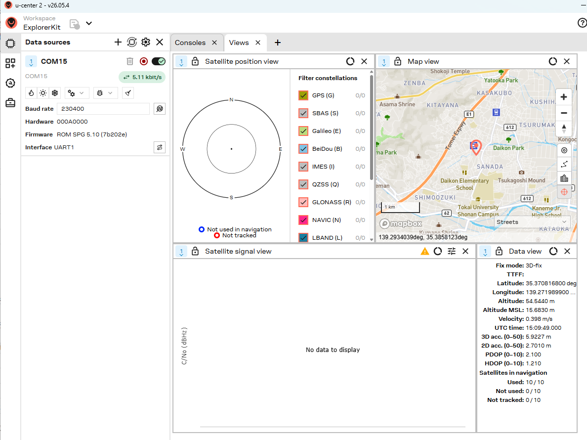

# Pixhawk 6C MiniとM10 GPSのパススルー確認手順

作成日：2026-10-01

更新日：2026-10-02

現在のCC-02 Roverに搭載したM10 GPSを、Pixhawk 6C MiniのUSB経由でPCに接続し、通信・受信機情報・測位状態を確認する。GPSの配線はGPS1に接続したまま使う。

2026-10-02、ユーザー報告とu-center 2の画面で、COM15・230400bpsでのGPS情報受信と3D Fix表示を確認した。確認画像は手順6に掲載する。ログ保存、更新周期の実測、手動照会への応答、通常状態への復帰は、この画像だけでは確認できないため、各手順で別に記録する。

## 1 対象構成

| 項目 | 本書の対象 |
| --- | --- |
| 車体 | タミヤ CC-02 Rover |
| FC | Holybro Pixhawk 6C Mini、Model A相当 |
| FCファームウェア | ArduRover 4.6.3（3fc7011a）、直近の起動ログで確認 |
| GPS | 現搭載M10 GPS、10ピンでGPS1に接続 |
| GPSの論理ポート | SERIAL3 |
| PC接続 | Pixhawk USB、SERIAL0 |
| 確認ソフト | u-center 2、M10対応 |
| 他の機器 | Pi Zero 2 WH＝TELEM1、TF-Luna＝TELEM2 |

構成の根拠は[配線資料](../01_FC換装/04_配線.md)と[部品リスト](../../docs/11_部品リスト.md)。コンパスは資料上IST8310。GPSの商品型番とV1/V2は未確認。受信機FWは手順6の確認結果に記録する。

```text
PCのu-center 2
      ↕ USB仮想COM
Pixhawk USB / SERIAL0
      ↕ シリアルパススルー
Pixhawk GPS1 / SERIAL3
      ↕ 既存の10ピンケーブル内のUART
M10 GPS
```

本書の対象はGPSのUART通信。コンパスI2C、機体方位、安全スイッチは別に確認する。TELEM2のTF-Luna設定は変更しない。

## 2 用意するものと作業前の状態

- Windows PC、データ通信できるUSBケーブル、Mission Planner、u-center 2。
- FCパラメータ、GPSログ、画面を保存する場所。
- 測位確認では、空が見える屋外の静止した場所。

FCをDISARMにし、車両が走り出さない状態で作業する。GPS確認のためにARMやSAFE解除を行う必要はない。USB給電でFCとGPSが起動するかを確認し、別電源も使う場合は、FCを再起動するときの給電元を把握しておく。

u-center 2は[公式配布ページ](https://www.u-blox.com/en/product/u-center)から用意する。初回利用ではアカウント認証等の準備が必要なため、訪問前に起動できることを確認する。2026-10-02の確認ではu-center 2 v26.05.4を使用した。

## 3 通常接続と変更前設定の保存

1. GPSは既存のGPS1接続のまま、PCとPixhawkをUSBケーブルでつなぐ。
2. Windowsのデバイスマネージャーで、PixhawkのUSB COM番号を記録する。複数ある場合は、Mission Plannerで機体のHeartbeatとパラメータを取得できる主USB COMを使う。
3. Mission PlannerでそのCOMに接続し、機体名とArduRoverの版を確認する。
4. 「設定／調整 → 全パラメータリスト」で、変更直前の全パラメータを保存する。
5. 次表の実機値を記録する。添付値と異なる場合は実機値を復帰先とする。

Mission PlannerがPi経由のUDPで接続できていても、今回使用するUSB COMは別に確認する。USB COMを開くソフトは同時に1つだけにする。

2026-10-02はMission PlannerでCOM15の接続に成功し、u-center 2でも同じCOM15を使用した。COM番号はWindows側の割り当てであり、別のPC・別のPixhawkで同じ番号になるとは限らない。

添付された`20261001_Rover_変更前パラメータ.param`の値：

| パラメータ | 添付値 | 作業直前の実機値 |
| --- | ---: | --- |
| SERIAL3_PROTOCOL | 5（GPS） | |
| SERIAL3_BAUD | 230（230400bps） | |
| SERIAL3_OPTIONS | 0 | |
| GPS1_TYPE | 1（AUTO） | |
| GPS2_TYPE | 0 | |
| GPS_AUTO_CONFIG | 1 | |
| GPS_SAVE_CFG | 2 | |
| GPS1_RATE_MS | 200（5Hzの設定目標） | |
| SERIAL_PASS1 | 0 | |
| SERIAL_PASS2 | -1（無効） | |
| SERIAL_PASSTIMO | 15 | |

添付元：`C:\Users\ta1na\OneDrive\00_MyDoc\#PRJ_202610_SEIKO\20261002_訪問準備\20261001_Rover_変更前パラメータ.param`。

## 4 通常起動時のGPS認識と速度の確認

1. DISARMを確認してFCを再起動し、Mission Plannerの「メッセージ」を確認する。
2. GPSの検出・受信機情報に関する行と、表示された通信速度を保存する。
3. 通常状態でGPSデータが更新されることを確認し、Fixと衛星数を記録する。

`probing`は検出の試行を示す。複数の速度が表示される場合があるため、その1行だけで実通信速度を決めない。検出結果と正常なデータ更新を併せて判断する。

現在の添付値では、パススルーの初回候補は**230400bps**。GPS自動設定が有効なので、Holybro M10の出荷時速度115200bpsと現在の速度が一致するとは限らない。起動ログ等で別の実通信速度を確認できた場合は、パススルー開始前にSERIAL3_BAUDをその速度に合わせる。変更した元値も記録する。

| 実通信速度 | SERIAL3_BAUDに設定する値 |
| --- | ---: |
| 230400bps | 230 |
| 115200bps | 115 |

USBのSERIAL0_BAUDは変更しない。SERIAL3_PROTOCOL=5、GPS1_TYPE、GPS_AUTO_CONFIG等は、今回の通信確認のために変更しない。No GPSで検出できていない場合は、まず接続先と給電を確認する。No FixはGPS認識済みでも測位が成立していない状態なので、通信試験を続けられる。

## 5 パススルーの開始

Mission Plannerの全パラメータリストで、次の順番に設定し、それぞれ書き込む。

| 順番 | パラメータ | 試験値 | 意味 |
| --- | --- | ---: | --- |
| 1 | SERIAL_PASSTIMO | 0 | 自動タイムアウトなし |
| 2 | SERIAL_PASS1 | 0 | 主USB、SERIAL0 |
| 3 | SERIAL_PASS2 | **3** | GPS1、SERIAL3 |

**SERIAL_PASS2は最後に書き込む。設定後はFCを再起動しない。** 主USBがパススルーに切り替わると、Mission PlannerのUSB通信は使えなくなる。最後の書き込み後に通信が途切れても、接続障害と決めつけず次の操作へ進む。

Mission Plannerを切断して終了し、USBケーブルは接続したままにする。この後は、同じCOMをu-center 2で開く。

## 6 u-center 2で接続と双方向通信を確認

以下は[公式ガイド](https://www.u-blox.com/en/info/u-center-2-user-guide)の操作名を基準にする。版によって画面配置が異なる場合がある。

1. u-center 2を起動し、左側の「Data sources」から「Add data source」を開く。
2. ローカル機器の接続で、手順3で記録したPixhawkのCOMを選ぶ。safebootは選択しない。
3. 初回は自動ボーレート検出を外し、手順4で決めた速度を選ぶ。通常候補は230400bps。
4. 「Add device」で接続し、機器情報と受信の表示を確認する。
5. 「Message view」でUBXのMON-VERを探し、メッセージ横のメニューから「Poll message」を実行する。

照会後に新しいMON-VER応答が届き、受信機情報が表示されれば、PC→GPSの照会とGPS→PCの応答を確認できる。情報と画面を保存する。対応するメッセージが見つからない場合は、ソフトと受信機FWの対応も確認する。

接続表示だけでは通信確認を完了としない。新しい応答の到着時刻と、継続して届くメッセージを確認する。GPS設定の保存、初期化、FW更新は本試験に含めない。

### 2026年10月2日の接続確認

ユーザーから「繋がった」と報告があり、次の画面を保存した。GPSの機器情報、受信量、位置・測位状態が表示されている。



| 確認項目 | 画面の表示 |
| --- | --- |
| 確認ソフト | u-center 2 v26.05.4 |
| PCのCOMポート | COM15 |
| Baud rate | 230400bps |
| Hardware | 000A0000 |
| Firmware | ROM SPG 5.10 (7b202e) |
| GPS側Interface | UART1 |
| 受信量 | 5.11 kbit/s、撮影時の表示 |
| Fix mode | 3D-fix |
| 測位に使用中の衛星 | Used: 10 / 10 |
| 水平精度推定の表示 | 2D acc.: 2.7010m |

この画面では衛星信号ビューが「No data to display」で、衛星配置ビューにも衛星が表示されていない。一方、Data viewには3D Fixと使用衛星数が表示されている。衛星の詳細表示の未取得を、GPSデータ全体の未受信と混同しない。

画像は受信・測位表示の確認記録。GPS生ログ保存、継続受信時間、実更新周期、手動MON-VER照会への応答、作業後の通常復帰は未確認であり、試験全体の完了とは扱わない。

## 7 測位状態と更新周期を確認

Message view等で、次の情報を確認する。自動出力されないUBXメッセージは、まず1回の照会で確認する。定期出力の有効化はGPS設定の変更になるため、初回の確認では行わない。

| メッセージ・表示 | 記録する内容 |
| --- | --- |
| MON-VER、機器情報 | 受信機型番、ハードウェア・FW情報 |
| NAV-PVT | 時刻、Fix、測位に使う衛星数、緯度・経度、水平精度推定 |
| NAV-SAT、衛星表示 | 衛星・信号状態。受信機FWの対応範囲で確認 |
| NAV-DOP | 精度低下率。出力または照会に対応している場合に確認 |

NAV-PVTでは、`fixType=3`と`gnssFixOK=1`を3D測位が有効である目安とする。緯度・経度が試験場所に合っていることも確認する。水平精度推定値は受信機の推定であり、実測誤差そのものではない。各項目の意味は[u-blox M10のインターフェース仕様](https://content.u-blox.com/sites/default/files/u-blox-M10-SPG-5.10_InterfaceDescription_UBX-21035062.pdf)のNAV-PVTを参照し、実受信機のFWに対応した表示で読む。

屋内ではNo Fixでも、有効なメッセージと照会応答があれば通信確認は成立する。測位確認は空が見える屋外で、車両を静止させて行う。

GPS1_RATE_MS=200は5Hzの設定目標。定期的に届くNAV-PVTのGPS時刻`iTOW`の差が約200msかを確認し、10秒以上の継続受信で欠落・停止がないかを見る。手動照会で得た回数をGPSの更新周期とは扱わない。定期出力が確認できない場合は、更新周期を未確認として記録する。

## 8 ログと結果を保存

1. 接続した機器のData sourcesパネルで記録アイコンを選び、保存先とファイル名を指定する。
2. 初回は追加のデバッグメッセージを有効にする選択を外し、現在の受信状態を記録する。
3. 記録を開始し、例えば60秒間、受信と時刻の進行を確認する。
4. 記録を停止し、保存された`.uc2`と`.ubx`を確認する。u-center 2での再生には`.uc2`を使う。

推奨保存先は、このフォルダ内の`logs/20261001_M10_passthrough/`。パラメータ、起動メッセージ、GPS生ログ、画面、次の結果表をまとめる。

| 記録項目 | 結果 |
| --- | --- |
| 実施日時・場所、屋内／屋外 | |
| FC・GPS型番、FC版・GPS FW | |
| u-center 2の版、USB COM番号 | |
| 実通信速度、SERIAL3_BAUD | |
| MON-VER照会への新しい応答 | |
| Fix、衛星数、位置、水平精度推定 | |
| 更新周期、記録時間、受信の欠落 | |
| ログ・画面のファイル名 | |
| 通常状態への復帰結果 | |

## 9 通常状態への復帰

1. 記録を停止し、u-center 2を終了する。
2. FCを再起動する。USB以外の給電もある場合は、USBを抜いただけで再起動したとは扱わない。
3. Mission Plannerで通常のUSB接続を開く。4.6.3では起動時にSERIAL_PASS2が-1へ戻る。
4. 全パラメータリストで次の値を確認し、作業前の実機値に戻して書き込む。

| パラメータ | 添付資料の復帰値 | 復帰確認 |
| --- | ---: | --- |
| SERIAL_PASS2 | -1 | |
| SERIAL_PASS1 | 0 | |
| SERIAL_PASSTIMO | 15 | |
| SERIAL3_BAUD | 230、変更した場合は作業前の値 | |

**再起動だけではSERIAL_PASSTIMOを15へ戻したことにならない。** 値を読み取り、必要なら手動で戻す。

5. 通常のGPS認識とデータ更新を確認する。屋外なら3D Fixと位置も確認する。
6. Pi経由のMission Planner UDP／WebGCSにもテレメトリが戻ることを確認する。
7. 作業後パラメータを保存し、作業前との差が意図したものか確認する。

パススルー中のGPS表示を走行判断に使わない。通信確認・測位確認・通常復帰をそれぞれ記録して作業を終了する。

## 10 接続できない場合

| 症状 | 確認すること |
| --- | --- |
| COMを開けない | 他のソフトが同じCOMを開いていないか、主USBのCOMか |
| 接続表示はあるが応答がない | PASS2=3で開始したか、GPS1の給電とUART接続、SERIAL3_BAUDと実通信速度 |
| 型番やFWが不明のまま | MON-VER照会の新しい応答、M10対応ソフト・受信機FW、速度の一致 |
| No Fixだがデータは来る | 通信と測位を分け、屋外で測位を確認する |
| バイナリが文字化けして見える | UBXを端末で表示すると通常の文章にはならない。u-center 2で解釈する |
| 確認中にMPのGPS表示が止まる | パススルーを終了して通常状態へ復帰後、GPS更新を再確認する |
| MPへUSB再接続できない | u-center 2を終了し、FCが実際に再起動したか、再起動後のCOM番号を確認する |

受信できない場合は、まず手順9で通常状態へ戻す。起動時のGPS認識・速度を再確認してから、必要な項目だけ修正して再試験する。通信不良の対策としてGPS初期化やFW更新を先に行わない。

## 11 参照資料

- [ArduPilot シリアルパススルー](https://ardupilot.org/rover/docs/common-serial-passthrough.html)
- [ArduPilot Pixhawk 6Cと6C MiniのUART対応表](https://ardupilot.org/rover/docs/common-holybro-pixhawk6C.html)
- [ArduRover 4.6.3のシリアル管理実装](https://github.com/ArduPilot/ardupilot/blob/3fc7011a/libraries/AP_SerialManager/AP_SerialManager.cpp)
- [Holybro 標準M10 GPS仕様](https://docs.holybro.com/gps-and-rtk-system/m8n-m9n-m10-gps/standard-m10-m9n-m8n-gps/overview)
- [u-blox u-centerの対応製品と配布](https://www.u-blox.com/en/product/u-center)
- [u-blox u-center 2公式ガイド](https://www.u-blox.com/en/info/u-center-2-user-guide)
- [u-blox M10 SPG 5.10のインターフェース仕様](https://content.u-blox.com/sites/default/files/u-blox-M10-SPG-5.10_InterfaceDescription_UBX-21035062.pdf)
- [現機体の配線](../01_FC換装/04_配線.md)
- [現機体の部品リスト](../../docs/11_部品リスト.md)
