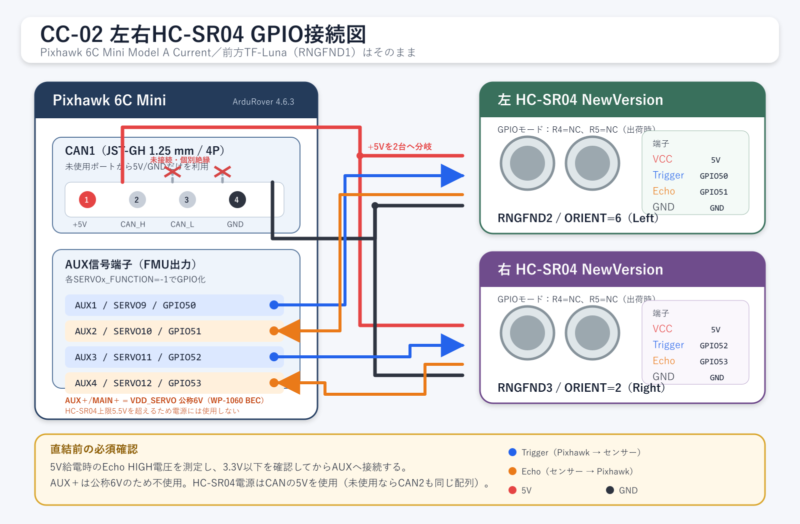

# HC-SR04左右距離計の接続と設定

## 結論

CC-02の左右距離計は、HC-SR04（2020 NewVersion）を2台とも**GPIOモード**で使う。前方TF-Lunaが使用中の `RNGFND1` は変更せず、左を `RNGFND2`、右を `RNGFND3` に割り当てる。

Pixhawk 6C Mini Model A Currentとの接続は次の構成とする。

- 左：Trigger=`AUX1/GPIO50`、Echo=`AUX2/GPIO51`
- 右：Trigger=`AUX3/GPIO52`、Echo=`AUX4/GPIO53`
- 電源：未使用の `CAN1` から5VとGNDだけを2台へ分岐
- CAN_H/CAN_L：接続せず、各線を個別に絶縁

この機体の `AUX/MAIN +` は、MAIN3へ3線接続されたQuicRun WP-1060 ESCのBECから給電されるため、通常走行時は**公称6V**になる。HC-SR04 NewVersionの電源上限5.5Vを超えるので、HC-SR04のVCCには使用しない。

ただし、**5V給電時のEcho HIGH電圧をテスターまたはオシロスコープで確認し、3.3V以下であることを確認するまではPixhawkへ直結しない**。NewVersionの説明書は動作電圧3～5.5Vを示しているが、5V給電時のEcho HIGH電圧を明記していないためである。

## 接続図



[拡大・編集用SVG版](images/hc-sr04-dual-gpio-wiring.svg)

## 現在の機体構成との関係

| 項目 | 現在の状態 | 今回の扱い |
| --- | --- | --- |
| フライトコントローラ | Holybro Pixhawk 6C Mini Model A Current | AUX1～4と未使用CAN1を利用 |
| ファームウェア | ArduRover 4.6.3 | 同版のパラメータ名で記載 |
| PWM電源レール | QuicRun WP-1060 ESCのBECから給電 | 公称6VのためHC-SR04には使わない |
| 前方距離計 | TF-Luna、`RNGFND1` | 変更しない |
| 近接センサー設定 | `PRX1_TYPE=4`（RangeFinder） | 原則変更しない |
| 左右HC-SR04 | 未装着 | 本資料の対象。動作未確認 |

## HC-SR04 NewVersionのモード

対象品は基板に `R4/IIC`、`R5/UART` の設定箇所がある2020 NewVersionで、GPIO/UART/I²Cの3方式に対応する。今回はArduPilot標準のHC-SR04ドライバ（`RNGFNDx_TYPE=30`）を使うため、出荷時のGPIOモードを使う。

| モード | R4 | R5 | 今回 |
| --- | --- | --- | --- |
| GPIO | 未実装（NC） | 未実装（NC） | 採用 |
| UART | 未実装（NC） | 10 kΩ | 不採用 |
| I²C | 10 kΩ | 未実装（NC） | 不採用 |

NewVersionのI²Cアドレスは固定 `0x57` であり、2台を同じI²Cバスへそのまま並列接続するとアドレスが衝突する。また、ArduPilot標準のHC-SR04設定はTrigger/Echo用の2本のGPIOを使う方式であり、この製品固有のI²Cコマンドを直接読む設定ではない。したがって、今回はI²Cマルチプレクサを使わず、4本のAUX GPIOで単純に接続する。

## 配線

### CAN1からの電源分岐

CAN1はJST-GH 1.25 mm、4ピン。センサー2台の合計消費電流は説明書上では数mA程度なので、電流容量よりも誤配線防止を重視する。

| CAN1ピン | 信号 | 接続先 |
| --- | --- | --- |
| 1 | VCC +5V | 左右HC-SR04のVCCへ分岐 |
| 2 | CAN_H | 使用しない。先端を個別に絶縁 |
| 3 | CAN_L | 使用しない。先端を個別に絶縁 |
| 4 | GND | 左右HC-SR04のGNDへ分岐 |

CAN2が未使用なら同じピン配置で代用できる。CAN機器を後から追加する場合は、使用中のポートから電源を横取りせず、配線を見直す。

### この機体のAUX＋が公称6Vになる根拠

Pixhawk 6C Miniの公式ピン表では、AUXとMAINの `+` は固定5V出力ではなく、共通の `VDD_SERVO` と定義されている。`POWER` 端子の `VDD5V_BRICK1` とは別系統である。

現在のCC-02では次の経路でサーボレールが給電される。

```text
3Sバッテリー
  └─ QuicRun WP-1060 ESC
       └─ 内蔵BEC 公称6V / 3A
            └─ MAIN3の赤線
                 └─ VDD_SERVO共通レール
                      ├─ MAIN各端子の＋
                      └─ AUX各端子の＋
```

したがって、状態別の仕様は次のとおり。

| 状態 | AUX/MAIN＋－間 |
| --- | --- |
| ESCがバッテリーに接続され、BECが動作中 | 公称6V |
| ESCのBECが停止・未接続 | 0V |
| PM02だけでPixhawkを給電 | PM02の5.2Vは `POWER` 系統であり、VDD_SERVOの給電源にはならない |

HC-SR04 NewVersionの動作電圧は3～5.5Vなので、公称6VのVDD_SERVOからは給電しない。AUXの `-` はGNDとして使用できるが、誤配線防止のため、今回はCAN1の5VとGNDを対で使用する。

### GPIO信号

Pixhawk 6C MiniのAUX出力はArduPilot上では `SERVO9` から始まる。TriggerはPixhawkからHC-SR04への出力、EchoはHC-SR04からPixhawkへの入力である。

| センサー | HC-SR04端子 | Pixhawk端子 | GPIO番号 | ArduPilotパラメータ |
| --- | --- | --- | --- | --- |
| 左 | Trigger | AUX1 | 50 | `RNGFND2_STOP_PIN=50` |
| 左 | Echo | AUX2 | 51 | `RNGFND2_PIN=51` |
| 右 | Trigger | AUX3 | 52 | `RNGFND3_STOP_PIN=52` |
| 右 | Echo | AUX4 | 53 | `RNGFND3_PIN=53` |

AUX信号はロジック信号専用で、大電流負荷を駆動する端子ではない。HC-SR04の電源は公称6VのAUX `+` から取らず、図のとおりCANの5V/GNDを使う。

## Echo電圧の事前確認

Pixhawk 6C MiniのFMU/AUX信号は標準状態で3.3V系である。一方、NewVersion説明書は3～5.5V給電を認めているものの、Echo出力のHIGH電圧を明記していない。

次の順で確認する。

1. Pixhawkとは信号線を接続せず、CAN1の5V/GNDからHC-SR04だけを給電する。
2. 単体のマイコンまたはパルス発生器でTriggerを与える。
3. Echo-GND間のHIGH電圧をオシロスコープで測る。テスターの場合はパルスのピークを正しく読めない可能性がある。
4. Echo HIGHが3.3V以下なら直結候補とする。
5. 3.3Vを超える場合はEcho側に分圧回路または3.3V対応レベルシフタを追加する。確認できない場合も直結しない。

5V Echoだった場合の簡単な分圧例は、Echo側10 kΩ、GND側20 kΩで約3.3Vとする構成である。実際に使う抵抗値と波形は組み立て後に確認する。

## ArduPilot 4.6.3の設定案

### AUX1～4をGPIO化

設定後に再起動する。

```text
SERVO9_FUNCTION  = -1   # AUX1 / GPIO50
SERVO10_FUNCTION = -1   # AUX2 / GPIO51
SERVO11_FUNCTION = -1   # AUX3 / GPIO52
SERVO12_FUNCTION = -1   # AUX4 / GPIO53
```

`SERVOx_FUNCTION=0` は未割り当てPWM出力であり、GPIOではない。GPIOとして使う場合は `-1` にする。

### 左右距離計

まずはArduPilotのHC-SR04資料に合わせて、実用範囲を安全側の20～200 cmに制限する。NewVersion説明書の公称最大4.5 mを、そのまま `MAX_CM` に設定しない。

```text
# 左：RNGFND2
RNGFND2_TYPE      = 30
RNGFND2_STOP_PIN  = 50
RNGFND2_PIN       = 51
RNGFND2_MIN_CM    = 20
RNGFND2_MAX_CM    = 200
RNGFND2_ORIENT    = 6    # Left

# 右：RNGFND3
RNGFND3_TYPE      = 30
RNGFND3_STOP_PIN  = 52
RNGFND3_PIN       = 53
RNGFND3_MIN_CM    = 20
RNGFND3_MAX_CM    = 200
RNGFND3_ORIENT    = 2    # Right
```

前方TF-Lunaの `RNGFND1_*` と、既存の `PRX1_TYPE=4` は変更しない。パラメータ変更前には全パラメータを保存し、変更後は再起動する。

## 実機確認手順

1. **配線前記録**
   現在の全パラメータを保存し、CAN1が本当に未使用であること、AUX1～4に既存機能が割り当てられていないことを確認する。
2. **電源だけ確認**
   HC-SR04を1台だけ接続し、VCC-GNDが約5Vで極性が正しいことを確認する。
3. **Echo電圧確認**
   前節の手順でEcho HIGHがPixhawkへ入力可能な電圧であることを確認する。
4. **左だけ確認**
   左センサーだけをAUX1/2へ接続し、Mission Plannerの距離表示とDataFlashログで値を確認する。
5. **右だけ確認**
   右センサーだけをAUX3/4へ接続し、同様に確認する。
6. **2台同時確認**
   左右を同時接続し、片側の物体移動が反対側の値へ影響しないか確認する。
7. **既設TF-Lunaとの共存確認**
   前方、左、右の3方向が正しい向きに表示され、前方TF-Lunaの値が変わっていないことを確認する。
8. **低速走行確認**
   車輪を浮かせた状態または即停止できる環境から開始し、最初は監視だけで確認する。障害物回避へ使うのはログで妥当性を確認した後とする。

## 合格条件

- Pixhawk再起動後も3台の距離計が認識される。
- 左の障害物だけを動かすと左距離が、右だけなら右距離が主に変化する。
- 20～200 cmの範囲で壁までの実測値と大きく外れない。
- 2台同時動作で周期的な飛び値や左右の取り違えが続かない。
- 前方TF-Luna、Raspberry Pi、GPS、操舵・スロットルの既存機能に変化がない。

## 未確認事項と注意点

- HC-SR04は防水ではなく、屋外の雨、泥、風、柔らかい物体、斜面では値が不安定になり得る。
- 左右2台の40 kHz超音波が互いに干渉する可能性がある。外向き配置で軽減できるが、実機試験が必要。
- NewVersion説明書では連続測定間隔を200 ms以上としている。ArduPilotでの実測更新周期と欠測率をログで確認する。
- 本資料作成時点では、5V給電時Echo電圧とCC-02上での同時動作は未確認。

## 元に戻す方法

問題が出た場合はHC-SR04を取り外し、次を行う。

1. `RNGFND2_TYPE=0`、`RNGFND3_TYPE=0` にする。
2. AUX1～4を他用途へ戻す場合だけ、保存済みパラメータを参照して `SERVO9_FUNCTION`～`SERVO12_FUNCTION` を復元する。
3. 前方TF-Lunaの `RNGFND1_*` と `PRX1_TYPE` は変更しない。

## 参照資料

- [ArduPilot: HC-SR04 Sonar Rangefinder](https://ardupilot.org/rover/docs/common-rangefinder-hcsr04.html)
- [ArduPilot: GPIOs](https://ardupilot.org/rover/docs/common-gpios.html)
- [ArduPilot Rover 4.6.3 Complete Parameter List](https://ardupilot.org/rover/docs/parameters-Rover-stable-V4.6.3.html)
- [Holybro: Pixhawk 6C Mini Technical Specification](https://docs.holybro.com/autopilot/pixhawk-6c-mini/technical-specification)
- [Holybro: Pixhawk 6C Mini Ports](https://docs.holybro.com/autopilot/pixhawk-6c-mini/pixhawk-6c-mini-ports)
- [Hobbywing: QuicRun WP-1060 Brushed（BEC 6V/3A）](https://www.hobbywing.com/en/products/quicrun-wp-1060-brushed55)
- [2020 HC-SR04 NewVersionユーザーマニュアル（PDF）](https://akizukidenshi.com/goodsaffix/hc-sr04_v20.pdf)
