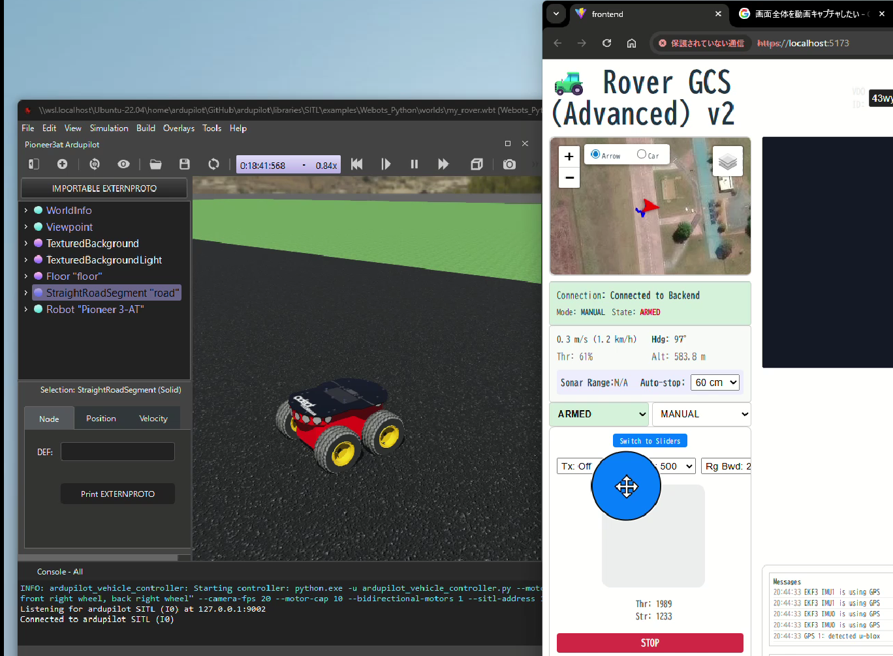
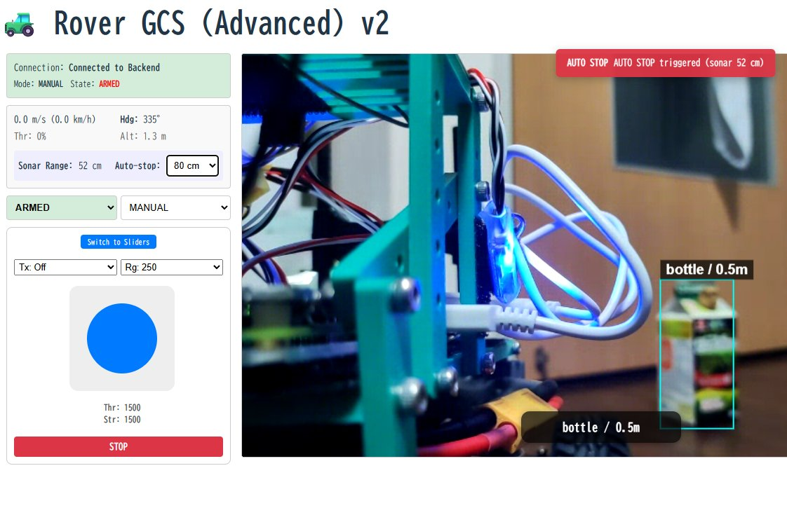
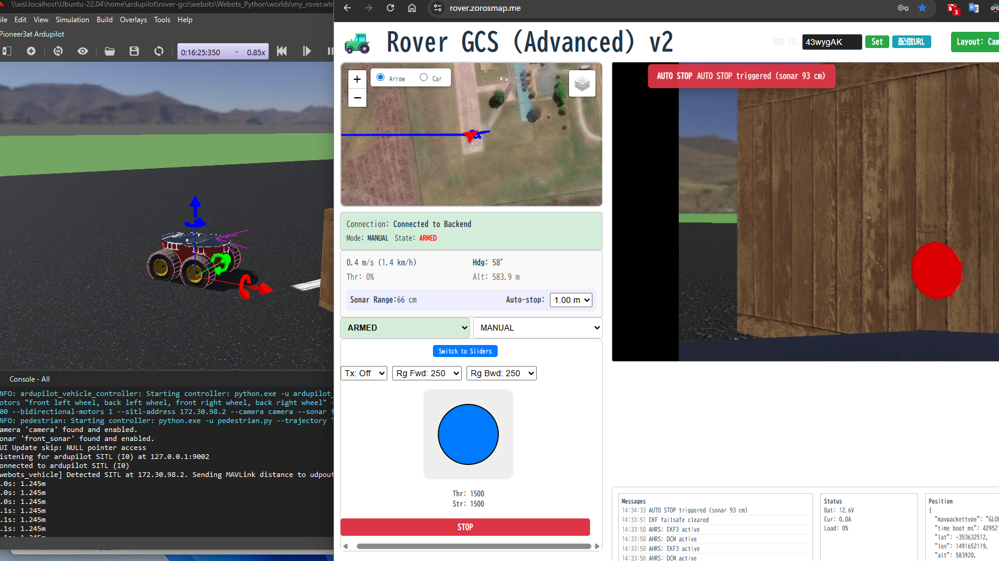
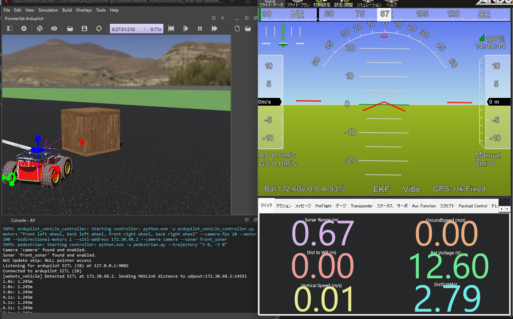

> 元ファイル: `C:\Users\ta1na\source\rover-gcs\docs\webots_summary.md`
> 取得日: 2026-06-08
> 種別: シミュレーション資料
> 備考: `rover-gcs` は変更せず、このリポジトリへ参考資料として取り込んだコピーです。
# Webots 連携シミュレーションの概要
本プロジェクトでは、高機能3Dロボットシミュレータ **Webots** と **ArduRover SITL** を連携させることで、実機なしでの高度な開発・テスト環境を提供します。

## 1. システム構成

シミュレーション環境は、Windows（物理演算・描画）とWSL2（制御・UI）を跨いで構成されます。

- **Windows**:
  - **Webots**: 3D環境の構築、物理演算、センサーシミュレーション。
- **WSL2 (Ubuntu)**:
  - **ArduPilot SITL**: 仮想機体の制御ファームウェア。
  - **rover-gcs (Backend)**: MAVLinkデータの仲介と配信。
  - **rover-gcs (Frontend)**: ブラウザベースの監視・操作UI。

## 2. 連携の仕組み

1. **SITL ↔ Webots**: UDP通信（ポート9002/9003等）を介して、制御コマンドとセンサーデータ（IMU、GPS、LiDAR等）を同期。
2. **SITL ↔ rover-gcs**: MAVLinkプロトコルを使用して、機体状態の取得とコマンド送信。

## 3. 主な活用シーン

- **自動走行アルゴリズムの検証**: 障害物回避や経路追従のテスト。
- **GCS UI/UX の開発**: リアルタイムな機体情報の表示確認。
- **ミッションプランニング**: ウェイポイント走行のシミュレーション。

## 4. 距離センサー (LiDAR/Sonar) の扱い

Webots の距離センサーを ArduPilot の RangeFinder として成立させるため、
Webots → MAVProxy → SITL(master) へ `DISTANCE_SENSOR` を **注入**する経路を用意しています。

- Webots は `udpout:<WSL_IP>:14551` に `DISTANCE_SENSOR` を送信
- MAVProxy はモジュール `webotsrf` で `udpin:0.0.0.0:14551` を受信し、master(SITL)へ再送
- ArduPilot 側は `RNGFND1_TYPE=10` / `RNGFND1_ORIENT=0` を設定

表示例:

## 5. クイックスタート

詳細な設定手順については [Webots 連携詳細ガイド](08_Webotsセットアップ手順.md) を参照してください。

1. **Webots 起動**: Windows側で対象のワールド（`.wbt`）を開き、シミュレーションを開始（Play）する。
2. **SITL 起動**: WSL2側のターミナルで `ardurover` を適切な引数（`--model webots-python` 等）を付けて起動。
3. **ブリッジ起動**: `mavproxy.py` を起動して GCS との通信パスを確立する。
4. **GCS 起動**: `rover-gcs` を起動し、ブラウザで `localhost:5173` にアクセス。

---

## 関連ドキュメント

- [Webots 連携詳細ガイド (ネットワーク・設定編)](08_Webotsセットアップ手順.md)
- [Webots カメラストリームのWebRTC配信](09_Webots_WebRTC連携.md)
- [システムアーキテクチャ](03_GCSシステム構成.md)

